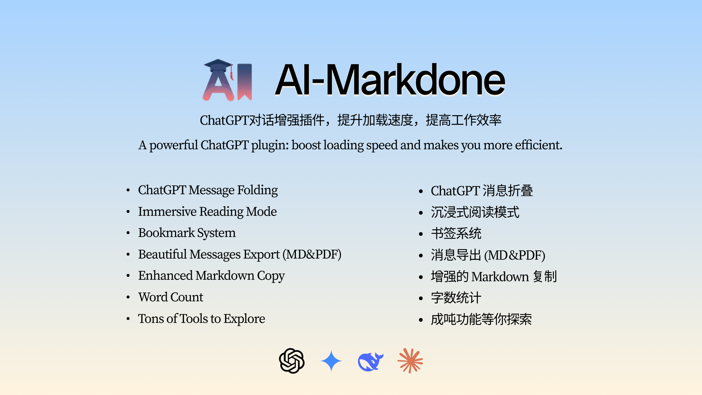
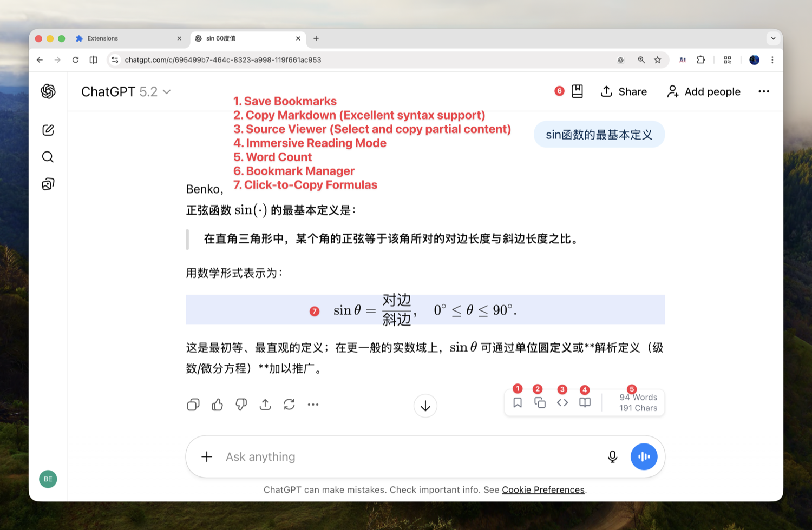
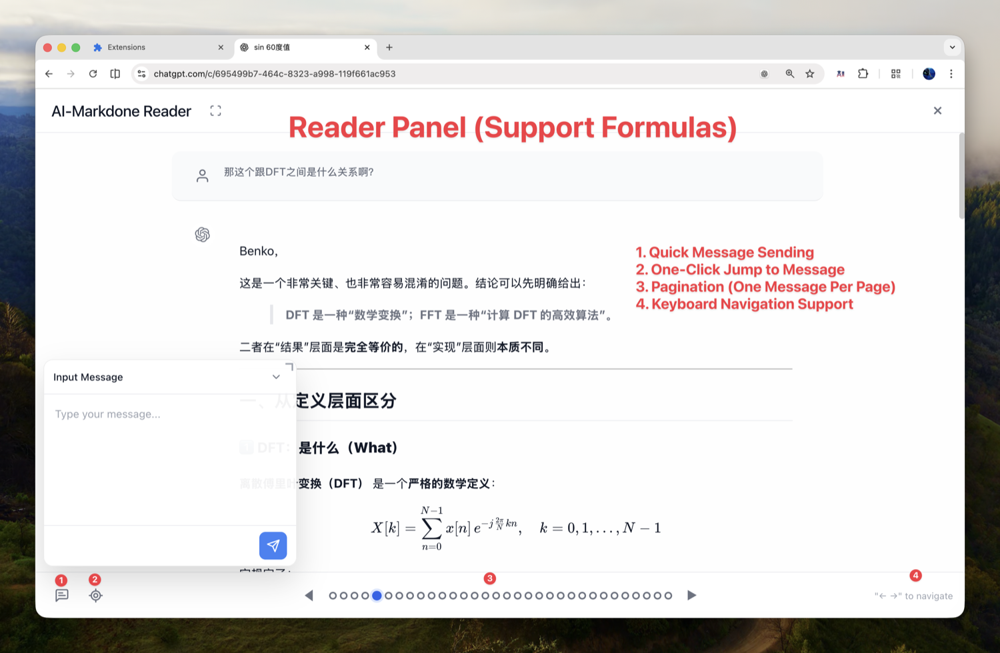

<div align="center">
  
  <h1>AI-MarkDone — Supercharge Your ChatGPT</h1>
  <p>
    <a href="https://chromewebstore.google.com/detail/ai-markdone/bmdhdihdbhjbkfaaainidcjbgidkbeoh">
      
    </a>
    <a href="./LICENSE">
      
    </a>
    </br>
    
    <a href="https://github.com/zhaoliangbin42/AI-MarkDone">
      
    </a>
  </p>
  <p><strong>Read, save, export. Stay in flow.</strong></p>
  <p><em>Reading Mode, one-click Markdown copy, bookmarks, and beautiful PDF export.</em></p>

  [中文文档](./README.zh.md) | English
</div>

---

<p align="center">
  
</p>

---

## 🤔 Is This For You?

- **ChatGPT feels slow?** Long answers make the page heavy and annoying to navigate.
- **Scroll fatigue?** You keep losing the exact paragraph you need.
- **Need a stable view?** You want to read and keep chatting without losing context.
- **Need real deliverables?** Clean Markdown for Obsidian/Typora, or a beautiful PDF you can share.
- **Knowledge keeps disappearing?** You want a bookmark system that actually helps you organize.
- **Deep Research looks like a dump?** You want AI output cleaned up so it is readable and reusable.

If any of these sound familiar, **AI-MarkDone** is built exactly for you.

---

## Interface

<p align="center">
  
</p>
<p align="center">
  
</p>

---

## ✨ Core Features

### 📚 Reading Mode (Focus View)
- **Stable context**: A dedicated reader that renders full Markdown syntax.
- **Fast navigation**: Use `Left` / `Right` arrow keys to jump between messages.
- **Keep chatting**: Send messages from Reading Mode without losing your place.

### 📦 Export & Copy (Markdown + PDF)
- **Clean Markdown**: Copy standard Markdown, ready for Obsidian, Typora, or VS Code.
- **Beautiful PDF**: Export a print-ready PDF when you need something shareable.
- **Deep Research cleanup**: Restore messy Deep Research outputs into readable Markdown.

### 🔖 Bookmarks That Actually Help
- **One-click save**: Bookmark any important message instantly.
- **Organize**: Use folders to keep projects and topics separate.
- **Preview + jump**: Preview a bookmark and jump back to its exact spot in chat.

### 🧮 One-Click LaTeX Copy
- **Click-to-copy**: Copy LaTeX from inline (`$...$`) and block (`$$...$$`) formulas.
- **No selection hassle**: Grab exactly one formula without breaking the text.

### 📊 Word Count
- **Real-time stats**: Words and characters for the current message, minus code noise.

---

## 🌐 Platform Support

| Platform | Status |
| :--- | :--- |
| **ChatGPT** | ✅ Fully Supported |
| **Gemini** | ✅ Fully Supported |
| **Claude** | ✅ Fully Supported |
| **DeepSeek** | ✅ Fully Supported |

---

## 🚀 Installation

### 🏬 Chrome Web Store (Recommended)

👉 **[Install from Chrome Web Store](https://chromewebstore.google.com/detail/ai-markdone/bmdhdihdbhjbkfaaainidcjbgidkbeoh)**

Secure, verified, and auto-updated.

### 📦 Manual Installation (Developer Mode)

1. Download the latest ZIP file from [GitHub Releases](https://github.com/zhaoliangbin42/AI-MarkDone/releases).
2. Unzip the file.
3. Open Chrome and go to `chrome://extensions/`.
4. Enable **Developer mode** in the top right corner.
5. Click **Load unpacked** and select the unzipped `dist/` folder.
6. Refresh your ChatGPT or Gemini page and enjoy! 🎉

---

## 💻 Development & Contribution

Contributions are welcome!

If you are using LLMs for development, please refer to our [GEMINI.md](./GEMINI.md) for coding standards.

```bash
# Install dependencies
npm install

# Dev mode
npm run dev

# Fast regression smoke suite (critical paths)
npm run test:smoke

# Core reliability gate (import/storage/render/message guards)
npm run test:core

# Build
npm run build
```

## 📅 Changelog (Latest)

### v2.9.5
- **🌍 Improved**: Comprehensive bilingual (English + Simplified Chinese) localization coverage across key bookmark and settings flows.
- **✨ Improved**: More robust ChatGPT toolbar injection timing and lifecycle cleanup for dynamic page updates.
- **🐛 Fix**: Reader pagination edge cases and code-only word count loading behavior.
- **🐛 Fix**: Bookmark panel empty-state styling when no folders exist.

[Full Changelog](./CHANGELOG.md)

## ☕️ Support the Author

If this extension saves you time, consider buying me a coffee to support future updates!

<div align="center">
  <div style="display: flex; justify-content: center; gap: 20px;">
    <div style="display: flex; flex-direction: column; align-items: center;">
      <p><strong>Buy me a coffee</strong></p>
      
    </div>
    <div style="display: flex; flex-direction: column; align-items: center;">
      <p><strong>WeChat</strong></p>
      
    </div>
  </div>
</div>


## ✅ TODO

- ChatGPT history folding
- Full-text bookmarks
- Message comments
- More...

## 📜 License & Contact

This project is licensed under the [MIT License](./LICENSE).

We welcome all forms of contribution and discussion! If you have any questions, ideas, or just want to chat about AI or research, feel free to open an [Issue](https://github.com/zhaoliangbin42/AI-MarkDone/issues) or reach out.

Happy coding! 🚀
