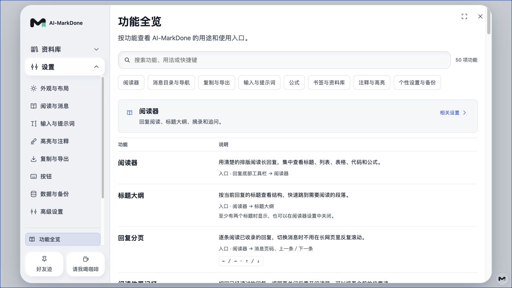
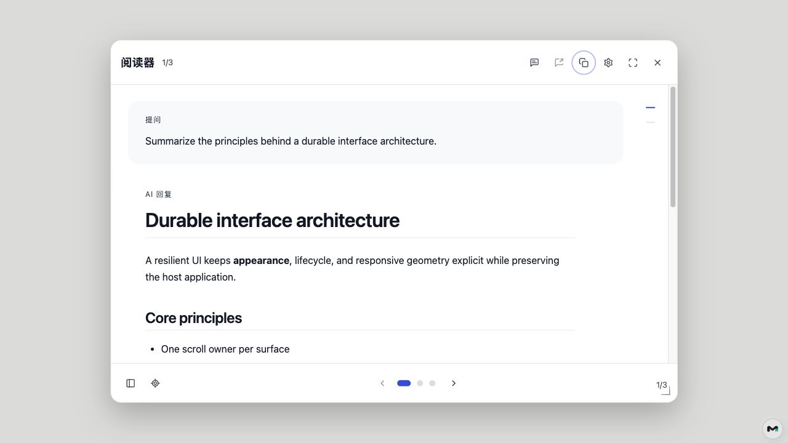

<div align="center">
  
  <h1>AI-MarkDone — ChatGPT Productivity Suite</h1>
  <p>
    <a href="https://chromewebstore.google.com/detail/ai-markdone/bmdhdihdbhjbkfaaainidcjbgidkbeoh">
      
    </a>
    <a href="./LICENSE">
      
    </a>
    
    <br>
    
    
    <a href="https://github.com/zhaoliangbin42/AI-MarkDone">
      
    </a>
  </p>
  <p><strong>Read, save, export. Keep the conversation going.</strong></p>
  <p>Message navigation, Separate reader, formula assistance, prompts, bookmarks and annotations.</p>

  [Official website](https://zhaoliangbin42.github.io/ai-markdone/en/) | [中文文档](./README.zh.md) | English
</div>

AI-MarkDone is an open-source browser extension for ChatGPT. Find replies with the message directory, read long answers in Reader, organize highlights, annotations and bookmarks, then copy or export the content to your notes.

Version 6.1.0 brings customizable toolbars and refreshed Settings. Pin the buttons you use often, explore less obvious features in Feature overview, and preview or export formulas as you type.

## Interface

<p align="center"></p>
<p align="center"></p>

## Core features

### Message directory and navigation
- Enable the message directory under Settings → Reading & messages to find replies by question summary and hover over entries to preview them.
- As you browse older messages, newly loaded replies join the directory.
- Use the lower-right previous/next buttons or arrow keys to move between replies; arrow keys keep their normal cursor behavior while typing.
- Automatically restore your reading position after sending so you can keep reading earlier content.

### Reader and Separate reader
- Open Reader below a reply to read headings, lists, tables, code and formulas.
- Use the Heading outline to navigate long replies; reading positions are remembered during the page session.
- Keep selected passages in the Excerpt tray for comparison, or prepare your next question while reading.
- When scrolling a long ChatGPT conversation slows down, open Separate reader from the website's lower-right toolbar and read in another tab.
- Choose how links and code blocks appear in Reader, whole-reply copying and message exports.

### Copy and export
- Copy a reply or selection as Markdown with headings, lists, tables, code and formulas for further editing.
- Partial code selections keep the selected text; formulas are copied as complete formulas.
- Hover over Copy to copy PNG above or the matching question and reply together below.
- Select one or several replies and save Markdown or PNG, or use the browser print dialog to save PDF; multiple PNGs can be packed into a ZIP.
- Adjust image width and resolution for sharing, and clean up Deep Research content for notes or documents.

### Writing and formulas
- Use Enter for a new line and Cmd/Ctrl + Enter to send, with bold shortcuts and numbered/bulleted list assistance.
- Preview a formula when the text cursor enters it; type a backslash for LaTeX snippets and use Tab to move between placeholders.
- Copy or export PNG, SVG or MathML from formula previews, and click reply formulas to copy their LaTeX source.

### Prompts, annotations and highlights
- Save reusable prompts and call them with a backslash and trigger word in ChatGPT or Reader's send box.
- Set a cursor marker for the next text to fill in, or insert a prompt with current-conversation annotations into your draft.
- Annotate selected passages or mark them with three highlight colors. Search, edit and organize them in Library.
- Highlights save automatically; enable Save new annotations to keep annotations after a refresh.
- Use annotation templates to combine source passages, notes and prompts, then copy or insert them for a follow-up question.

### Bookmarks and backup
- Save a reply with its question or bookmark a conversation link; organize material with folders, search and batch actions.
- Read a saved message bookmark, copy its content or return to the original conversation.
- Export Library to a local file or connect Google Drive (experimental) for manual backups, with a merge preview before importing or restoring.
- Import and export preference files to use familiar settings in another browser.

### Make it yours
- Light, dark and page-matched appearance, several accent colors and custom color values.
- Manage button visibility and pins under Settings → Buttons, with previews showing the result.
- Search across eight Settings categories and find purposes, entry points and shortcuts in Feature overview.

## Browsers and platforms

Chrome (MV3) and Firefox (MV2) are supported. The main features are for ChatGPT; Gemini, Claude and DeepSeek provide formula copying and export.

## Installation

### Chrome

Install from the [Chrome Web Store](https://chromewebstore.google.com/detail/ai-markdone/bmdhdihdbhjbkfaaainidcjbgidkbeoh) and receive updates through the store.

For manual installation:
1. Download AI-MarkDone-v6.1.0-chrome.zip from [GitHub Releases](https://github.com/zhaoliangbin42/AI-MarkDone/releases) and extract it.
2. Open chrome://extensions/ and enable Developer mode.
3. Choose Load unpacked and select the extracted folder containing manifest.json.
4. Refresh ChatGPT.

### Firefox

The Firefox package is AI-MarkDone-v6.1.0-firefox.zip. For development, extract it, open about:debugging#/runtime/this-firefox, choose Load Temporary Add-on, and select manifest.json.

## 💻 Development & Contribution

Contributions are welcome.

If you are using Codex or another LLM for development, use [AGENTS.md](./AGENTS.md) for the repository entrypoint and [docs/README.md](./docs/README.md) for the authoritative system documents.

```bash
# Install dependencies
npm install

# Dev mode
npm run dev

# Fast regression smoke suite (critical paths)
npm run test:smoke

# Core reliability gate (import/storage/render/message guards)
npm run test:core

# Build
npm run build
```

## 📅 Changelog (Latest)

### 6.1.0
- Strengthened the message directory as older replies load.
- Added toolbar pins and categorized, searchable Settings with button previews.
- Added Feature overview, more accent colors and custom colors.
- Formula previews follow the text cursor and export PNG/SVG directly.
- Added content and floating-button options, and fixed reading-position restoration after sending.

[Full Changelog](./CHANGELOG.md)
[Release Notes](./RELEASE_NOTES.md)

## ☕️ Support the Author

If this extension saves you time, consider buying me a coffee to support future updates.

<div align="center">
  <div style="display: flex; justify-content: center; gap: 20px;">
    <div style="display: flex; flex-direction: column; align-items: center;">
      <p><strong>Buy Me a Coffee</strong></p>
      
    </div>
    <div style="display: flex; flex-direction: column; align-items: center;">
      <p><strong>WeChat</strong></p>
      
    </div>
  </div>
</div>

## 🙏 Acknowledgements

Thanks to all contributors, everyone who sends feedback, and the open-source projects used by AI-MarkDone.

## ⭐ Star History

<p align="center">
  <a href="https://www.star-history.com/#zhaoliangbin42/AI-MarkDone&Date">
    <picture>
      <source media="(prefers-color-scheme: dark)" srcset="https://api.star-history.com/svg?repos=zhaoliangbin42/ai-markdone&type=Date&theme=dark" />
      <source media="(prefers-color-scheme: light)" srcset="https://api.star-history.com/svg?repos=zhaoliangbin42/ai-markdone&type=Date" />
      
    </picture>
  </a>
</p>

## 📜 License & Contact

This project is licensed under the [MIT License](./LICENSE).

We welcome all forms of contribution and discussion. If you have questions or ideas, open an [Issue](https://github.com/zhaoliangbin42/AI-MarkDone/issues).
