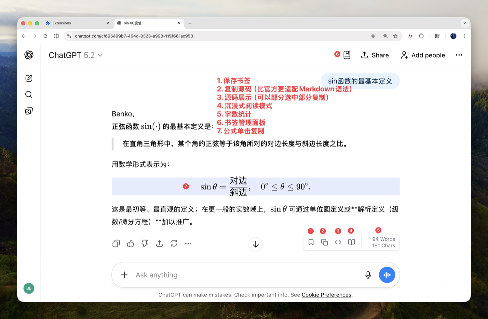
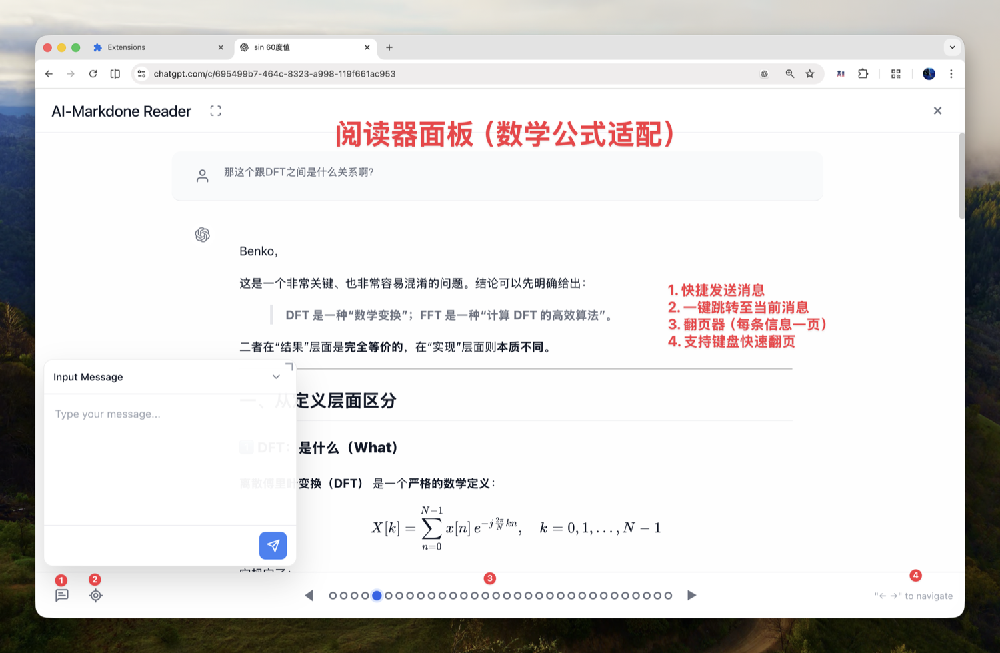

<div align="center">
  
  <h1>AI-MarkDone</h1>
  <p><strong>专为学生、科研人员、AI 重度依赖者设计的沉浸式阅读插件，提供阅读模式、公式复制、一键跳转、书签管理等成吨功能。✨</strong></p>
  <p><em>作为科研工作者，我懂你要什么😉</em></p>

  中文文档 | [English](./README.md)
</div>

---

<p align="center">
  
</p>

---

## 🤔 是否适合我？

- 你是否经常在**消息之间来回切换**时拖动长长的进度条却总是对不齐？
- 你是否希望有一个**稳定的阅读环境**，而不是每次输入消息之后，就会被强制划走？
- 你是否经常因为**复制出来的数学公式总是出错**而抓耳挠腮？
- 你是否经常需要单独复制段落内的**单个数学公式**？
- 你是否经常面对 **Deep Research** 输出的长文源码感到头皮发麻，不仅公式挂掉，连阅读都困难？
- 你是否希望能将重要的对话**一键存为书签**，防止丢失？
- 你是否需要精准**统计对话字数**，以掌控文章篇幅？

上面这些痛点，但凡占一个，这款插件都无比适合你。

---

## 界面展示

<p align="center">
  
</p>
<p align="center">
  
</p>

---

## ✨ 核心特性

### 📚 沉浸式阅读模式
- **阅读模式**：完整渲染 Markdown 语法，支持左右方向键快速切换对话，告别页面卡顿。
- **快捷消息发送**：在阅读模式中，快捷发送消息，无需切除页面，告别消息发送时，焦点被强制转移的烦恼。
- **Deep Research 优化**：针对 Deep Research 输出的“灾难级源码”进行定向解析，从乱码中恢复标准 Markdown，**显著提升数学公式阅读体验**。

### 📋 真正的 Markdown 源码复制
- **完整兼容**：不同于官方的“半成品”复制，本插件提取标准 Markdown 语法。
- **编辑器友好**：复制内容可直接粘贴进 Typora、Obsidian 等编辑器，渲染效果完美。
- **智能降噪**：自动清洗引用标记、超链接等干扰信息。

### 📝 LaTeX 公式点击复制
- **Click-to-Copy**：看见公式点一下就能复制，无需手动框选。
- **论文神器**：支持行内公式 (`$...$`) 和块级公式 (`$$...$$`)，写作效率倍增。

### 📚 书签系统 & 实时预览
- **一键收藏**：将重要对话保存至书签，防止灵感丢失。
- **即时预览**：在书签面板直接预览内容，无需跳转原页面，方便知识整理。
- **轻松跳转**：再输入前面板，直接跳转至对应聊天窗口的对应位置，知识立马回到眼前。
- **文件夹管理**：支持自定义文件夹分类，井井有条。

### 📊 对话字数统计
- **实时统计**：精确计算当前对话的字数与字符数，剔除代码干扰。

---

## 🌐 平台支持

| 平台 | 状态 |
| :--- | :--- |
| **ChatGPT** | ✅ 完全支持 |
| **Gemini** | ✅ 完全支持 |
| **Claude** | 🔜 计划中 |
| **DeepSeek** | 🔜 计划中 |

---

## 🚀 安装方式

### 🏬 Chrome 商店（推荐）

👉 **[前往 Chrome Web Store 安装](https://chromewebstore.google.com/detail/ai-markdone/bmdhdihdbhjbkfaaainidcjbgidkbeoh)**


### 📦 手动安装（开发者模式）

1. 前往 GitHub [Releases](././releases) 下载最新 ZIP 包。
2. 解压 ZIP 文件。
3. Chrome 地址栏输入 `chrome://extensions/`，开启右上角 **开发者模式**。
4. 点击“加载已解压的扩展程序”，选择解压后的 `dist/` 文件夹。
5. 刷新页面即可使用 🎉

---

## 💻 开发与贡献

欢迎提交 PR 或 Issue！

如果你采用大模型进行开发，详细开发规范请参考 [GEMINI.md](./GEMINI.md)。

```bash
# 安装依赖
npm install

# 开发模式
npm run dev

# 构建
npm run build
```

## 📅 更新日志 (Latest)

### v2.5.0
- **✨ 新增**: 完整的设置系统（行为、存储、数据管理）。
- **✨ 新增**: 赞赏支持（微信 / Buy Me a Coffee）。
- **✨ 新增**: 全新的无障碍对话框系统（Dialog System）。
- **✨ 新增**: 书签导入时的重复检测与合并功能。
- **⚡️ 优化**: 批量操作性能显著提升。
- **🎨 优化**: UI 细节与设计语言的全面统一。

[查看完整更新日志](./CHANGELOG.md)

## ☕️ 请作者喝杯咖啡

如果觉得这个插件对你有帮助，欢迎请我喝杯咖啡，支持我继续开发更多功能！

<div align="center">
  <div style="display: flex; justify-content: center; gap: 20px;">
    <div style="display: flex; flex-direction: column; align-items: center;">
      <p><strong>Buy me a coffee</strong></p>
      
    </div>
    <div style="display: flex; flex-direction: column; align-items: center;">
      <p><strong>微信 (WeChat)</strong></p>
      
    </div>
  </div>
</div>


## 📜 许可证与交流

本项目基于 [MIT License](./LICENSE) 发布。

欢迎任何形式的贡献与交流！如果你有任何问题、建议，或者想探讨 AI 与科研话题，欢迎提交 [Issue](https://github.com/zhaoliangbin42/AI-MarkDone/issues) 或直接联系我。

Happy coding! 🚀
