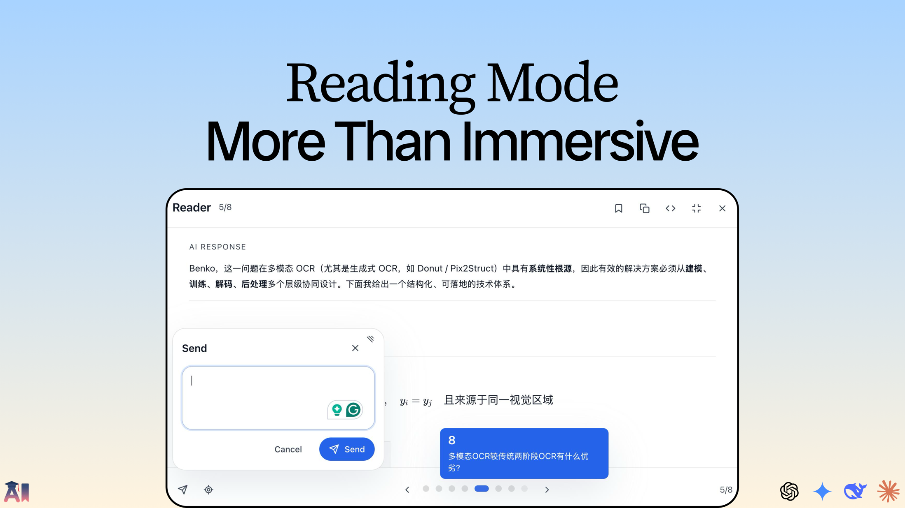
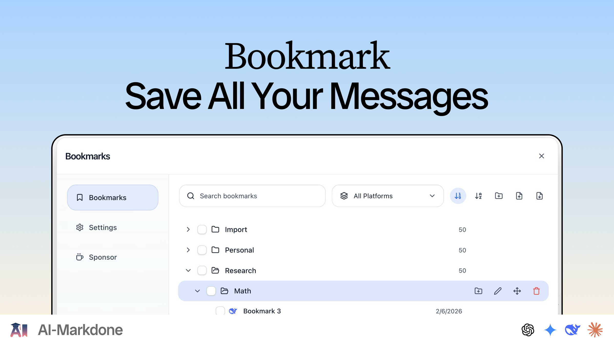

<div align="center">
  
  <h1>AI-MarkDone — 专注 ChatGPT 的提效增强扩展</h1>
  <p>
    <a href="https://chromewebstore.google.com/detail/ai-markdone/bmdhdihdbhjbkfaaainidcjbgidkbeoh">
      
    </a>
    <a href="./LICENSE">
      
    </a>
    
    </br>
    
    
    <a href="https://github.com/zhaoliangbin42/AI-MarkDone">
      
    </a>
  </p>
  <p><strong>Read, save, export. Stay in flow.</strong></p>
  <p><em>ChatGPT 右侧目录、阅读器源码复制、灵动注释、书签管理、PNG 导出与精美 PDF 导出。</em></p>

  中文文档 | [English](./README.md)
</div>

---

<p align="center">
  
</p>

---

## 🤔 适合谁使用？

- **ChatGPT 长对话不好定位？** 增量加载让旧消息回看更容易出现延迟。
- **总是找不到刚才那一段？** 滚动很久才能回到关键内容。
- **需要对话目录？** 希望一边留在原生页面，一边用实时预览快速跳回目标轮次。
- **需要稳定阅读视图？** 希望一边继续聊天，一边保留清晰上下文。
- **需要可复用输出？** 想把结果整理成标准 Markdown、PDF，或者适合分享的 PNG 图片。
- **知识总是散落？** 需要真正能帮你整理内容的书签系统。
- **Deep Research 输出太乱？** 希望清洗成更适合阅读和复用的结构化内容。

如果这些问题你都遇到过，**AI-MarkDone** 就是为此而做。

---

## 界面展示

<p align="center">
  
</p>
<p align="center">
  
</p>
<p align="center">
  
</p>
---

## ✨ 核心功能

### ⚡ ChatGPT 右侧目录
- **右侧实时目录**：进入 ChatGPT 对话页后，可以在原生页面右侧查看当前对话目录。
- **消息预览**：用紧凑预览快速判断每一轮内容，也可以切换到展开模式，一次性看清所有消息摘要。
- **目录开关**：不需要目录时，可以直接关闭，保持原生页面干净。
- **点击跳转**：点击目录项即可通过与书签、阅读器定位一致的稳定锚点链路跳回目标轮次。
- **适配新版 ChatGPT**：替代旧的消息折叠功能；折叠在 ChatGPT 新的动态加载模型下已经不再稳定。

### 📚 阅读模式（Focus View）
- **稳定上下文**：独立阅读面板完整渲染 Markdown。
- **ChatGPT 全量识别恢复**：针对 ChatGPT 增量加载重新设计内容发现能力，阅读器可以重新识别完整对话。
- **快速导航**：支持 `Left` / `Right` 键切换消息。
- **按源码复制闭合内容**：公式、代码块、表格、图片等内容可以直接在阅读器里按源码复制。
- **局部源码选中**：只选中需要的部分即可复制；阅读器会把公式、代码块、表格、图片等闭合内容映射回原始 Markdown 边界，再按选区顺序重新拼接。
- **灵动注释**：对具体段落做标注、写修改意见，再整理成结构化输入继续发给模型。
- **删除注释**：不再需要的灵动注释可以直接删除。
- **注释插入发送框**：选择提示词后，可以把整理好的注释内容直接插入阅读器发送框，减少手动复制粘贴。
- **不中断聊天**：阅读模式下也能发送消息。

### 📦 导出与复制（Markdown + PDF + PNG）
- **标准 Markdown**：可直接用于 Obsidian、Typora、VS Code。
- **精美 PDF**：导出适合分享或归档的 PDF。
- **复制为 PNG**：在消息悬浮工具栏中直接将当前消息复制为适合分享的图片。
- **批量导出 PNG**：将选中的多条消息分别渲染为 PNG，多选时会打包成 ZIP。
- **图片参数设置**：可在设置中调整 PNG 宽度和清晰度，适配不同分享平台的视觉宽度。
- **Deep Research 清洗**：把杂乱内容恢复成可读的 Markdown。

### 🔖 真正有用的书签
- **一键保存**：重要消息即时收藏。
- **分组整理**：支持文件夹管理不同主题。
- **预览与跳转**：从书签预览并回到原始聊天位置；ChatGPT 下的保存定位和跳转定位都做了针对性优化。
- **内置信息页**：可直接在书签面板里查看更新日志、常见问题和关于我。

### 🧮 一键复制 LaTeX
- **点击即复制**：支持行内公式与块级公式。
- **无需手动选区**：精确提取单个公式。

### 📊 字数统计
- **实时统计**：显示当前消息的字数与字符数，并排除代码噪音。

---

## 🌐 浏览器支持

| 浏览器 | 状态 |
| :--- | :--- |
| **Chrome** | ✅ 完全支持，MV3 构建 |
| **Firefox** | ✅ 已支持，MV2 构建 |
| **Safari** | ✅ 已支持，Safari Web Extension 构建 |

## 🤖 AI 平台方向

| 平台 | 状态 |
| :--- | :--- |
| **ChatGPT** | ✅ 主力支持，重点测试与持续开发 |
| **Gemini** | ⚠️ 维护模式，后续主动功能开发会逐步退出 |
| **Claude** | ⚠️ 维护模式，后续主动功能开发会逐步退出 |
| **DeepSeek** | ⚠️ 维护模式，后续主动功能开发会逐步退出 |

AI-MarkDone 接下来会回到 ChatGPT-first 的方向。Gemini、Claude 和 DeepSeek 的既有功能可能仍然可用，但新的功能开发和深度适配会优先投入到 ChatGPT。

Gemini 平台可以试试 [Gemini Voyager](https://github.com/Nagi-ovo/gemini-voyager)。如果需要全平台书签工作流，也可以看看我很喜欢的 [Timeline](https://github.com/houyanchao/Timeline)。

---

## 🚀 安装方式

### 🏬 Chrome 商店（推荐）

👉 **[从 Chrome Web Store 安装](https://chromewebstore.google.com/detail/ai-markdone/bmdhdihdbhjbkfaaainidcjbgidkbeoh)**

安全、已审核、支持自动更新。

### 📦 手动安装（开发者模式）

1. 前往 GitHub [Releases](https://github.com/zhaoliangbin42/AI-MarkDone/releases) 下载最新 ZIP 包。
2. 解压文件。
3. 打开 Chrome，进入 `chrome://extensions/`。
4. 开启右上角“开发者模式”。
5. 点击“加载已解压的扩展程序”，选择解压后包含 `manifest.json` 的扩展目录。
6. 刷新 ChatGPT 页面即可开始使用。

### 🧩 Firefox 与 Safari

Firefox 和 Safari 由同一套源码生成，通过浏览器专属 manifest 和适配层区分：

```bash
npm run build:firefox
npm run build:safari:webext
```

Safari 需要通过 Safari Web Extension wrapper 分发，具体流程见 [docs/runbooks/safari-extension-release.md](./docs/runbooks/safari-extension-release.md)。

---

## 💻 开发与贡献

欢迎提交 PR 或 Issue。

如果你使用 Codex 或其他大模型参与开发，请以 [AGENTS.md](./AGENTS.md) 作为仓库入口规范，并以 [docs/README.md](./docs/README.md) 作为系统权威文档入口。

```bash
# 安装依赖
npm install

# 开发模式
npm run dev

# 快速回归冒烟测试（关键路径）
npm run test:smoke

# 核心可靠性门禁（导入/存储/渲染/消息边界）
npm run test:core

# 构建
npm run build
```

## 📅 最新更新

### v4.2.1
- 修复 ChatGPT 更新后右侧目录定位不稳定的问题。
- 目录点击现在使用统一的用户轮次锚点，不再混用消息数量和 DOM 定位规则。
- 页面滚动时，目录高亮会按当前可见的用户/助手轮次范围同步，并让高亮项保持在目录附近。

[完整更新日志](./CHANGELOG.md)
[版本说明](./RELEASE_NOTES.md)

## ☕️ 支持作者

如果这个扩展帮你节省了时间，欢迎请作者喝杯咖啡，支持后续更新。

<div align="center">
  <div style="display: flex; justify-content: center; gap: 20px;">
    <div style="display: flex; flex-direction: column; align-items: center;">
      <p><strong>Buy Me a Coffee</strong></p>
      
    </div>
    <div style="display: flex; flex-direction: column; align-items: center;">
      <p><strong>WeChat</strong></p>
      
    </div>
  </div>
</div>

## 🙏 Acknowledgements

本项目使用了 [Tailwind CSS](https://tailwindcss.com/)，感谢 Tailwind 团队。


## 📜 许可与联系

本项目基于 [MIT License](./LICENSE) 开源。

欢迎通过 [Issue](https://github.com/zhaoliangbin42/AI-MarkDone/issues) 提出问题、建议或讨论想法。
