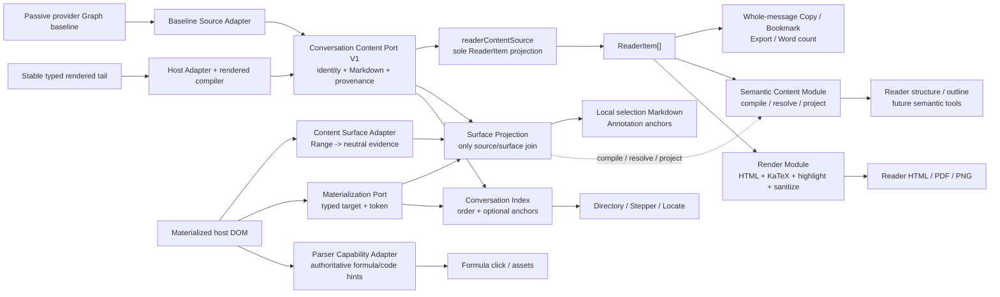

# ADR-0011 Semantic Content and Surface Projection

## Status

Accepted and implemented. Installed Chrome current-build acceptance passed for
ordinary and formula local Markdown selection on 2026-08-10; Firefox MV2 remains
a separate release gate.

ADR-0018 supersedes this ADR's absolute prohibition on host-rendered whole-turn
bodies. Compiler-verified stable tail turns may now carry `host-rendered /
normalized` provenance. A sealed host-rendered turn may also supply canonical
Markdown spans for local copy through `SurfaceProjection`; it still does not
claim provider-original source provenance. This ADR remains authoritative only
for the provider-neutral Semantic Content and source/surface proof boundary;
ADR-0018 owns ChatGPT discovery, identity, pool, and page Surface lifecycle.

## Context

ChatGPT content discovery already publishes one immutable conversation snapshot, but several downstream capabilities still solved a different problem independently:

- whole-message copy, Reader, bookmark, and export projected Markdown from the snapshot;
- direct page selection cloned rendered DOM and converted that clone back to Markdown;
- formula interaction searched generated KaTeX descendants for source;
- Reader structure parsed Markdown again for atomic units and outline.

This made host markup an accidental data model. A harmless wrapper or attribute move could break only one consumer, and rendered DOM could overwrite cleaner provider Markdown during graph/DOM convergence. `coverage` also described whether turns were complete, but not whether their bodies were exact, normalized, or reconstructed.

## Decision

Adopt one provider-neutral Semantic Content Module, two thin content Adapters (Source and Surface), and one capability-scoped parser Adapter for authoritative formula/code hints.

### Stable semantic Interface

`src/contracts/semanticContent.ts` owns the public Interface. The implementation may use unified/remark internally, but it exposes an AI-MarkDone-owned immutable node model rather than mdast. The Interface accepts canonical Markdown with source identity, revision, coverage, and provenance; it returns:

- a semantic document with UTF-16, half-open source spans;
- exact canonical Markdown;
- source-backed Markdown fragments;
- plain text;
- Reader structural units and outline;
- explicit diagnostics for rejected, unsupported, or ambiguous operations.

The Module contains no DOM, browser global, platform ID, selector, clipboard, UI, or runtime dependency. Cache identity includes schema, source key, revision, provenance, and source digest; cached documents are immutable and bounded.

### Source Adapter

The platform Source Adapter owns provider routes, passive Graph decoding and
provider Markdown dialect adaptation. ChatGPT Graph Markdown is normalized at
this edge before publication. The Host Adapter owns selectors, typed identity,
streaming/completion facts and semantic source carriers; after a 400 ms stable
window, the provider-neutral rendered compiler may publish a contiguous tail
turn with `{ authority: "host-rendered", fidelity: "normalized", producer:
"rendered-content-v2" }`.

`ConversationContentRepository` seals the baseline prefix and host tail in one
projection. Identical evidence is idempotent, regeneration creates a new
projection suffix, and any change reaching into the baseline prefix becomes
`stale`. `ConversationSnapshotV1.proof` remains orthogonal to per-turn
readability and now reports `basis: source | hybrid | host-born` in addition to
order/body/tail/gap completeness. Reconstructed bodies remain non-canonical.

### Surface Adapter and projection

`ContentSurfaceAdapter` is the host-facing Interface. Its DOM implementation may use the existing Site Adapter to find a message and content root, but it emits only platform-neutral evidence:

- typed conversation target;
- content token;
- materialization token;
- surface token;
- W3C-style exact text quote with optional prefix and suffix.

`Range`, `Selection`, `Element`, and selectors remain inside the driver. `SurfaceProjection` is the only service seam allowed to join surface evidence to canonical content. The complete interaction path validates three lifetimes before copying:

- `SurfaceProjection` validates the content token (semantic source revision) and materialization token (typed target-to-DOM projection);
- the interaction controller re-captures the native selection and compares the surface token (concrete rendered root instance), Range endpoints, target, and TextQuote before reusing a snapshot.

The semantic resolver succeeds only for one proven canonical Markdown span. Source-backed and compiler-verified sealed `host-rendered` turns are both eligible because the output is projected from the Repository body, never serialized from the selected DOM. Repeated text without unique context, stale tokens, reconstructed source, unsupported decoded-character offsets, cross-message selection, and streaming content fail closed for a configured canonical Markdown shortcut: no visual text is promoted to Markdown and the host copy event is not allowed to publish a misleading result. The host's native copy path remains available when the shortcut is disabled or no canonical content/materialization port exists. The implementation must never estimate a span merely because an offset looks plausible. A host-rendered span proves a location inside AI-MarkDone's sealed canonical Markdown; it does not become provider-original provenance for a persistent annotation claim.

### Formula capability

Formula source extraction is a capability of the parser Adapter, not a selector owned by the controller. Shared extraction recognizes semantic source carriers such as `data-math-source`, existing TeX attributes, and TeX annotations through ancestor lookup. The ChatGPT Adapter handles any remaining host-specific wrapper detail. The content composition root injects that parser Adapter into the formula controller.

Only authoritative TeX may enter the structured formula asset path. Visual glyph text remains `dom-only` compatibility evidence or fails open; it is never promoted to canonical TeX.

### Consumer ownership

| Consumer | Stable input | Must not own |
|:--|:--|:--|
| Reader / whole-message copy / bookmark / export / word count | `readerContentSource` projected from Content Port V1 | provider fetch, DOM body fallback, host selectors |
| Reader structure and outline | Semantic Content projection | a second Markdown structure parser |
| Local selection Markdown | Surface Projection result | DOM-to-Markdown as the canonical path |
| Formula click/assets | parser Adapter result with source confidence | KaTeX descendant guessing in UI |
| Directory / Stepper / Locate | Content Port identity + Materialization Port | body parsing or Semantic Document dependency |
| HTML/PDF/PNG rendering | canonical Markdown + dedicated render Module | content discovery or surface identity |

The old strict atomic DOM conversion remains only a bounded compatibility fallback for non-ChatGPT legacy composition roots that do not provide canonical content/materialization ports. ChatGPT has canonical ports, so any rejected semantic projection fails open; its controller never revives DOM reconstruction. The compatibility path cannot overwrite content source, enter persistence, or claim canonical success for unproven formulas.

## Alternatives Considered

### Add more methods and selectors to `SiteAdapter`

Rejected as the primary design. It would centralize selectors but keep a shallow Interface: every consumer would still interpret DOM independently, and each new capability would enlarge the host contract.

### Serialize every native `Range` directly to Markdown

Rejected. Rendered DOM is a lossy view: formula glyphs are not TeX, wrappers are presentation details, and browser selection boundaries do not encode Markdown delimiters. More heuristics would increase apparent coverage while reducing proof of correctness.

### Expose mdast as the shared contract

Rejected. It would couple every consumer to one parser library and make parser upgrades a repository-wide migration. mdast remains an implementation detail behind the Semantic Content Interface.

## Consequences

- A host DOM change should normally affect only the Source, Surface, or parser Adapter. Semantic projections and consumers remain unchanged.
- Correct lower-layer evidence produces one consistent upper-layer result because consumers no longer reinterpret host markup. This does not guarantee browser clipboard, renderer, or host event success; those remain independent side-effect boundaries.
- Ambiguous or low-fidelity input can reduce feature availability, but it cannot silently become canonical output.
- The architecture has three explicit revision domains instead of one overloaded cache key: semantic content, materialization, and rendered surface.
- The semantic Module is deliberately deeper than its Interface: parser details, immutable modeling, source mapping, ambiguity handling, and caching can change without changing consumers.
- New providers implement thin source/surface/parser Adapters and reuse the same Module. They do not fork Reader, selection, formula, or export semantics.

## Verification

The focused gate is `npm run test:chatgpt-discovery`. Required direct coverage includes:

- provider Markdown cannot be overwritten by reconstructed DOM;
- provenance and source quality remain separate from coverage;
- Semantic Document immutability, parser isolation, source spans, ambiguity, cache isolation, and unproven-offset rejection;
- wrapper-insensitive surface evidence, service-level content/materialization invalidation, and trigger-level surface-token invalidation;
- ordinary paragraph selection and Markdown wrapper recovery from both source-backed and sealed host-rendered turns;
- current ChatGPT `data-math-source` formula extraction through the real runtime injection path;
- reconstructed content cannot enter Reader copy, bookmark, PNG, or Save Messages export success paths;
- dependency tests keep the Semantic Module browser- and provider-independent and keep Surface Projection as the single join seam.
