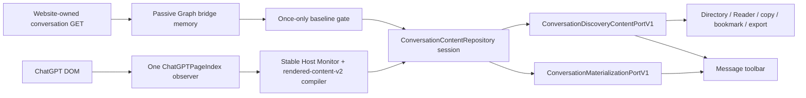

# ADR-0017: ChatGPT baseline and host-tail content lifecycle

## Context

The passive ChatGPT Graph path is the only reliable way to recover a complete
virtualized history, but it is not a live tail. After the first website-owned
conversation GET, ChatGPT can add a completed assistant turn to the DOM without
performing another conversation GET. The previous production runtime reacted
to that DOM mutation by peeking at bridge memory again; it never compiled or
committed the new DOM body.

This created two user-visible races:

- a first turn born on the blank page could finish before a canonical
  conversation route existed, so the message toolbar was not mounted;
- a later assistant message could receive a toolbar anchor while the content
  snapshot still ended at the previous Graph turn, so word count displayed
  `—`.

Long conversations also prove that DOM cannot replace the baseline: ChatGPT may
retain many persistent turn slots while hydrating only a small viewport window.
The lifecycle therefore needs one complete baseline and a constrained live DOM
tail, not repeated Graph reads and not a DOM-only history reconstruction.

## Decision

Adopt one page-scoped `ConversationContentRepository` session with two typed
input ports:

### Baseline gate

- `document_start` installs the MAIN-world bridge and the shared PageIndex.
- A canonical conversation identity creates a new page epoch and opens one
  baseline gate.
- The first matching valid bridge snapshot is admitted. A complete Graph closes
  the gate as a stable source projection. A complete historical prefix with one
  streaming tail closes the gate as a partial source projection; the stable DOM
  tail may subsequently close it.
- A missing/invalid bridge snapshot leaves the gate open for a real bridge
  capture signal. There is no polling or timer replay.
- Once admitted, later same-conversation Graph captures and consumer
  `refresh()` calls cannot alter the projection or reopen the gate.
- A canonical conversation switch or a new document runtime creates a new gate.
  Hash changes and BFCache restoration do not.

The bridge remains passive. The extension issues zero conversation GET/POST
requests, reads no Cookie/token/Authorization data, and does not parse generation
responses.

### Stable host tail

`ChatGPTConversationHostMonitor` subscribes to the existing
`ChatGPTPageIndex`; it does not create a second `MutationObserver`.

- Character-data mutations only dirty typed assistant identities and reset a
  400 ms quiet window. They do not read bridge memory, compile Markdown, or scan
  the full history.
- A turn may compile only when user/assistant typed identities are complete,
  the assistant is no longer streaming, an adapter-verified official action
  anchor exists, both bodies are non-empty, and the rendered compiler validates
  the semantic result within its budget.
- Formula, code and table semantics use adapter-owned authoritative carriers.
  Unsupported formulas, code, artifacts, Deep Research bodies, semantic
  mismatches and budget overflow fail closed for that turn.
- A compiled turn carries
  `{ authority: "host-rendered", fidelity: "normalized", producer:
  "rendered-content-v2" }`.
- A new turn is accepted only when its typed predecessor is the current source
  or host tail. It cannot fill a historical gap or use a DOM-local ordinal as
  global history.
- Virtualization unmount/remount changes only materialization. Already sealed
  content and `contentToken` remain unchanged.

### Blank-page birth and identity binding

The monitor begins before a canonical conversation URL exists. `empty-proven`
is established only by a full typed-DOM scan with zero user/assistant messages
while no canonical conversation identity is bound. It is never inferred from a
domain or `/` path.

Temporary `/c/WEB:*` routing does not discard page-born facts. When the
canonical identity appears, the bounded birth buffer binds to that epoch. A
validated first turn can therefore publish a complete `host-born` projection
without a Graph baseline. A canonical conversation that already exists at
startup cannot use this exception; if its baseline was missed, the user must
reload the page.

### Immutable cache and projections

The active snapshot proof adds `basis: "source" | "hybrid" | "host-born"`.
Baseline prefix records and sealed host records are immutable within one
projection.

- Duplicate typed identity/content is idempotent.
- Cross-source idempotency compares typed identity and semantic bodies;
  provenance metadata alone cannot turn matching Graph/host content into a
  conflict.
- A regenerated latest host suffix creates a new `projectionId`, preserves the
  unchanged prefix and atomically replaces the active suffix.
- A replacement that reaches into the baseline prefix makes the active
  state `stale`; the old snapshot remains readable for diagnostics, while the
  full Reader and Save Messages export pause until a page reload establishes a
  new baseline.

`ConversationContentRepository` owns these production lifecycle decisions.
`ConversationEvidenceLedger` remains a provider-neutral reducer/compatibility
test seam, but it is no longer a second production content repository.

### Consumer lifecycle

The public content and materialization ports remain unchanged. For ChatGPT,
`MessageToolbarOrchestrator` subscribes to shared materialization instead of
owning a mutation observer or route watcher. Materialization may expose a
pending typed anchor for navigation, but the toolbar must not mutate the
React-owned official action row until the matching assistant is readable from
the authoritative Content snapshot, the host has exited streaming, and the
anchor remains connected. It then mounts once from the exact assistant anchor
and calls `readTurn()` using the materialized typed target, so the first render
already has a numeric word count. Non-ChatGPT adapters retain their existing
DOM-local toolbar lifecycle.

`ConversationContentSourceV1` exposes no baseline coordinator API. Consumer
`refresh()` only awaits/returns work already observed by the Session; the
driver-local lifecycle alone may enter a new conversation epoch or notify the
Session that a passive Bridge capture arrived.

Precise native selection still requires `SurfaceProjection` proof; any future
provider-exact persistent annotation claim requires stricter provenance.
Sealed host-rendered content may feed Reader, whole-message copy, bookmark,
word count, export and uniquely proven local Markdown copy. Its projected span
is canonical within AI-MarkDone's sealed body, but is not treated as exact
provider-original provenance for persistent annotations.

## Consequences

- Existing conversations recover complete history with one passive baseline;
  later turns do not cause bridge replay or extension network traffic.
- First-turn and later-turn toolbars use the same content/materialization
  lifecycle, never mount during a pending host commit, and receive numeric word
  counts after stable commit.
- One observer and one immutable cache replace the previous Repository/toolbar
  lifecycle duplication.
- The design is generic above the host port: baseline gating, immutable merge,
  projection replacement and consumer ports are provider-neutral; ChatGPT
  endpoint, selectors, typed identity and completion facts remain in the
  adapter/driver layer.
- Late extension enablement in an already loaded long conversation is not
  supported as complete discovery. Reloading the page is the required recovery.

This ADR supersedes the absolute “host DOM can never supply a body” statements
in ADR-0011, ADR-0013 and ADR-0015, while retaining their projection-proof,
virtualization and passive-network safety boundaries. It supersedes ADR-0016's
explicit-refresh acquisition wording and stale-export behavior. It absorbs the
validated rendered compiler and surface-fencing ideas from ADR-0014 without
adopting its second observer or second production repository.

## Verification

`npm run test:chatgpt-discovery` must cover:

- blank page → temporary route → canonical route → host-born first turn;
- source baseline → multiple stable DOM successors with one bridge read;
- 1,000 streaming mutations producing zero pre-stable and at most one stable
  compile;
- partial streaming baseline closed by a stable host tail;
- closed-gate Graph captures as no-ops;
- route/epoch fencing, virtualization unmount/remount, suffix regeneration and
  historical-prefix stale behavior;
- host-rendered provenance, local-selection acceptance and reconstructed rejection;
- toolbar mounting and numeric word count through the real materialization
  trigger, including proof that a pending first-turn anchor does not mutate the
  official action row;
- Chrome object and Firefox JSON bridge transport parity.

Installed Chrome and Firefox acceptance remains a separate release gate.

## Status

Accepted and implemented. Functional, type, performance, Chrome/Firefox build
and bundle gates passed on 2026-08-10. Installed Chrome current-build acceptance
passed for ordinary and formula local Markdown selection. A fresh blank-page
first-turn matrix and installed Firefox MV2 acceptance remain separate release
sign-off gates.
