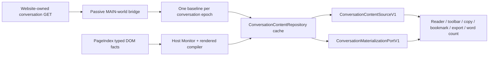

# ADR-0017: ChatGPT baseline and append-only content cache

## Status

Superseded on 2026-08-10 by
[ADR-0018](ADR-0018-chatgpt-identity-proven-single-content-pool.md). This file
remains a historical record of the earlier source-first and birth-route model.

## Context

ChatGPT's own conversation GET is the only practical way to recover a long,
virtualized conversation when the extension enters at `document_start`. The
DOM is the reliable source for a newly rendered turn after that GET, but it
usually contains only a window of the conversation. Re-reading bridge memory
for every DOM mutation was wasteful and left consumers with two competing
answers: the toolbar could see a new assistant node while Reader and word
count still saw the old snapshot.

The user-facing rule is simpler than the old evidence model: a message is
either not obtained yet or obtained and available. Streaming, debounce and
Markdown compilation are implementation details. Once a message enters the
maintained cache, later copies of the same message must not invalidate it.

## Decision

Use one page-scoped `ConversationContentRepository` as the ChatGPT content
Session and one public content path:

### Baseline

- The document-start bridge only observes and stores the website's own
  same-origin conversation GET. The extension performs zero conversation
  GET/POST requests and reads no cookie, token or authorization data.
- A canonical conversation identity opens one baseline gate for its epoch.
  The first matching graph in bridge memory seeds the cache. Later graph
  captures and consumer `refresh()` calls do not reopen or reread that gate.
- A graph whose active assistant is still being generated omits that assistant
  from the cache. The stable DOM turn later appends it. An all-generating graph
  produces no cache and remains unavailable until a real bridge capture or
  stable host fact arrives.
- A missed baseline is recovered only by the bridge's latest in-memory graph or
  one real future capture signal. There is no polling, retry timer or active
  network recovery.

### DOM increment

- `ChatGPTPageIndex` is the only ChatGPT `MutationObserver`. Character changes
  mark a dirty assistant identity; they do not read bridge memory or compile
  Markdown.
- `ChatGPTConversationHostMonitor` waits 400 ms after the last relevant host
  signal, then clones and compiles only dirty, typed, completed turns. A
  compiler failure, transient shell or missing anchor keeps that one identity
  dirty for a later lifecycle signal; it does not affect other messages.
- A new valid turn is appended to the cache. If the DOM predecessor is
  temporarily virtualized away, the current cache tail is the append anchor.
  If the order cannot be established, only that message is deferred.
- An `assistantMessageId` already in the cache is authoritative. A repeated
  DOM copy is an idempotent remount, even if its rendered text differs; it
  never replaces the cache body.
- Virtualization only changes materialization anchors. It cannot remove a
  cached message, change its ordinal or create a second toolbar.

### Blank-page first turn

- The monitor establishes `empty-proven` only from a complete typed-DOM scan
  with no user or assistant messages. It never infers emptiness from a domain
  or URL path.
- A host-born first turn is allowed only after real typed birth facts have
  crossed the temporary `/c/WEB:*` route (or an equivalent birth lifecycle
  fact) and then bind to the canonical conversation identity. A direct home →
  existing conversation transition must wait for its baseline, even if a
  local DOM window appears before the route callback.
- After the first stable host turn is compiled, it is an ordinary complete
  cache entry with `basis: host-born`; the toolbar and word count consume it
  through the same `readTurn()` path as a Graph-backed turn.

### Anonymous stable-URL boundary

The current decision covers canonical conversation epochs and the validated
blank-page birth path that crosses a temporary `WEB` route. It does not yet
enable a DOM-only cache for a logged-out page whose URL remains `/` or another
non-canonical route. Without a document identity, the current Repository
correctly remains unavailable rather than assigning a durable conversation ID
from a DOM ordinal, prompt text, or URL shape.

A future page-session extension must be designed as a separate, in-memory
scope. It may seed messages that are actually observed and stable in the DOM
when the Graph baseline is absent, then append later typed DOM messages. It must
also define a same-URL “New Chat” reset signal, keep virtualized unmounts from
clearing the cache, and prevent the synthetic scope from entering persistent
bookmark or cross-page navigation contracts. Until those seams and real-host
tests exist, anonymous stable-URL discovery is a known unsupported boundary,
not an implicit fallback of this ADR.

### Contract and consumers

- `ConversationContentStateV1` has only `idle`, `syncing`, `ready` and
  `unavailable`. A snapshot always has dense `coverage: "complete"` turns.
- `proof.basis` (`source`, `hybrid` or `host-born`) is diagnostic metadata. It
  does not decide whether a cached message is consumable.
- `authority: "host-rendered"`, `fidelity: "normalized"` and
  `producer: "rendered-content-v2"` identify compiler-verified DOM content.
- Reader, word count, whole-message copy, bookmark, Save Messages, export and
  toolbar actions all read the same Content Port. They may not read DOM text,
  bridge Graphs or infer order themselves.
- `SurfaceProjection` remains the separate selection/source join. Its
  `stale-content` and `stale-surface` results describe one selection or async
  operation, not the message cache.

### Scope and safety

- `projectionId` identifies the current page/document projection. Normal DOM
  appends do not create branch replacement projections; `contentToken` changes
  only when the maintained cache grows or the document epoch changes.
- Complex regeneration and full branch recovery are outside the core path.
  An observation that would rewrite an existing prefix is deferred while the
  already obtained cache remains usable.
- Formula, code, table and Deep Research handling stays in the existing
  adapter/compiler capabilities. A single unsupported turn may fail closed;
  it cannot poison the cache or trigger a second discovery path.
- Non-ChatGPT platforms retain their existing discovery lifecycle.

## Consequences

- One baseline read recovers long existing conversations without repeated
  bridge replay or extension requests.
- New messages become available through one controlled DOM append path, so the
  first-turn toolbar, later-turn word count, Reader, copy, bookmark and export
  converge on the same cache.
- Consumers no longer need `partial`, `stale`, gap, suffix replacement or
  branch-conflict semantics to decide whether an obtained message is usable.
- The only duplicated work left is intentional: Materialization tracks where a
  cached message is mounted, while Content tracks what that message contains.

## Verification

The focused gate must cover:

- one baseline read per epoch and no later Graph replay;
- generating-tail omission and stable DOM append;
- blank page → temporary `WEB` route → canonical route → host-born first turn;
- direct home → existing conversation waiting for baseline;
- duplicate assistant identity idempotency;
- compiler failure retry and virtualized predecessor absence;
- 1,000 mutations producing no pre-stable compile and at most one stable
  compile;
- official toolbar preservation and numeric word count through the real entry;
- shared Reader/copy/bookmark/export counts;
- Chrome object and Firefox JSON transport parity;
- zero extension conversation requests and no credential access.

`npm run test:chatgpt-discovery`, the repository test ladder, `npm run
type-check`, `npm run perf:chatgpt`, `npm run build` and `git diff --check` are
required. Installed Chrome and Firefox acceptance remain separate host-level
evidence.
