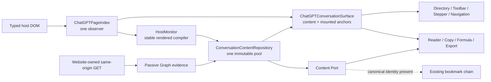

# ADR-0018: ChatGPT page identity, single content pool, and atomic Surface

## Status

Accepted and implemented on 2026-08-10; implementation structure was closed on
2026-08-11. This ADR supersedes the ChatGPT lifecycle/projection portions of
ADR-0005, ADR-0007, ADR-0009, ADR-0011, ADR-0013, ADR-0014, ADR-0015, and
ADR-0017. ADR-0011 remains authoritative for the provider-neutral Semantic
Content and source/surface proof contract only.

## Context

ChatGPT can expose complete history through a website-owned JSON Graph while
mounting only a small DOM window. A newly completed message can also exist in
typed DOM before that Graph is available, and an anonymous page can keep the
same URL for the whole conversation. URL shape therefore cannot decide whether
content exists, and Graph, DOM, consumers, and toolbars cannot own separate
content lifecycles.

The user-facing model is intentionally small: a message is either not obtained,
or it has entered the maintained pool and is immediately consumable. Streaming,
quiet-window debounce, compilation, and mounted/unmounted state are internal
facts, not weaker message states.

## Decision

ChatGPT production uses one Runtime lifecycle owner, one PageIndex observer,
one Repository message pool, and one atomic page Surface:

### Identity and page lifecycle

- Every Runtime starts with a unique in-memory page identity. Stable typed DOM
  rounds may establish a `host` pool under that identity even when the URL has
  no conversation ID.
- At the reusable Repository seam, no bound page document is `idle`, not an
  unsupported-route failure. ChatGPT production binds page identity before
  observation begins, so absence of a canonical URL token never makes obtained
  content unavailable.
- A canonical identity is a safe token after a semantic `c` or `conversation`
  path segment at any depth. `/c/:id`, `/conversation/:id`,
  `/g/:gptId/c/:id`, and future prefixed variants share this rule;
  `/g/:gptId` alone is not a conversation.
- URL and conversation ID bind identity, passive Graph evidence, and
  cross-page navigation. They never prove content, emptiness, login state, or
  whether a DOM message may enter the pool.
- Page identity to canonical identity is an identity promotion. Existing turns,
  projection ID, bodies, and content token remain unchanged. Canonical A to B
  creates a new projection, aborts old asynchronous work, clears old staging,
  and opens B's one baseline gate.
- Query/hash changes with the same identity do not create an epoch. BFCache and
  same-document root replacement retain the pool and rebuild mounted Surface
  facts. A hard refresh creates a new Runtime and page epoch.
- On an ID-less page, a new projection is created only after maintained typed
  surfaces have clearly disappeared and a later real generation signal starts
  a new first round. Ordinary virtualization cannot reset the pool.

`ChatGPTConversationContentRuntime` owns initialization, identity
synchronization, PageIndex facts, Graph capture, `pushState`, `replaceState`,
`popstate`, `hashchange`, and `pageshow`. Every signal synchronizes identity
before Repository admission. There is no polling RouteWatcher and no synthetic
navigation event.

### Passive Graph baseline

- The MAIN-world bridge observes only successful website-owned same-origin
  `GET` responses. It never observes POST, generation request bodies, SSE,
  resource timing, cookies, tokens, or authorization data, and never initiates
  a request.
- The decoded response URL must carry the current canonical conversation token
  exactly in a path or query value. The response must be JSON, and a bounded
  traversal (depth 4, at most 256 objects) must find a Graph-shaped
  `mapping + current_node` payload.
- A declared payload conversation ID must match. The active parent chain,
  roles, message IDs, and complete user/assistant rounds must validate before
  capture.
- The Repository consumes at most one accepted Graph per canonical epoch.
  `peek` reads bridge memory only; refresh does not replay it or reopen the gate.

### Monotonic content pool

- Graph first establishes the source pool. Stable DOM messages with new
  assistant identities append afterward.
- DOM first establishes a `host` pool immediately, including the first message
  on an ID-less page. A later Graph may prepend only the history before a
  reliably overlapping identity. It cannot overwrite an obtained body.
- No overlap, identity conflict, invalid structure, or conflicting order causes
  the late Graph to be ignored. Baseline failure cannot demote a host-ready pool.
- An obtained assistant identity is authoritative and idempotent. A different
  assistant identity may be a new tail message. One stable DOM batch is ordered
  from the maintained pool tail and publishes at most one new content token.
- Character mutations only dirty assistant identities. Admission requires a
  complete typed user/assistant pair, non-streaming state, a non-empty body, a
  400 ms quiet window, and successful semantic compilation. An official action
  anchor, an observed generation end, or a later typed round is a strong
  completion signal. When none is available, a second 1,600 ms quiet
  confirmation (2,000 ms total) provides a bounded compatibility path for
  delayed or absent action rows. The official action anchor remains required
  for toolbar placement, not for content admission.
- PageIndex carries generation start/end across mutation batches and reports an
  assistant identity replacement only when one stable mounted owner changes
  identity. It does not require a complete turn to be born in one mutation.
- A unique mounted copy of the maintained pool tail is the primary local order
  anchor. A candidate after it may append. If that tail is unmounted, a real
  generation start or a same-owner replacement of the maintained tail may
  anchor a candidate to the cached tail. A candidate rendered before the unique
  tail, or beyond an unresolved typed gap, is deferred rather than guessed.
- Persistent-slot hydration and assistant-only remounts are Surface facts, not
  new content. Root replacement fences in-flight compilation and clears
  transient generation/replacement evidence before the new root is rescanned.
  None of these events changes the content token by itself.
- `coverage: complete` means every admitted turn has a complete dense body. It
  does not claim recovery of history that appeared in neither Graph nor DOM.
  `proof.basis` (`source | hybrid | host`) is diagnostic and never gates use.

### Atomic Surface and consumers

`ChatGPTConversationSurface` is the only production join between Repository
content and current PageIndex anchors. It owns no message body and creates no
observer. Its frame contains:

- `obtained`: canonical turns, with an optional current materialization;
- `pending-surface`: a mounted assistant whose complete body has not entered
  the pool, usable only for pending toolbar lifecycle;
- an obtained turn with no materialization, which remains available to
  content consumers but is currently unmounted.

The compatibility `ConversationMaterializationPortV1` is projected from the
same frame and is not a second state store.

The former Discovery Coordinator, Conversation Index, and standalone
Conversation Materialization modules are deleted. Runtime owns signal order,
Repository owns obtained content and order, PageIndex owns host facts, and
Conversation Surface owns the only Content-to-DOM join. Tests and consumers may
not recreate those layers as compatibility fixtures.

- Directory, Toolbar, and Stepper subscribe only to the Surface in production.
  Directory reconciles entries and visibility together; Toolbar observes a
  pending surface without touching the host action row, then mounts once the
  obtained turn and connected official anchor agree; Stepper uses obtained
  order and current geometry.
- Directory, Stepper, and message-toolbar hosts carry one shared Surface
  consumer marker. If ChatGPT hydration removes one of those extension-owned
  hosts, the existing PageIndex observer emits a Surface-only lifecycle fact
  and the owning consumer reconciles from the current Frame. This recovery
  neither creates another observer nor changes message content.
- Character-stream mutations remain Host Monitor input only. A content-only
  mutation does not rebuild the Surface or rescan PageIndex topology; the
  Surface publishes when materialization changes or the stable body commits.
- Reader, whole-message copy, word count, formula resolution, and export use the
  same canonical turns from the Content Port. They never reconstruct a second
  body from consumer DOM.
- Native-page local Markdown copy uses the separate semantic
  `SurfaceProjection` proof: current Range, typed identity, canonical Markdown,
  and projection/content/surface tokens. Identity promotion alone preserves
  those tokens; content change or DOM remount invalidates the operation.
- No canonical ID does not block Directory, Stepper, Toolbar, word count,
  Reader, copy, formula, or export.
- Same-page navigation is fenced by Surface projection identity, not URL text.
  An unchanged URL can continue receiving new DOM turns; a query/hash or route
  text change that leaves the projection unchanged does not cancel local work.

### Bookmark boundary

This decision does not change bookmark types, storage fields, keys, migration,
protocol payloads, import/export, or compatibility behavior.

- The existing bookmark chain runs only when the current document has its
  required canonical conversation ID and URL.
- Without that identity, bookmark controls are unavailable, bookmark
  preparation returns no value, and no save/remove request or incomplete
  bookmark object is produced.
- Identity promotion causes the next Surface reconciliation to re-enable the
  existing bookmark chain. It does not rebuild content or change content tokens.

## Safety and capability boundary

- Extension-initiated conversation GET/POST count is always zero.
- The chain does not read Cookie, Token, Authorization, request bodies,
  generation streams, or React/private host stores.
- It does not auto-scroll to force virtualized history to mount.
- Content visible in neither a validated passive Graph nor a stable typed DOM
  round remains not obtained; the system does not invent it.
- Shared Links, Temporary Chat, and recovery after enabling the extension in
  the middle of an already loaded hidden history remain outside this decision.
- Non-ChatGPT adapters keep their existing local lifecycle.

## Consequences

- First messages, later messages, anonymous stable-URL conversations, normal
  `/c` routes, and `/g/.../c` routes use the same pool and consumer semantics.
- Long virtualized history can still be recovered without mounting when a
  trusted website Graph was passively observed.
- Consumer visibility, word count, and toolbar state are driven by one atomic
  frame, preventing independent callback order from hiding or degrading UI.
- The architecture remains bounded: one network evidence adapter, one DOM
  monitor, one content pool, one Surface frame, and existing consumer ports.

## Verification

The focused gate covers route generality, arbitrary same-origin GET paths,
bounded Graph validation, Chrome object and Firefox JSON transport, Graph-first,
DOM-first, late prefix merge, ID-less first messages, identity promotion,
canonical switching, same-URL new sessions, 1,000 streaming mutations,
virtualization, root/BFCache refresh, official toolbar safety, formulas, code,
tables, Reader, copy, export, and the no-ID bookmark boundary.

Required automated commands are `npm run test:chatgpt-discovery`,
`npm run test:core`, `npm run test:smoke`, `npm run test:acceptance`,
`npm run perf:chatgpt`, `npm run type-check`, and `npm run build`. Installed
browser acceptance remains separate evidence.
