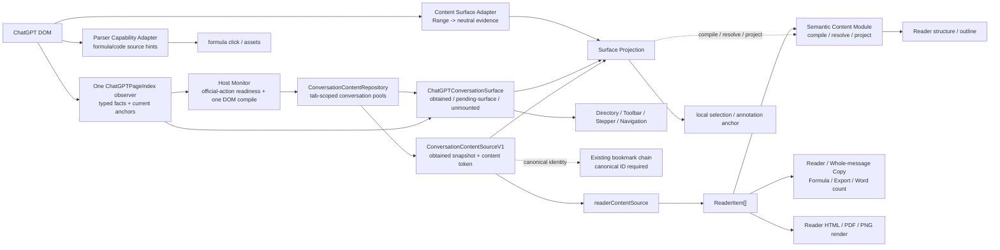

# Architecture Blueprint (To-Be)

本文定义 AI-MarkDone 的目标架构蓝图，用于指导当前主线代码的持续演进。蓝图的目标不是复刻旧实现，而是把边界做成可执行的契约，并让模块能并行演进、互不干扰，且更符合 MV3 的可审计/可恢复要求。

> **Active ChatGPT production seam:** the official completed-message action
> row wakes one DOM reconciliation, rendered DOM is the only body authority,
> and the Repository retains every eligible message loaded in the current tab.
> Pools are keyed by conversation so SPA navigation can switch and restore
> them until a full page reload. A turn in the pool is consumable; streaming,
> short coalescing and compilation are internal timing.
> `ConversationContentSourceV1` remains the only consumer content port.
> `ChatGPTConversationSurface` is the only production join between that pool
> and the current PageIndex anchors. See
> [ADR-0024](../adr/ADR-0024-chatgpt-dom-authoritative-content-pool.md).

> **Virtualized surface projection:** a mounted assistant response may outlive
> its user prompt in the DOM window. The shared Page Monitor keeps that fact as
> an assistant-only materialization projection keyed by `assistantMessageId`.
> It can restore toolbar and viewport geometry for a message already present in
> the canonical cache, but it never admits content, changes order, or creates a
> second discovery/cache path.

> **Page-scoped identity for stable URLs (current production)**
>
> Every Runtime creates one in-memory page identity before a canonical
> conversation ID exists. Stable typed DOM rounds publish immediately to the
> same `ConversationContentRepository`, including logged-out pages whose URL
> never changes. A later canonical identity promotes that projection without
> recompiling or changing its content token. Page identity is never persisted or
> used for cross-page navigation/bookmarks. Virtualization alone preserves the
> pool. The system never claims hidden history that was not loaded into the DOM
> during this page lifecycle.

重写总纲见：

- `docs/rewrite/PROGRAM.md`
- `docs/rewrite/FEATURE_PARITY.md`

---

## 1. 核心原则（以 MV3 哲学为基准）

- 最小权限：敏感能力（存储写入、网络、跨 tab 广播）集中在可审计的边界
- 组件隔离：content / background / extension pages 通过明确协议协作
- 可恢复：MV3 service worker 可被回收，关键状态必须可恢复，操作应幂等
- 契约优先：接口/协议是协作面，禁止跨层互相 import 具体实现

---

## 2. 总体框架（二维结构）

扩展天然存在“运行时组件边界”，同时我们需要“逻辑分层”。建议采用二维框架：

### 2.1 运行时组件（Runtime Components）

- Page Side（Content Script）：负责页面 DOM 交互与 UI 注入
- Background Side（Service Worker / background script）：负责副作用能力中心
- Extension Pages（unsupported popup / Detached Reader）：承载宿主外的用户界面；设置继续由 Bookmarks Settings surface 持有
- Image Export：消息图片由 content-side 闭合 profile 与分段栅格化 driver 负责；authoritative TeX 公式资产由按需 extension page iframe 负责；两者都不持有交付副作用

### 2.1.1 前后端分离定义（Extension Frontend vs Backend）

为避免“浏览器扩展只有前端”的误区，这里给出项目内的明确术语约定：

- **扩展前端（Frontend）**：Content Script + 页面内 UI（Shadow DOM/overlay）+ Extension Pages + 隔离的 Export Renderer
  - 负责：与页面交互、采集数据、呈现 UI、收集用户意图
  - 禁止：成为敏感副作用的权威执行者（例如任意写存储/任意网络/跨 tab 广播）
- **扩展后端（Backend）**：Background（Chrome MV3 service worker / Firefox MV2 background）
  - 负责：作为“能力中心（capabilities hub）”执行敏感副作用，并提供可审计的统一入口
  - 特别强调：MV3 service worker 可被回收，后端逻辑必须事件化、可恢复、可重放/幂等

### 2.2 逻辑三层（3-Layer Logical Architecture）

把“层数减少”落到可执行边界：

1) **UI 层**
   - 只负责：渲染、交互状态、事件绑定、把用户意图发给 Service
2) **Service 层（用例编排）**
   - 分为：
     - `pure/domain service`：统一操作逻辑（跨站一致），不触碰 DOM/存储写入细节
     - `content-facing feature service`：允许处理 DOM clone、parser node、content fragment，但不得直接持有 host selector、runtime wiring、UI shell
3) **Driver 层（适配/基础设施）**
   - 只负责：站点适配、DOM 采集与注入、Browser API、存储/网络/权限等基础设施

补充：Driver 并非“只存在于 content”，而是跨 runtime 的基础设施层：

- Content runtime 的 driver：adapters/observers/injectors/datasource
- Background runtime 的 driver：storage/network/tab routing/permissions（capabilities）

关键点：三层是“依赖规则”，不是“目录名字”。同一 runtime 内可同时存在 UI/Service/Driver，但依赖方向必须单向可审计。

---

## 2.3 闭环链路（Self-Contained Closed Loops）

“自闭环”的标准：每条用户可见能力都能在**清晰边界**内完成输入、执行、持久化、恢复与回归验证；并且任何站点差异只影响 driver，不影响 service 与 UI。

### 2.3.0 ChatGPT content discovery lifecycle

ChatGPT content follows one page-scoped session with two typed inputs, one
content port and one atomic page Surface:

`ConversationContentSourceV1` remains the stable content interface. The route
Adapter owns generic route-token identity. The Host Adapter owns selectors,
official-action readiness, streaming state and rendered semantic carriers.
`ConversationContentRepository` is the single production owner of tab-local
conversation pools, projection tokens and snapshots. Consumers neither read
ChatGPT payloads nor compile their own DOM body source.

`SemanticContentModuleV1` is provider-neutral and browser-independent. It accepts canonical Markdown and emits one immutable AI-MarkDone model, UTF-16 half-open source spans, Reader structure, plain text, and canonical Markdown projections. Parser libraries remain implementation details. `ContentSurfaceAdapter` keeps DOM/Range/selector knowledge in the driver and emits only typed target, content/materialization/surface tokens, and TextQuote evidence. `SurfaceProjection` is the only source/surface join. Source-backed and compiler-verified `host-rendered` Markdown already in the cache may produce a local canonical selection; ambiguous, stale, reconstructed, cross-message, streaming, or unproven mappings fail open instead of estimating offsets or reconstructing Markdown from DOM.

`ChatGPTConversationSurface` atomically joins the immutable pool with the
current PageIndex facts. Directory, Toolbar and Stepper subscribe only to this
Frame. Its compatibility `ConversationMaterializationPortV1` projection answers
where a typed turn is currently mounted without maintaining another state
store. The same PageIndex observer classifies removal of a marked
extension-owned Directory, Stepper, or Toolbar host as a Surface-only lifecycle
fact, so the consumer can reconcile from the current Frame after ChatGPT
hydration without a private observer. Pure character-stream mutations do not
rebuild the Surface or rescan topology; they remain dirty Host Monitor input
until a stable content commit or real materialization change. Formula source
recovery is a parser-Adapter capability; authoritative
semantic attributes/annotations can enter the TeX path, while visual glyph text
remains `dom-only` compatibility evidence.

The active lifecycle is signal-driven and owned by
`ChatGPTConversationContentRuntime`: initial synchronization, PageIndex facts,
History `pushState`/`replaceState`, `popstate`, `hashchange`, `pageshow`, document
`resume`, and visible-page wake. These signals share one short page-level
reconciliation. A page identity exists immediately and promotes to a canonical
conversation key when the URL gains one. SPA navigation switches the active
Repository pool; it does not delete other pools in the same tab. `refresh()`
only waits for already observed local work. There is no extension conversation
GET/POST, response bridge, polling, retry ladder, second content observer, or
content RouteWatcher. Full rationale is recorded in
`docs/adr/ADR-0024-chatgpt-dom-authoritative-content-pool.md`.

### 2.3.1 扩展启动闭环（Boot）

1. Content 入口启动（Page runtime）：选择 adapter → 读取 settings → 注入 UI → 绑定 observers
2. Background 启动（Background runtime）：host gating/action 状态更新 → 接收 content intent → 执行副作用
3. 两端通过 protocol handshake（version/ping）确认“协议可用”

### 2.3.2 Reader 闭环（预览/复制/发送）

1. Driver 在官方完成工具栏出现且消息不再生成时，把当前渲染 DOM 适配成 typed evidence；`ConversationContentRepository` 按 conversation key 维护标签页内纯内存池并发布 V1 partial snapshot；`readerContentSource` 是唯一 `ReaderItem[]` 投影。相同 assistant identity 的相同正文幂等忽略，变化正文以最新 eligible DOM 更新，虚拟化移除不删除已获得内容；`readTurn()` 支持按目标身份直接读取，消费者不能拥有第二套恢复链路
2. Service 通过 Semantic Content Module 编译稳定语义、source spans 与 Reader structure；HTML/KaTeX/highlight/sanitize 属于独立 Render Module。预览、复制、书签、导出只能选择 projection/policy，不能各自重新解释宿主 DOM
3. UI 只负责呈现与交互（分页/复制/打开浮层/触发发送）
4. 副作用（写书签、写设置、网络等）通过 Background 执行并返回结果

Detached Reader 是 Reader 闭环的跨 runtime 形态，而不是第三套 Reader：

1. ChatGPT content runtime 仍通过既有 `readerContentSource` 投影当前已发布 snapshot 的 `ReaderItem[]`；普通打开命中 snapshot cache，显式 Reader Refresh 也只冲刷已观察到的本地 DOM 工作，不触发网络获取
2. Background 只持有 `sessionId + sourceTabId + readerTabId` 路由与可恢复快照，不理解 ChatGPT 正文结构
3. Extension page 复用 ReaderPanel、Reader settings surface、Markdown rendering、bookmark、copy/comment/Sticky/prompt 与 conversation Reader action service；发送弹框必须复用同一个 tokenized SendPopover，通过完整 SendPort contract 在 content adapter 与 detached reader-session bridge 之间切换：draft 读写走 `readerSession:draft`，发送前准备走 `readerSession:beforeSend`，真实提交走 `readerSession:send`，不得退回 `window.prompt` 或一次性原生弹框
4. Reader header refresh 必须复用同一条 fresh Reader source：官网内 Reader 直接刷新，detached Reader 通过 `readerSession:refresh` 回源 content runtime 刷新；draft/beforeSend/send/locate 同样继续回源执行，不能在 extension page 直接操作 ChatGPT DOM；detached send 会在转发前 best-effort 激活源 ChatGPT tab 后调用官方 composer 发送链路，detached locate 必须激活源 ChatGPT tab 并定位目标消息，但不得关闭 detached Reader tab
5. 首次打开的实验性说明属于用户意图确认边界，必须复用现有 modal/notice family，不新增孤立提示框组件
6. Reader 专属配置由 Reader 内 settings dialog 拥有；Settings 页面不再承载 Reader rendering、Reader typography、Reader prompt/template 或 Reader presentation 控件
7. Reader panel resize 只保存相对于 viewport 的比例，viewport 变化后由 Reader surface 自己重算并 clamp；调用方不得传入 CSS 或绝对几何值覆盖 shared Reader
8. Reader visual assets 由 Reader surface 自己持有：Markdown/KaTeX layout CSS 注入 Reader Shadow DOM，KaTeX `@font-face` 在 document 层注册；detached extension page 不得依赖 ChatGPT 宿主页面已有的公式字体或样式

### 2.3.2.1 Reader 注释持久化闭环（v1）

Reader 注释是 Reader 正文的 source-bound sidecar，不是对话快照、Bookmarks 或独立笔记库的一部分：

1. ChatGPT Conversation Engine 提供已验证的 `conversationId`、assistant message identity 和 Reader document descriptor。
2. In-page Reader 与 detached Reader 通过同一个 annotation client 请求 background；两者不得各自拥有注释 `Map` 或直接写 storage。
3. Background repository 以每个 conversation 一个 `storage.local` bundle 为 canonical store；每次 mutation 只修改一个 bundle，不建立第二个持久化 index。
4. `reader.persistAnnotations` 只控制新建注释是否进入 canonical bundle；已有 durable 注释始终读取、展示并继续通过 background 更新/删除。关闭期间新建的 runtime-only 注释不自动迁移。
5. `storage.onChanged` 只触发重新读取；全局列表的搜索、会话分组和时间线排序属于 UI view-model。
6. 锚定只接受已校验的 DOM/atomic、TextPosition 或 exact TextQuote；歧义或失配保持记录并显示 `unanchored`。
7. 同一会话在当前 Reader 内直接定位；跨会话请求由 background 创建新 ChatGPT tab，待目标 tab 暴露相同 verified conversation identity 后再打开 Reader 并聚焦注释。

v1 的正式领域契约、排除项和失败语义见 `docs/adr/ADR-0006-reader-annotation-persistence.md`；实现协议已同步记录在 `RUNTIME_PROTOCOL.md`。

### 2.3.3 Bookmarks 闭环（保存/导入导出/恢复）

1. UI 收集意图（保存/删除/移动/导入/导出/批量操作）
2. Service 进行校验与拆分（幂等 key、判重策略、错误分类）
3. Driver 执行写入与监听（优先 Background 作为 write authority）
4. UI 仅消费“状态快照/事件”刷新（避免 UI 直写 storage）

### 2.3.4 Google Drive Backup 闭环（v1）

1. UI 只呈现 Settings → Data Management → Google Drive Backup，并通过 `cloudBackup:*` runtime protocol 提交连接、备份、列表、恢复预览、安全合并恢复等用户意图
2. Service 只编排用例：构建书签 snapshot、校验下载结果、生成恢复计划；不得持有 browser API、OAuth、provider token 或直接读写 extension storage
3. Background driver/provider 作为云端副作用边界：Google Chrome 以 manifest `oauth2` 作为 `chrome.identity.getAuthToken` 的 SSOT；支持 WebAuth 的浏览器环境使用 Web application OAuth client、`identity.getRedirectURL()` 和 `identity.launchWebAuthFlow`；Google Drive API、上传后回读校验、provider 错误映射都收敛在 background 侧
4. 本地书签写入继续复用 bookmarks 的 storage/index 与现有导入导出能力；Google Drive Backup v1 是用户主动触发的不可变 snapshot 备份/恢复，不会实时双向更新
5. 恢复必须先做安全合并预览；用户确认后才允许进入 background storage queue，并写入 pre-restore emergency snapshot
6. Build config 由 `config/extension/cloudBackup.ts` 与 `config/extension/chromeWebStore.ts` 驱动：Chrome/Chromium build 同时包含 Chrome Extension OAuth client ID、manifest `oauth2`、Web OAuth client ID、`identity` 与 Google host permissions；Google Chrome 使用 Chrome Extension client，WebAuth-compatible browser 使用 Web OAuth client；Chrome 默认注入 Chrome Web Store public key 固定 extension ID；Firefox 使用 Web OAuth client ID、`launchWebAuthFlow` 和 `identity.getRedirectURL()` 的实际返回值
7. OAuth client ID 是公开的应用身份，不是共享 Google 账号。Provider 不请求 `identity.email`，不把 refresh token/cookie/account id 写入 extension storage；账号展示只来自 Drive `about.get` 的邮箱、显示名与头像 URL 摘要。浏览器 identity cache 管理长期授权体验；provider 只把短期 access token 缓存在 extension local storage，过期前用于抗 service worker 重启。

### 2.3.5 Image Export 闭环（消息长图 + 公式资产）

1. UI 只保留当前消息 Copy PNG、Save Messages PNG、公式资产三个入口；入口不持有 HTML/CSS/renderer function，也不自行决定 Markdown、KaTeX、highlight 或分片算法。
2. 消息路径从当前 snapshot 的 `ReaderItem[]` 转换为 `ChatTurn[]`，再构建版本化 `ExportDocumentV1`；authoritative TeX 提交结构化 spec。`dom-only` source 不能跨 iframe 传递，因此只允许由 `renderFormulaAsset()` 背后的唯一 content-side compatibility adapter 消费。Markdown 文件导出保持现有 formatter，不因图片重构改变 canonical 内容语义；只有已经进入 cache 的完整消息才进入导出。
3. 消息路径在 content runtime 内由 `message-card-v1` 编译闭合静态 DOM，并进入同一个 `renderPngBlob()`；它不依赖 iframe handshake。authoritative 公式资产才通过 lazy `export-renderer.html` iframe、私有 `MessageChannel` 与 scheduler 执行；启动期不得加载两条路径的重模块。
4. 消息 profile 自持 Markdown、highlight、KaTeX 与静态图片规则，不复制宿主计算样式；content driver 按消息 section 和 Markdown 顶层 block 分段栅格化，公式 renderer 只处理结构化公式 spec。两条路径都不读 storage、不联网。
5. 消息 PNG 优先生成一张长图；最终 Canvas 超过 16,384px 单边或 24,000,000 pixels 的保守预算时自动降低 effective ratio，以稳定产出为先。代码、表格和 display formula 必须在导出宽度内换行或等比收敛，不得以横向滚动区域进入图片。
6. authoritative TeX 的 SVG/PNG/MathML 共享同一 MathJax 语义资产；`dom-only` 只允许兼容 PNG，SVG/MathML 返回 `SOURCE_UNAVAILABLE`。公式 PNG 保持单图，可等比降低到 1x 以下，SVG 保持无损出口。
7. Content driver 继续独占 clipboard 与 download 交付；Chrome 与 Firefox 共用同一消息 profile/content renderer 与公式 host/DOM compatibility adapter，不新增 offscreen document、background renderer、权限、服务端或远程资源代理。

---

## 3. 契约（Contracts）与可审计边界

### 3.1 Runtime Message Protocol（Content ↔ Background）

目标：把 runtime message 从“散落常量/弱类型对象”升级为“版本化协议”。

协议最低要求：

- `v`：协议版本
- `id`：requestId（用于追踪、幂等、日志）
- `type`：消息类型（枚举）
- `payload`：可序列化数据（禁止 DOM/函数/类实例）
- `result`：`ok` + `errorCode` + `data`（统一错误码）

对应权威文档：

- `docs/architecture/DEPENDENCY_RULES.md`（协议文件只能在 contract 层）
- `docs/architecture/RUNTIME_PROTOCOL.md`（当前协议语义与错误模型）
- `src/drivers/content/adapters/base.ts`（适配器源代码契约）
- `docs/architecture/CURRENT_STATE.md`（当前适配器与平台边界）

### 3.2 Site Adapter Contract（站点差异收敛点）

目标：站点差异只能存在于 adapter（driver）实现里，Service 层不感知 DOM 选择器，也不按 platform id 分支选择 parser 实现。

补充约束：

- Adapter 按 capability 拆分，不把所有站点知识堆进一个浅层 `SiteAdapter`：Content Source Adapter 负责 provider payload/dialect/provenance；Content Surface Adapter 负责把 DOM Range 转为中立 evidence；Markdown parser Adapter 负责公式/代码等宿主语义源码提示。三者输出稳定 Interface，任何一个都不能直接产出某个 UI consumer 的最终行为
- `SemanticContentModuleV1` 只能依赖 provider-neutral contract 和纯 parser library；不得 import driver/UI/runtime，不得出现 DOM/browser global/platform id/host selector。它必须输出项目自有 immutable model，不把 mdast/hast 作为跨模块 contract
- `SurfaceProjection` 是唯一同时依赖 canonical content contract 与 surface evidence contract 的 service seam；它校验 content/materialization revision，交互 controller 必须在复用 snapshot 前重新采样并比对 surface token、Range 与 TextQuote。UI、Reader、copy、bookmark、export 与 annotation 不得私自 join DOM selection 和 source Markdown
- `coverage` 与 source quality 必须分离。`host-rendered/normalized` 不冒充 provider 原始源码，但 compiler 校验并封存后属于可消费的 canonical Markdown：可以进入 Reader、整条 Copy、Bookmark、PNG/PDF/Markdown export、词数，以及由当前 typed surface 唯一证明的局部 Markdown 复制。`reconstructed` 仍只能用于明确标记的降级展示，不得进入这些 canonical output 或持久 annotation source success path

- 页面级入口必须由 AI-MarkDone 自有 surface 承载，不得为入口修改宿主页面 header 的内部 DOM；若未来新增宿主锚点，相关 DOM 差异仍必须收敛在 adapter 契约内
- 页面注释入口只在 UI controller 内编排选区工具条、Reader 注释 builder、Prompt autocomplete seam 与页面管理器；selection frame 由 `ChatGPTPageSelectionCoordinator` 唯一提供，拖选期间不做语义水合。普通注释插入传空 `userPrompt`，Prompt 右方向键才把候选 Prompt 交给 Reader `buildCommentsExport`；页面管理器不重复实现 Reader 的批量复制/删除。
- ChatGPT conversation group discovery、turn root、conversation root、streaming 判定同样属于 adapter/driver 契约的一部分；UI/controller 只能消费已经抽象好的 structural refs，不得在 UI 层按 ChatGPT selector 重新推导轮次、正文或 identity
- `ConversationContentRepository` / `ConversationContentSourceV1` 是 ChatGPT semantic SSOT；`readerContentSource` 是唯一 `ReaderItem[]` 正文投影，分别提供无副作用的当前读取和只等待/返回已观察 DOM 工作的显式 `refresh()`。Repository 从页面启动即持有 page identity，并在当前标签页内按 conversation key 保存多个纯内存池；官方 action row 出现且 assistant DOM 非空、非生成中时，Host Monitor 按消息 ID 写入。canonical identity 后到只 promotion，不重建 projection、正文或 content token；SPA 切换只切换 active pool，虚拟化移除不删池，页面刷新自然清空。`resolveChatGPTReaderStartIndex()` 是唯一语义起始位置规则。工具栏词数与 Reader binding 只被动读取；Copy/Reader open/Save Messages 只读取当前 snapshot，公式动作直接读取公式 DOM。书签命令只有在当前 canonical ID 和 URL 完整时沿用既有链路；无 ID 时不准备、不保存、不构造不完整记录。任何 UI/controller 都不得启动内容获取或构造 ChatGPT Reader items
- 官网 conversation Reader 只由 `ChatGPTConversationReaderBinding` 订阅 source state；cache 新增消息时追加，已有 typed identity 保持权威，没有 snapshot 时关闭 Reader。Save Messages 以 projection/content token 失效；延迟书签事务继续使用既有 canonical conversation identity 与 content token，且 token 不进入持久 schema
- `ChatGPTPageIndex` 只按宿主 DOM revision 缓存当前 connected anchors 和 typed host facts；虚拟化只挂载 assistant response 时保留 assistant-only surface projection，并以 `assistantMessageId` 回接既有 obtained turn，不把它当成新的正文或轮次。`ChatGPTConversationSurface` 以 V1 snapshot 的完整顺序为事实，并以 typed identity 原子连接 complete group、assistant-only surface 与 pending host anchor；它是 Directory、Toolbar、Stepper 和同页 Navigation 的唯一生产页面投影。兼容 `ConversationMaterializationPortV1` 从同一 Frame 派生，不维护第二份状态。已挂载 assistant message element 的唯一 `data-message-id` 直接对应 `assistantMessageId`，不得因 wrapper/turn ID 漂移而失配；无直接身份时才使用 materialized containment，歧义必须 fail closed。DOM window replacement 不得改变 obtained count；PageIndex 必须忽略 AI-MarkDone 自有节点和 `data-aimd-*` bookkeeping。Directory active geometry 优先使用完整 user/assistant group；只有已缓存 assistant 的 assistant-only projection 时才使用 assistant root 的真实范围。pending toolbar anchor 只服务 UI 状态，不能伪造正文
- 旧 `ChatGPTConversationDiscoveryCoordinator`、`ChatGPTConversationIndex` 与独立 `ChatGPTConversationMaterialization` 不属于兼容层，而是已删除的重复所有权。长期结构不得以测试 helper、UI fallback 或导航适配为名恢复它们；Runtime、Repository、PageIndex、Conversation Surface 四个 owner 足以覆盖 lifecycle、content、host facts 与唯一 join
- Off-screen navigation 应以经过 typed-anchor 校准的宿主持久 turn slot 为主路径，不得把 canonical position 直接换算为全局 scroll ratio，也不得依赖 React/Fiber、私有 virtualizer 或宿主数字 test id。校准成功后必须在 bounded budget 内复用同一 target slot，直到 exact identity anchor materialize；不得中途退回像素探测。只有没有可信 slot topology 时才可运行 compatibility seeker，且 exact connected identity 与稳定 alignment 仍是唯一成功条件。正常点击不得因此新增全页 observer、常驻 timer 或重复 slot scan
- ChatGPT 稳定态性能优化所需的重子树结构提示（如 KaTeX / code-heavy subtree refs）同样属于 adapter/driver 契约；UI/controller 只能消费 adapter 返回的结构化 hints，不得自行扩张宿主 selector 集合
- runtime 只允许持有平台无关的生命周期编排器（如 toolbar orchestrator），不得在入口层写平台选择器
- ChatGPT 工具栏不得持有自己的 `MutationObserver` 或独立 route reset；它只订阅共享 `ChatGPTConversationSurface`。`pending-surface` 只能呈现不改动官方 action row 的等待状态；`obtained` 以精确 assistant identity 挂载，并通过 `readTurn()` 取得数值词数和正文操作。无 canonical ID 时仅禁用书签 action，其他正文动作照常可用；identity promotion 后同一 reconcile 原位恢复书签。非 ChatGPT 平台暂时保留原 DOM-local toolbar lifecycle
- `ChatGPTPageIndex` 是 ChatGPT 唯一 Page Monitor。逐字符 mutation 只标记 dirty assistant identity；结构、身份、generation start/end、同 owner assistant identity replacement、action anchor、conversation root replacement 或 BFCache 信号触发必要的 snapshot/materialization 工作。Host Monitor 必须跨分批 hydration 累积这些事实，以唯一挂载的缓存尾部作为首选顺序证明；尾部未挂载时只接受 generation start 或缓存尾部同 owner replacement 的锚定。位于可见尾部之前、跨未解析 round 或顺序歧义的候选必须暂缓。正文 admission 在 400 ms 安静窗口后接受 action anchor、generation end 或后续 typed round 任一强完成信号；三者缺失时使用总计 2 秒的有界安静确认。官方 anchor 仍约束工具栏挂载，但不是内容入池硬条件。root replacement 必须 fence 旧编译并清除瞬态 generation/replacement evidence。扩展自有节点与无关 churn 必须过滤，稳定编译前不得全量重扫或读取 Bridge
- 同一 content runtime 内的 route-aware controllers 必须共享底层 URL poll/event hub，不得各自创建长期 timer；formula interaction 必须共享 document observer、按 enabled container 过滤 mutation，并让相同 gate 的 settings update 保持幂等
- 当前消息 Reader item cache 只允许在同一消息 revision 内服务多个用户动作；可归属 mutation 精确失效该消息，消息集合/顺序、route 或 dispose 失效整个 cache
- manifest content entry 必须保持轻量 classic startup graph；Reader、Bookmarks、Save/Bookmark dialogs 与 Copy PNG 通过 typed ports 延迟到真实用户动作。动态模块地址只能由 `browser.runtime.getURL()` 从固定 asset contract 生成，功能 facade 必须继续按 surface 分段加载，并与 detached Reader 共用构建图，避免把重型 renderer 重复打包或重新带回页面启动路径

契约位置：

- `src/drivers/content/adapters/base.ts`
- `docs/architecture/CURRENT_STATE.md`

### 3.3 Storage Contract（单一写入路径）

目标：把“写存储”收敛为可审计路径，减少竞态与恢复复杂度。

建议策略（待在重构阶段确认）：

- Background 作为“写入权威（write authority）”
- Content/UI 只提交 intent，不直接写入敏感存储

### 3.4 Export Renderer Contract（Content ↔ Extension Page）

目标：为 authoritative TeX 公式资产提供版本化、可取消、可分块交付的隔离渲染边界，同时避免把二进制塞进 background runtime protocol。消息图片的 SSOT 是 `ExportDocumentV1` 与 `message-card-v1`，但生产栅格化留在 content-side driver，不经过该协议。

- 公式生产调用只允许 `start(jobId, formula-asset)` 与 `cancel(jobId)`；协议中保留的 `message-png` capability 不是当前消息导出主链
- 事件固定为 progress、artifact-start、零基连续 artifact-chunk、artifact-complete、failed；二进制必须用 transferable `ArrayBuffer`
- 同一 artifact 的 metadata、chunk sequence、part number/count 必须严格连续；未知版本、乱序、重叠 completion 或不稳定错误码属于 protocol failure
- Host client 负责队列、生命周期、一次重建重试、取消与 bounded cache；renderer runtime 负责 capability dispatch 与纯渲染，不得反向拥有 clipboard/download/storage/network
- `ExportDocumentV1` 与 `message-card-v1` 是消息图片语义/样式 SSOT；service 不得绕过 profile 传入 HTML、CSS 或自定义 renderer，content driver 只消费 profile 结果
- 公式 source confidence 是资产正确性边界；只有 authoritative TeX 能请求 SVG/MathML，DOM compatibility 不得被扩张为默认公式主链
- 详细可执行门禁见 `docs/testing/IMAGE_EXPORT_GATES.md`

---

## 4. 目标模块边界（按功能域拆分）

重构后希望达到的“模块可替换边界”（不等同于目录）：

- Platform（Site Adapters）：选择器/主题探测/噪声过滤/normalizeDOM
- Reader（Preview/Panel）：仅消费 `ReaderItem[]` 与 Service 提供的数据
- Bookmarks：数据模型/迁移/导入导出/面板 UI（与 Reader 解耦）
- Parse/Render：parser v3 与 renderer 的纯逻辑能力
- Image Export：版本化语义文档、host protocol、message/formula capability、band planner 与 streaming encoder
- Settings：schema、迁移、默认值、cache、与 UI/Service 的边界
- Background Capabilities：storage/network/permissions/tab routing（intent 执行者）

---

## 4.1 当前代码到模块边界的映射

本节把蓝图映射到当前仓库中的可定位模块，避免边界只停留在抽象描述。

### UI 层（渲染、交互与 Surface 编排）

当前主要落点：

- 内容页组件与控制器：`src/ui/content/*`
- ReaderPanel UI：`src/ui/content/reader/ReaderPanel.ts`
- Bookmarks Panel UI：`src/ui/content/bookmarks/*`
- Appearance value/scope：`src/style/appearance.ts`、`src/style/appearanceScope.ts`
- Surface lifecycle：`src/ui/content/components/SurfaceRuntime.ts`
- 通用 overlay lifecycle：`src/ui/content/overlay/*`
- 通用 chrome、motion 与输入样式：`src/ui/content/components/styles/*`
- token 与 ShadowRoot style 注入：`src/style/*`
- Prompt workflow / geometry / rendering：`src/ui/content/prompts/*`
- Reader workflow / view-model / rendering / host adapter：`src/ui/content/reader/ReaderWorkflow.ts`、`ReaderViewModel.ts`、`ReaderRendering.ts`、`ReaderHostAdapter.ts`
- Bookmarks tab / Cloud Backup workflows：`src/ui/content/bookmarks/workflows/*`

Surface profile / motion ownership 规则补充：

- 同一个 named surface 一旦被 2 个以上入口复用，baseline chrome 必须由 surface 自己持有
- 入口只能选择 named `profile`，不能直接传 low-level chrome flags 或自定义 CSS
- `ReaderPanel` 当前就是这条规则的首个正式落点：
  - `profile` 负责 header/footer/action rail
  - Markdown body 视觉继续由 Reader 自己持有的默认正文主题负责
  - baseline chrome 与正文主题都属于 surface-owned contract，而不是 caller-owned override
- Reader 的 fullscreen/panel opening size 与 panel resize 都属于 `ReaderPanel` surface-owned state。调用方只能通过设置或命名 profile 选择语义，不得传 CSS、像素宽度或外部 layout override。Detached Reader extension page 的默认 presentation 是 fullscreen；半屏/panel 模式必须复用同一个 Reader shell 与 motion/focus 合同。
- shared overlay/modal surface 的 enter/exit motion 也必须由 surface 自己持有；caller 不得注入自定义 open/close motion
- `panel-window` family 与 `modal-dialog` family 可以拥有不同的共享 motion contract，但都必须使用 tokenized shared chrome CSS，而不是每个 surface 各自定义 keyframes
- 共享 surface 的 open-focus / restore-focus 也必须由 surface owner 持有并复用共享 lifecycle helper；不得只让 `ModalHost` 独占完整的焦点语义，而让其它 panel family 各自零散实现
- 同一 surface 在首次打开后，外层 shell/backdrop 必须保持 stable ownership；后续异步数据刷新只能更新内部内容区，不能通过重建外层 DOM 重新消费 opening motion
- Detached Reader 的首次实验性提示必须归入既有 modal/notice family，复用 tokenized chrome、focus restore、ESC/outside-click 语义和按钮样式；不能用 `window.confirm`、host page 原生 dialog 或自定义一次性 DOM。

### Service 层（统一用例编排，跨站一致）

当前主要落点：

- Bookmarks use cases：`src/services/bookmarks/*`
- Cloud Backup use cases：`src/services/cloudBackup/*`
- Copy / Reader / Export / Sending：`src/services/copy/*`, `src/services/reader/*`, `src/services/export/*`, `src/services/sending/*`
- Markdown parser / renderer：`src/services/markdown-parser/*`, `src/services/renderer/*`
- Settings use cases：`src/services/settings/*`

补充说明：

- `src/services/settings/*`、`src/services/bookmarks/*` 更接近 `pure/domain service`
- `src/services/cloudBackup/*` 属于 `pure/domain service` 的用例编排层：可复用 core/bookmarks 纯逻辑，但不得依赖 Chrome identity、Google Drive provider、browser storage implementation 或 UI
- `src/services/copy/*`、`src/services/reader/*`、`src/services/export/*`、`src/services/sending/*` 当前更接近 `content-facing feature service`
- `src/services/export/*` 持有 `ExportDocumentV1`、profile、预算/文件名 planner、host client 与交付编排；入口只提交语义数据，不得重新持有页面截图算法或 capability CSS
- `saveMessagesPdf.ts` 属于明确允许的导出例外：service 生成最终文档并消费样式 token

### Driver 层（站点差异与基础设施能力中心）

当前主要落点：

- Site adapters：`src/drivers/content/adapters/*`
- Injection / conversation / clipboard / theme / sending bridges：`src/drivers/content/*`
- ChatGPT 内容发现：`ConversationContentRepository` 持有唯一 V1 obtained snapshot，`ChatGPTPageIndex` 持有 connected anchors 与 typed host facts，`ChatGPTConversationSurface` 是唯一生产页面投影，`ChatGPTConversationNavigation` 负责 host-slot-first、bounded exact-identity materialization 与稳定 alignment；UI 不拥有宿主 selector、像素比例推算、第二套 join 或第二套定位算法
- Browser abstraction：`src/drivers/shared/browser.ts`
- Message image export：`src/services/export/messageCardProfile.ts` + `src/drivers/content/export/renderPng.ts`；Formula asset runtime：`src/runtimes/export-renderer/*`；content driver 继续持有 clipboard/download
- Background capabilities：`src/drivers/background/storage/*`, `src/drivers/background/cloudBackup/*`, `src/runtimes/background/handlers/*`
- Google Drive provider 属于 background-only driver；UI/service 只能通过 `src/contracts/protocol.ts` 与 background handler 间接触发

### Contracts（非“层”，是协作面）

当前落点：

- runtime protocol：`src/contracts/protocol.ts`
- platform contract：`src/contracts/platform.ts`
- storage contract：`src/contracts/storage.ts`
- formula export renderer protocol：`src/services/export/exportRenderHostProtocol.ts`（extension page 私有协议，不属于 content ↔ background runtime message）

---

## 5. UI Surface、样式系统与主题（统一管理）

合同：跨站 UI 外观一致、与宿主样式隔离、可主题同步、可审计（禁止硬编码、禁止 `!important`）。

权威规范：

- 设计与样式系统：`docs/design.md`

### 5.1 Appearance Token Runtime

- 内部 `AppearanceSnapshot` 是 appearance 传播的唯一值对象，由 `Theme + UserThemeOverrides` 组成并按值比较。settings 中与外观无关的变化不得触发 token 重写。
- `UserThemeOverrides` 只保留真实产品设置拥有的全局 appearance 值。Reader content width 与 Reader body font size 归 Reader state；未接入产品设置的 density/corner scale 不得继续作为伪全局合同。
- 内部 `AppearanceScope` 统一 page、ShadowRoot、light-DOM portal 三种 scope 的 token 生成、应用、缓存与释放；`getTokenCss()`、`getPageTokenCss()`、`ensureStyle()` 保持为底层兼容实现，不再由每个 controller 自行拼接 scope CSS。
- Reference、System、Public、Family、Private 五类 token 必须有唯一 owner。Reference 只能供 System 消费；Public 映射 System 或无环组合其它 Public alias；Family 由一个 UI family Module 暴露；单 Surface geometry 使用 `--_*`。
- token graph gate 覆盖 shipped CSS 和运行时 CSS template，阻止未定义引用、重复定义、循环依赖、未消费 Public alias、不可达 foundation token 与未登记的 Family token owner。删除 token 前必须证明定义图和消费图都不可达。
- page token 只生成 base-light 与 explicit dark override；不得保留内容相同的第二份 explicit-light block。
- 相同 `AppearanceSnapshot` 的 ShadowRoot 优先共享 constructed stylesheet；Firefox 等不支持路径继续使用稳定 style-tag fallback。

### 5.2 Surface Runtime

- 内部 `SurfaceProfile` 固定为 `panel`、`modal`、`anchored`、`inline` 四类行为族；产品 Surface 可以在族内声明具名 profile，但调用方不能传低层 CSS、motion 或 geometry flags。
- `ResponsiveProfile` 统一 viewport gutter、宽高 clamp、flip、collision、唯一 scroll owner 与窄屏降级。host selector 与 anchor rect 仍由 Platform Adapter 提供，Surface Runtime 不读取站点私有 DOM。
- `SurfaceMotionProfile` 是 CSS animation 与 JS delayed-unmount timing 的共同数据源，并内建 reduced-motion 语义；同一时长不得在 CSS 与 TypeScript 中重复维护。
- `SurfaceSession` 统一 appearance、locale、focus、Escape、outside-click、position、close 与 destroy。`OverlaySession` 是 modal/panel profile 的共享 Adapter；anchored Surface 直接或通过 family owner 组合同一个 session。唯一登记的例外是 transform-owned toolbar hover portal：它保留 motion-free 的既有 pointer boundary，防止 opening motion 覆盖锚定几何；其他 anchored Surface 不得各自复制 window listeners 和 viewport clamp。
- Surface 外壳在一次 session 内保持 stable ownership；异步数据、设置回流与错误状态只更新内容区，不重建 host/backdrop 或重复进入动画。
- 当前实现没有为 UI 收敛保留长期 feature flag 或第二套 lifecycle。新增 Surface 必须在真实入口、双实例（适用时）和销毁验证完成后接入 catalog。

### 5.3 Chrome Family Modules

- panel/dialog、anchored popover、toolbar/compact control、form/settings row、feedback 五个 family 分别拥有自己的 chrome Module 和具名 profile。
- header、footer、icon button、primary/secondary action、input、toggle、focus ring、pending/error/disabled 状态只在对应 family 定义一次；不得创建一个以大量 boolean flag 驱动的通用大组件。
- 同一个 named Surface 一旦拥有 2 个以上入口，baseline chrome 必须由 Surface 自己持有；入口只选择 profile。
- 高频重复 Surface 的低频子功能必须按首次真实触发创建；调用方已提供结构化 tooltip 数据时，不得为禁用的 title-upgrade 路径保留空转 observer。
- toolbar family token 统一使用 `--aimd-toolbar-*`；跨文件消费必须由 toolbar family Module 明确导出，不得依赖某一实例恰好先注入 token。

### 5.4 长期样式与响应式规则

- 组件样式必须使用 `--aimd-*` token；`--aimd-*` 是唯一 canonical design token source，外部样式框架不得成为第二套样式真源。
- 页面内 UI 使用 Shadow DOM；light-DOM 只允许记录在 Surface Catalog 中的宿主集成例外，并必须通过 `AppearanceScope` 获取 token。
- 站点主题探测只存在于 driver；UI 只接收 `AppearanceSnapshot`。
- 每个 Surface 必须登记 desktop、narrow-width、short-height、200% zoom、中文/英文长文案、reduced-motion、overflow 与 collision 行为。响应式优先按语义 profile 复用，不按 Surface 堆叠一次性 media query。
- overlay、toolbar 与高频注入 UI 继续使用自定义 CSS + token，保持启动路径轻量；重型 Surface 继续通过现有 lazy feature graph 加载。
- 若未来重新评估外部样式库，必须先更新 `docs/design.md` 并通过治理测试证明其不会成为第二套样式真源。
- 新 UI Module 或高风险重构必须先通过真实组件、真实 token、真实 Shadow DOM 的 mock-first 浏览器视觉验收，再完成生产入口测试；视觉探索页不能替代产品 Surface mock。

---

## 6. UI 长链职责拆分（已落地边界）

### 6.1 Bookmarks

Bookmarks 按 shell、tab workflow、data workflow 与 family styles 分责，而不是按文件长度机械切分：

- `BookmarksPanel` 保留 overlay lifecycle、tab orchestration、snapshot wiring 与 shell mounting
- `BookmarksPanelTabWorkflow` 持有 tab model、选择与 scroll memory
- `BookmarksCloudBackupWorkflow` 持有 Cloud Backup modal/RPC workflow
- `bookmarksWorkspaceResponsiveCss` 持有 workspace family responsive contract
- `BookmarksTabView`、`SettingsTabView`、`SponsorTabView` 是 tab 内容唯一 owner
- 树的 inline / virtualized 渲染必须通过 `BookmarksTreeViewport` 收口，避免 shell 与 tab view 双重拥有树
- Bookmarks family 的 overlay / modal / input-boundary 交互栈通过 `OverlaySession` 与 shared transient contract 收口；不存在 Bookmarks 私有 overlay session
- family-scoped select / stepper primitive 通过 transient-ui contract 与 shell 协作，不成为全局 UI 系统

### 6.2 Reader

ReaderPanel 是 orchestration owner，职责拆分为：

- `ReaderWorkflow`：profile 与 workflow state
- `ReaderViewModel`：展示模型构造
- `ReaderRendering`：Markdown、代码与页面内容渲染协调
- `ReaderHostAdapter`：window/document/browser host boundary
- `ReaderPanelContracts` / `ReaderPanelPort`：调用方合同，不反向依赖 `ReaderPanel` 实现
- `src/services/reader/*` 与 content conversation drivers：正文准备、缓存、bookmark intent 和 live-page 采集

### 6.3 Prompt

`ChatGPTPromptAutocompleteController` 只做 orchestration：

- `PromptWorkflow` 持有模式、候选、草稿与 library 调用
- `PromptGeometryAdapter` 持有 contenteditable/textarea caret 和 anchor 定位
- `PromptSurfaceRenderer` 持有 DOM 渲染
- `promptSurfaceCss` 持有 Prompt family visual contract

### 6.4 Content Runtime

`src/runtimes/content/entry.ts` 仍是 bootstrap/wiring root；重型 Reader、Bookmarks、save dialogs、Copy PNG 与 formula assets 继续通过 `lazyContentFeatures.ts` 和固定 extension-origin feature facade 按真实触发加载。UI 收敛不得把这些模块重新拉回启动 chunk，也不得增加全局 observer。

---

## 7. 演进策略（保证功能不变）

- 继续以“契约先行”更新内部实现：先调整协议、ports 或 Surface/family owner，再移动实现
- 每次变更保持可回归；当前可执行门禁由 `docs/testing/CURRENT_TEST_GATES.md` 定义

全 UI 收敛的交付历史与 Phase 7 closeout 见：`docs/refactor/UI_SYSTEM_REFACTOR_PLAN.md`。
