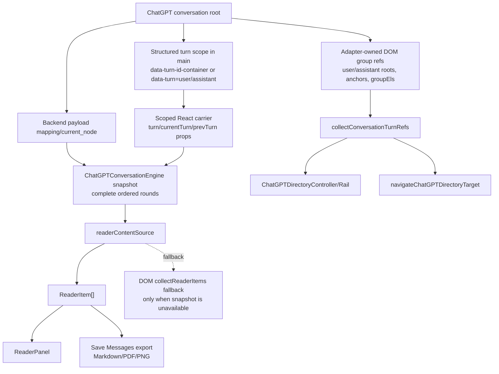

# Architecture Current State (As-Is)

本文描述 AI-MarkDone 当前仓库已经落地的结构事实，用于帮助开发者和 Codex 理解“现在是什么”。它不描述目标蓝图，也不描述未来计划。

---

## 1. 当前代码分层

仓库当前主要按以下目录分层：

- `src/runtimes/*`
  - 运行时入口
- `src/drivers/*`
  - 浏览器 API、站点适配、注入、主题、导出、存储等基础设施
- `src/services/*`
  - 用例编排与跨站共享逻辑
- `src/ui/*`
  - 页面内 UI、控制器、React/Shadow DOM UI foundation
- `src/contracts/*`
  - runtime 协议、平台契约、存储契约
- `src/core/*`
  - 更偏纯逻辑的数据与算法能力
- `src/style/*`
  - token、页面级 token 注入、Shadow DOM 样式入口

当前主线已经不再沿用旧的 `src/content/*` / `src/background/*` 目录组织，权威实现路径应以 `src/runtimes/*`、`src/drivers/*`、`src/services/*`、`src/ui/*` 为准。

---

## 2. 当前运行时入口

### Content runtime

- 入口：`src/runtimes/content/entry.ts`
- 当前职责：
  - 选择当前站点 adapter
  - 初始化 theme、math click、reader、send controller
  - 初始化 bookmarks panel 与 message toolbar orchestrator
  - 监听 background 发来的 `ui:toggle_toolbar`
  - 处理 best-effort 的书签跳转恢复

### Background runtime

- 入口：`src/runtimes/background/entry.ts`
- 当前职责：
  - 响应 content 发起的 protocol request
  - 路由到 bookmarks handler / settings handler
  - 处理 action icon 状态
  - 在启动时执行 best-effort journal recovery

---

## 3. 当前协议与契约

- runtime 协议：`src/contracts/protocol.ts`
- 平台契约：`src/contracts/platform.ts`
- 存储契约：`src/contracts/storage.ts`

当前 content ↔ background 协议已经具备：

- 固定版本字段 `v`
- request id `id`
- type-based request/response
- 统一错误码

当前协议语义说明已经以 `docs/architecture/RUNTIME_PROTOCOL.md` 为权威；阅读时应以它和 `src/contracts/protocol.ts` 共同作为当前真相。

---

## 4. 当前已稳定的能力边界

### Platform adapter

- 主要实现在 `src/drivers/content/adapters/sites/*`
- 平台差异已集中在 driver 层，而不是 UI 或 service 层
- ChatGPT 当前的专属增强能力已经改成 **payload/store-first**：
  - `ChatGPTConversationEngine` 负责通过 page bridge 优先读取 `/backend-api/conversation/<id>` payload，并从 `mapping/current_node` 还原完整轮次；payload 不可用时，会先尝试从 `main` 内的结构化 turn scope（旧 `[data-turn-id-container]` 或语义 `[data-turn="user"|"assistant"]` wrapper）读取 React turn 数据，并允许在该 turn scope 内查找承载 `turn/currentTurn/prevTurn` props 的 React carrier，最后才回退到内部 thread store 发现与可见 DOM fallback。React turn 读取必须始终由结构化 DOM container 限定，不允许变成全局文本或全局 fiber 猜测。
  - `ChatGPTDirectoryController` + `ChatGPTDirectoryRail` 负责把完整历史呈现为页面右侧目录条；官方线程继续作为正文显示层；目录条由独立的 `chatgptDirectory` 设置控制，可关闭或在 compact preview / expanded list 两种显示模式之间切换，并可在 expanded list 中选择只显示 Prompt 开头或同时显示开头与结尾，不复用 `platforms.chatgpt` 平台总开关。目录的轮次数量与跳转 anchor 以 adapter-owned DOM turn refs 为准，snapshot 只做 label/messageId 增强；目录订阅 snapshot 时不启动 5 秒 live refresh，但当 DOM 与缓存 snapshot 都只能提供 `Message N` 这类低质量标题时，会对同一 conversation/round/fallback 签名做一次有界 on-demand snapshot 补齐；DOM observer 只对真实 ChatGPT turn 结构变化做批处理重建，插件自身 DOM 或 toolbar 注入不得触发目录全量重建。
  - `ViewportResizeSuspendController` 是 ChatGPT content runtime 的轻量 viewport 宽度拖拽保护层：它只消费浏览器 `window.resize` 信号和宽度变化阈值，不依赖 ChatGPT DOM/mutation；持续 resize 时通过页面级 `data-aimd-viewport-resizing` 标记让 AI-MarkDone directory、preview、step controls 与 ChatGPT action-row toolbar chrome 暂时隐藏并暂停子树渲染，idle 后派发一次恢复事件。该链路只影响插件 chrome 的临时可见性，不卸载 DOM、不重建 toolbar record、不折叠 action-row toolbar 布局、不改变目录 round refs、snapshot、Reader、Save Messages 或书签语义。
  - `ChatGPTDirectoryRail` 的滚动与展开样式归组件 Shadow DOM 持有；长目录出现垂直滚动条时，expanded 条目必须用明确的 grid 列分配编号、可收缩文案和右侧短线，并保持滚动槽稳定，避免 hover/active 条目被 scrollbar 挤压或裁切。expanded label 的可见宽度应优先由 CSS intrinsic sizing 与字符宽度预算表达，而不是固定像素宽度、一次性宽度 token 或 JS 测量补偿。
  - `src/ui/content/chatgptDirectory/navigation.ts` 现在是 ChatGPT 目录条同页跳转的稳定入口：优先消费 adapter/content-discovery 产出的用户轮次位置模型，点击使用该轮次的 `jumpAnchor`，滚动高亮使用该轮次的可见 user/assistant DOM 范围；命中 anchor 后会用短生命周期的位置校准抵消官方 hydration/layout shift，但不会抢占焦点，且用户主动滚动、触摸、指针或键盘导航会中止后续校准
  - Reader、Save Messages 导出、当前消息 Copy Markdown / Copy PNG 通过 `readerContentSource` 共享正文供给：ChatGPT 上优先消费 `ChatGPTConversationEngine` 的完整 snapshot（payload first，随后结构化 turn 数据），避免被当前 DOM hydration/virtualization 范围截断；snapshot 不可用时才 fallback 到 adapter-owned DOM Reader collection，导出层不再自行 force refresh 或选择另一条正文来源
  - ChatGPT Reader 的 `jump to message`、右侧目录条、书签面板的同页/跨页定位入口都复用同一条 directory navigation helper；非 ChatGPT 平台仍保持原有 bookmark/conversation navigation 路径
  - ChatGPT 工具栏书签保存与高亮会先通过 skeleton/container 轮次映射到 payload 的绝对 `position`，再复用现有 `url + position` 书签身份，不改变底层存储 schema
  - 消息工具栏只注入到 adapter 返回的官方 action row；ChatGPT 上若 assistant message 先出现而官方 action row 后 hydrate，`MessageToolbarOrchestrator` 会把可归属的 action-row mutation 映射回对应消息，并通过本地 lifecycle reconcile 从 `anchor_pending` 推进到 `injected`。如果 action row 已出现但首次 `injectToolbar` 在官网 hydration / network jitter 窗口失败，状态会进入 `stale` 并由 bounded targeted recovery 把该消息重新放回 incremental reconcile；该恢复只针对未注入成功的消息，不使用长期整页轮询、正文 fallback 或整页补扫作为常规路径
  - `drivers/content/virtualization/*` 与相关设计文档目前只保留为历史实验资产，不构成现行 shipping path

ChatGPT 内容发现链路必须保持一条共享 family、两个投影：

- Reader 与 Save Messages 导出必须只通过 `readerContentSource` 获取正文，并消费同一份 `ReaderItem[]`。
- ChatGPT 正文完整性由 `ChatGPTConversationEngine snapshot` 负责；DOM markdown collection 不再作为 ChatGPT 长对话的主内容源。
- 右侧目录条、step controls、Reader locate、书签 Go 共用 adapter-owned DOM round refs 与 `collectConversationTurnRefs()` 的位置/锚点投影；它们与 Reader/导出共享同一轮次语义，但不读取正文内容。
- ChatGPT Reader 打开后的内容页集不得通过 DOM 正文补齐；snapshot 是完整页集来源，DOM round refs 只允许把新 round position 标记为 Reader tail pending。Reader 已打开时，pending position 只有在刷新后的 `ChatGPTConversationEngine snapshot` 中存在非空 assistant 内容时才追加为新 `ReaderItem`；追加后 position 进入 known，避免 ChatGPT streaming 期间 assistant `messageId` 从占位变为真实值时重复新增页面。
- 两个投影允许的差异只在职责上：snapshot 投影回答“每一轮的完整内容是什么”，DOM anchor 投影回答“这一轮在页面哪里、如何跳过去”。不得再引入第三套 ChatGPT 轮次发现入口。
- 该链路的变更边界必须局限在 ChatGPT 内容发现、Reader/Save Messages 正文供给、目录/定位投影及其测试/SSOT；不得改变书签存储 schema、导出 formatter、Reader 渲染主题、平台开关、发送链路或非 ChatGPT 平台的内容采集语义。

### Bookmarks

- background 负责写入和恢复
- content UI 负责意图触发与界面交互
- `BookmarksPanel` 现在主要承担 shell / overlay lifecycle / tab orchestration
- `BookmarksTabView`、`SettingsTabView`、`SponsorTabView` 是 bookmarks family 的主内容真相；`SponsorTabView` 只进入 Chrome/Firefox target surface
- bookmarks 信息页职责已经拆开：`AboutTabView` 持有个人介绍、项目背景和 support contact card，三端都保留反馈邮箱入口；Chrome/Firefox 额外保留 About 小红书入口，`SponsorTabView` 作为最后一个 `请我喝咖啡` tab 持有付款二维码、GitHub 支持入口与感谢赞助名单；Safari App Store target 通过 build-time surface policy 移除 sponsor tab、赞助/社交文案资源、付款二维码资源与 About 小红书关注卡
- 书签树渲染与 virtualization 已收口到 `BookmarksTreeViewport`
- `src/ui/content/overlay/OverlaySession.ts` 现在是通用 overlay session wrapper，负责组合 overlay host、keyboard scope、input boundary 与 modal slot
- `BookmarksPanel`、`BookmarkSaveDialog` 与 `SaveMessagesDialog` 已直接复用通用 `OverlaySession`；Bookmarks family 不再保留独立 overlay wrapper
- `Deep Research` 已退出产品范围；当前 `src/` 中不再保留 active compatibility hook，仓库只保留文档与测试中的退场声明
- `src/ui/content/components/transientUi.ts` 现在是共享 outside-click / transient-root contract；Bookmarks family 只保留对它的 family-level 组合，而不再拥有私有实现
- Bookmarks family 内部的 inline select / number-stepper 目前仍保持为 family-scoped primitive，并通过统一 transient-ui contract 与 panel shell 协作
- `ModalHost` 现在只承担 dialog render、topmost modal ownership 与 focus restore；shared host boundary 与 keyboard scope 由 `OverlaySession` 负责
- `ModalHost`、`BookmarksPanel`、`BookmarkSaveDialog`、`SaveMessagesDialog`、`ReaderPanel` 与 `SendModal` 现在都使用共享 motion contract：surface 先进入 `opening/open/closing` 状态，再在关闭动画结束后卸载，而不是立即从 DOM 移除
- 当前 motion contract 明确分成两族：
  - `panel-window`
  - `modal-dialog`
- 共享 backdrop fade 已从各 surface CSS 中抽离成单一 shared contract；surface owner 只保留各自 family 的 shell motion
- `ReaderPanel`、`SaveMessagesDialog`、`BookmarkSaveDialog` 与 `BookmarksPanel` 现在都通过 stable shell/backdrop ownership 保持首次 mount 的外层节点；后续内容刷新只更新内部内容区，不再重建进入动画绑定的外层 DOM
- `ModalHost` 现在和 `panel-window` 家族一样遵守单次 dismiss/close 提交；已进入 `closing` 的 surface 不再重复触发 dismiss 回调或恢复逻辑
- `ModalHost` 与 `panel-window` 家族现在都使用共享 focus lifecycle：打开前捕获 opener，打开稳定后把焦点移入 surface，关闭后再恢复焦点
- Settings tab 中的公式配置写入独立 `formula` category；旧 `behavior.enableClickToCopy` 只作为设置迁移/兼容输入，不再作为公式交互的运行时 SSOT
- `ToolbarHoverActionPortal` 是消息工具栏 hover 次动作与公式 hover 图片动作的共享 anchored portal；它负责 viewport clamp、anchor bridge 定位与顶部空间不足时的下翻，不允许调用方各自实现一次性边界补偿

### Reader / Copy / Sending

- `pure/domain service` 负责纯逻辑与规则
- `content-facing feature service` 负责数据准备和行为编排
- content driver 负责 DOM 采集、剪贴板、导出、发送桥接
- UI 层负责 Shadow DOM / React UI 呈现
- `ReaderPanel` 当前通过 surface-owned named profiles 收口多入口差异；消息工具栏与书签预览不再直接传 low-level chrome flags，而是分别选择 `conversation-reader` 与 `bookmark-preview`
- `readerContentSource` 是 Reader 正文供给的共享 service 入口；Reader、Save Messages 导出和当前消息 Copy Markdown / Copy PNG 均消费同一份 `ReaderItem[]`。ChatGPT 正文优先来自 `ChatGPTConversationEngine` 完整 snapshot，DOM Reader collection 仅作兜底，导出只将 `ReaderItem.content` resolve 为 `ChatTurn[]` 后交给既有 Markdown/PDF/PNG formatter
- `saveMessagesFacade` 只保留 `exportTurnsMarkdown` / `exportTurnsPdf` / `exportTurnsPng` 这组格式化与副作用入口；它不再从 adapter 收集 turns，也不再拥有 ChatGPT snapshot refresh fallback
- Reader Markdown 正文恢复为单一默认主题；正文样式继续由共享 tokenized markdown contract 持有，入口不能直接传 preset、CSS 或 theme object
- Reader Markdown 支持边界固定为 sanitized GFM、KaTeX math、syntax-highlighted fenced code 与 tokenized reader typography；Mermaid 图表渲染已退出产品路线，Mermaid fences 只作为普通代码源码展示，不再接入 renderer iframe、SVG 替换、预览层或相关设置项
- Reader 正文最大宽度由 `reader.contentMaxWidthPx` 设置驱动，默认保持 1000px；该设置只影响 Reader content inner width，并必须继续 clamp 到 Reader panel 宽度内，不改变 panel shell、fullscreen 或 Markdown 渲染链路

说明：

- `src/services/copy/*`
- `src/services/reader/*`
- `src/services/markdown-parser/*`
- `src/services/export/*`

当前都属于 `content-facing feature service`，不是严格意义上的“纯 service”。
- `src/services/export/saveMessagesPdf.ts` 属于明确例外：它负责构建最终导出文档，并消费样式 token 生成 PDF/打印用 CSS。
- `SendPopover` 仍是 anchored popover，而不是 overlay surface；它保留 textarea-level `inputEventBoundary` 作为 intentional local boundary，不视为 shared overlay contract 的例外缺口
- Reader 当前已经拥有两条稳定的“只在 Reader 内部生效”的扩展链路：
  - atomic closed-unit source selection：普通文本保留原生选区，closed unit 按整单元高亮与源码复制
  - inline comments：comment session、highlight overlay 与右侧 gutter anchor 仍局限在 Reader overlay 内，不依赖 background/storage；但 comment export 的 prompt/template/prompt-position 配置已提升到 settings 域持久化，Reader export popover 只负责预览与复制最终结果
- Reader conversation profile 还拥有一条临时 Sticky 摘录链路：选区浮层的 `Stick` action 只消费现有 atomic selection Markdown export，将内容在当前页面生命周期内渲染为 sanitized Markdown block；Sticky block 保存在 `ReaderPanel` 实例内存状态中，翻页和关闭/重开 Reader 时保持不变，只有页面刷新或 content runtime 重新初始化才允许丢失。block 自身不限高且不使用卡片外框，左侧只保留拖拽与删除两枚纵向操作按钮。该链路不进入 bookmark-preview profile，不写入 background/storage，也不改变 Reader 内容采集、导出、书签、发送或评论合同。宽屏时 Sticky 是左侧 rail，宽度可拖拽且最大 clamp 到 Reader body 宽度的 2/3；窄屏时只允许作为 Reader 内部 drawer 覆盖，不形成三栏布局；展开入口位于 Reader footer 左侧 action cluster 前。
- Reader 不再新增专用图表渲染扩展链路；需要展示图表时保持 fenced code 源码，避免把重型渲染库重新带入 content runtime 或额外 overlay 生命周期
- 公式点击复制与单公式 PNG/SVG hover 动作由 `FormulaAssetHoverController` 统一承载，运行时消费 `formula` settings 与 build-time target surface policy 做 gating；Safari App Store target 隐藏二进制 PNG/SVG clipboard copy 动作，但保留 MathML copy 与 PNG/SVG save 下载动作。LaTeX source 提取、MathJax iframe renderer、PNG rasterize、clipboard/download services 仍保持独立，不感知 Settings UI
- Reader shell chrome 与正文排版都继续由 tokenized panel/template contract 持有，不再额外接入开源 Markdown 主题 preset
- fullscreen Reader 切换仍属于 surface state change，不复用 centered panel 的 open/close transform；fullscreen Reader 只保留更轻的 fade-style motion

### ChatGPT Directory

- ChatGPT right-side directory rail 与右下角上一条/下一条 step controls 由同一个 `ChatGPTDirectoryController` 管理，二者共享 active position、round discovery 与 `navigateChatGPTDirectoryTarget(...)`。
- Step controls 是 body-level fixed surface，视觉上不属于 rail footer；隐藏/显示、主题切换和 dispose 生命周期仍由 `ChatGPTDirectoryRail` 统一持有，避免出现独立导航状态或 DOM 残留。
- 浏览器 viewport 宽度持续变化时，ChatGPT directory chrome 与 action-row message toolbar chrome 允许通过页面级 resize suspend 标记短暂隐藏并暂停子树渲染；目录 active 扫描在 suspend 期间让位于宿主布局，resize idle 后只补算一次。

### Style system

- 主入口为 `src/style/reference-tokens.ts`
- `src/style/system-tokens.ts`
- `src/style/tokens.ts`
- `src/style/pageTokens.ts`

---

## 5. 当前仍需注意的历史遗留

- `docs/antigravity/*` 仍是活跃文档路径的一部分，但它表示历史命名空间，不代表当前依赖任何旧工具链
- 一些较老的架构描述仍可能引用旧目录或旧实现形态，阅读时以本文件和实际代码路径为准
- 文档体系已经迁移到 `AGENTS.md` + `.codex/*` + `docs/*`，旧规范目录不再是活跃规范来源

---

## 6. 与其它文档的边界

- 想看目标架构：读 `docs/architecture/BLUEPRINT.md`
- 想看依赖方向：读 `docs/architecture/DEPENDENCY_RULES.md`
- 想看 runtime 协议：读 `docs/architecture/RUNTIME_PROTOCOL.md`
- 想看重构阶段：读 `docs/refactor/REFACTOR_CHECKLIST.md`
