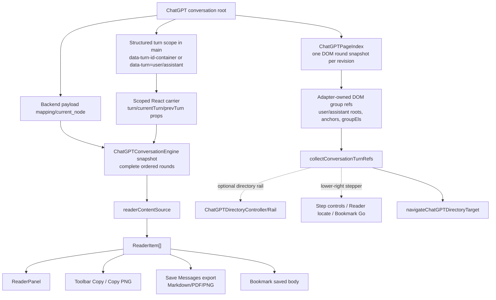

# Architecture Current State (As-Is)

本文描述 AI-MarkDone 当前仓库已经落地的结构事实，用于帮助开发者和 Codex 理解“现在是什么”。它不描述目标蓝图，也不描述未来计划。

---

## 1. 当前代码分层

仓库当前主要按以下目录分层：

- `src/runtimes/*`
  - 运行时入口
- `src/drivers/*`
  - 浏览器 API、站点适配、注入、主题、导出、存储等基础设施
- `src/services/*`
  - 用例编排与跨站共享逻辑
- `src/ui/*`
  - 页面内 UI、控制器、React/Shadow DOM UI foundation
- `src/contracts/*`
  - runtime 协议、平台契约、存储契约
- `src/core/*`
  - 更偏纯逻辑的数据与算法能力
- `src/style/*`
  - token、页面级 token 注入、Shadow DOM 样式入口

当前主线已经不再沿用旧的 `src/content/*` / `src/background/*` 目录组织，权威实现路径应以 `src/runtimes/*`、`src/drivers/*`、`src/services/*`、`src/ui/*` 为准。

---

## 2. 当前运行时入口

### Content runtime

- 入口：`src/runtimes/content/entry.ts`
- 当前职责：
  - 先按 URL 分流：ChatGPT 进入完整 content runtime；Gemini、Claude、DeepSeek 进入 formula runtime；未知 host 不启动页面能力
  - 为 ChatGPT 选择当前站点 adapter
  - 初始化 theme、math click、send controller，以及 Reader / Bookmarks / export / Copy PNG 的轻量 lazy ports
  - 初始化 bookmarks controller 与 message toolbar orchestrator；重型 panel / dialog / renderer 实现不进入页面启动图
  - ChatGPT 完整 runtime 与 Gemini/Claude/DeepSeek formula runtime 都监听 background 发来的 `ui:toggle_toolbar`；ChatGPT 切换完整 BookmarksPanel，formula runtime 允许复用全局书签管理面板作为扩展图标入口
  - 启动后向 background 发送一次 `content:ready`，让长时间休眠/恢复后的 service worker 能重新识别当前 supported tab
  - 处理 best-effort 的书签跳转恢复

当前 content feature 加载边界：

- `content.js` 仍是 manifest 直接声明的 classic content script，只包含站点启动、controller、port 与 lazy loader；`ReaderPanel`、`BookmarksPanel`、`SaveMessagesDialog`、`BookmarkSaveDialog` 和 Copy PNG 实现不得被它静态导入。
- `src/runtimes/content/lazyContentFeatures.ts` 只在真实用户动作首次调用对应 port 时，通过 `browser.runtime.getURL(extensionAssets.contentFeaturesEntry)` 动态导入扩展自身的 `content-features.js`。同一次页面生命周期共享 module promise；加载失败会清空 promise，允许下一次用户动作重试。
- `content-features.js` 是保留公开导出的 ES module facade；每个 facade 方法再按 Reader、Bookmarks、Save Messages、bookmark save 或 Copy PNG 的实际触发分别加载对应 chunk。它与 detached `reader.js` 在同一个 Rollup graph 中构建，以共享 Markdown / Reader 依赖而不复制整套 renderer。
- `content-features.js` 与 `content-feature-chunks/*.js` 只作为受控 web-accessible extension resources 暴露给受支持 host。chunk preload 必须用 `import.meta.url` 解析到扩展 origin，禁止退化为 ChatGPT host-origin 请求。
- `export-renderer.html` 是消息 PNG 与公式资产共用的 extension-origin 渲染宿主，只在真实导出动作后按需创建。启动、idle、streaming、toolbar recovery 和只打开普通 panel 的阶段都不得请求 renderer、MathJax、Markdown export capability 或 PNG worker。
- 右下角真实 Bookmarks 按钮是当前自动化 trigger-path gate：基准必须证明启动、idle、streaming 与 toolbar recovery 阶段没有 feature module 请求，点击后 facade 导出可调用、面板可挂载，且没有 host-origin chunk 请求。

### Background runtime

- 入口：`src/runtimes/background/entry.ts`
- 当前职责：
  - 响应 content 发起的 protocol request
  - 路由到 bookmarks handler / settings handler
  - 处理 action icon/popup 状态：supported hosts 保持 active/no-popup 并通过 `ping -> ui:toggle_toolbar` 路由到 content runtime；其它页面显示 unsupported popup
  - 通过 `readerSession:*` protocol 为 detached Reader extension page 维护 `sessionId + sourceTabId + readerTabId` 绑定，并把 refresh/draft/beforeSend/send/locate 请求路由回源 ChatGPT content runtime
  - 对已关闭、discard/freeze 恢复中、content script 暂不可达的 tab 做 best-effort 静默降级
  - 在启动时执行 best-effort journal recovery

---

## 3. 当前协议与契约

- runtime 协议：`src/contracts/protocol.ts`
- 平台契约：`src/contracts/platform.ts`
- 存储契约：`src/contracts/storage.ts`
- Google Drive 书签备份位于 Settings → Data Management → Google Drive Backup。本地导出位于 Settings → Data Management → Local Backup。Google Drive Backup v1 不会实时双向更新，而是用户主动触发的不可变 bookmark snapshot 备份/安全合并恢复：本地读取与恢复写入仍通过 bookmarks storage/index 与 background storage queue，Drive 副作用经 `cloudBackup:*` runtime protocol 和 background provider 执行。Chromium build 使用 manifest `oauth2` 作为 `chrome.identity.getAuthToken` 的 Google OAuth SSOT，先按能力调用浏览器托管身份缓存，失败时再用 Web application OAuth client 与 `identity.getRedirectURL()` 走 `identity.launchWebAuthFlow`；Firefox 使用同一 WebAuth fallback，Firefox allizom redirect 会转成 MDN 允许的 loopback redirect。OAuth client ID 只标识 AI-MarkDone 这个公开应用，不携带开发者 Google 账号登录态；用户安装后授权的是当前浏览器/profile 中自己的 Google 账号。连接前 UI 会先显示 AI-MarkDone 的简短确认，用户确认后才启动 Google 授权。连接后本地状态只保存 Drive `about.get` 返回的账号摘要（邮箱、显示名、头像 URL）用于用户确认，不把 refresh token、cookie 或 Google account id 写入 extension storage。浏览器 identity cache 管理长期授权体验；provider 只把短期 access token 缓存在 extension local storage，过期前用于抗 service worker 重启。Safari v1 不暴露 Google Drive 入口。

当前 content ↔ background 协议已经具备：

- 固定版本字段 `v`
- request id `id`
- type-based request/response
- 统一错误码
- Supported content runtime 通过 `content:ready` 进行轻量恢复握手；extension action click 使用 `ping -> ui:toggle_toolbar`，不保活 MV3 service worker，也不新增动态注入权限。ChatGPT full runtime 打开完整 BookmarksPanel；Gemini、Claude、DeepSeek formula runtime 允许打开全局书签管理面板，但这只是扩展 UI 入口复用，不代表恢复这些平台的 Reader、消息 toolbar、发送、整条消息复制/导出或完整 adapter 适配。
- detached Reader session 只使用 `chrome.storage.session` / `browser.storage.session` 保存 snapshot 与 tab 绑定，不 fallback 到 persistent local storage，避免依赖 MV3 service worker 全局变量且避免把对话快照持久化；它不做强保活或实时 tail sync。当前合规/安全边界以浏览器提供的 `sender.tab.id` 和 `sessionId + sourceTabId + readerTabId` 绑定为权威：URL hash 只用于让 Reader 页声明要读取哪个 session，不能单独授予读取、刷新、发送或定位权限。

当前协议语义说明已经以 `docs/architecture/RUNTIME_PROTOCOL.md` 为权威；阅读时应以它和 `src/contracts/protocol.ts` 共同作为当前真相。

---

## 4. 当前已稳定的能力边界

### Platform adapter

- 当前生产完整页面 adapter 为 `src/drivers/content/adapters/sites/chatgpt.ts`
- Gemini、Claude、DeepSeek 当前保留公式复制 runtime，用于单公式 LaTeX 点击复制与用户启用的公式 PNG/SVG/MathML copy/save；旧书签中的平台字符串仍作为用户历史数据保留。formula runtime 可以构造/打开全局书签管理面板以支持扩展图标入口和设置入口，但不得恢复这些平台的 Reader、消息 toolbar、发送、整条消息复制/导出、定位或完整 adapter 链路。
- ChatGPT 当前的专属增强能力已经改成 **payload/store-first**：
  - `ChatGPTConversationEngine` 负责通过 page bridge 优先读取 `/backend-api/conversation/<id>` payload，并从 `mapping/current_node` 还原完整轮次；payload 不可用时，会先尝试从 `main` 内的结构化 turn scope（旧 `[data-turn-id-container]` 或语义 `[data-turn="user"|"assistant"]` wrapper）读取 React turn 数据，并允许在该 turn scope 内查找承载 `turn/currentTurn/prevTurn` props 的 React carrier，最后才回退到内部 thread store 发现与可见 DOM fallback。React turn 读取必须始终由结构化 DOM container 限定，不允许变成全局文本或全局 fiber 猜测。
  - ChatGPT snapshot page bridge 是 Reader、Bookmark、Copy、Save Messages 共享的内容 SSOT；Chrome/Chromium 继续使用 object `CustomEvent.detail`，Firefox 使用 JSON string detail 规避 content/page script 隔离边界。该差异只能存在于 bridge transport encode/decode 层，上层 Reader、Bookmark、Copy 不得新增浏览器分支或 DOM fallback。
  - 完成态 `Deep Research` 报告继续属于同一 snapshot SSOT：page bridge 只识别已验证的 Deep Research resource 标识，并从其 `widget_state.report_message` 读取完整 assistant Markdown；未完成、空白、未知或损坏的 widget 必须 fail closed，上传文件正文、工具调用参数与其他 tool 输出不得进入报告。报告随后复用既有 `normalizeChatGPTReaderMarkdown()` 与 `ReaderItem[]` 链路，不新增 iframe 采集、host permission、runtime protocol 或 Deep Research 专属 UI/导出分支。
  - `ChatGPTPageIndex` 是 ChatGPT 当前页面 DOM 轮次/锚点投影的唯一 revision cache。它在 adapter/driver 层为每次相关宿主 DOM revision 只构建一份有序 `ChatGPTDomRoundRef[]`，并让 adapter group refs 与 `collectConversationTurnRefs()` 的映射结果按对象身份复用；工具栏、目录条、lower-right stepper、发送位置恢复和同页定位不得另做整页轮次扫描。directory 与 lower-right stepper 必须订阅该索引拥有的同一个轮次结构变化源，不得各自创建 `MutationObserver` 或复制 turn selector；新增/删除轮次和 conversation root 替换会通知两者，正文流式 child/text 变化只失效 snapshot，不触发导航 UI 刷新。AI-MarkDone toolbar 插入与 `data-aimd-*` bookkeeping 必须被过滤，避免自失效；runtime disable 时由 adapter `dispose()` 断开 observer 并清空缓存。该索引只包含当前 DOM 的位置/锚点，不替代 `ChatGPTConversationEngine` 的完整正文 snapshot。
  - content runtime 内的 toolbar、directory 与 conversation engine 继续各自拥有 route change 语义，但底层 `RouteWatcher` 共享唯一 poll timer 和唯一 `popstate` / `hashchange` listener pair；首个订阅者负责启动，最后一个订阅者停止后完整释放，不允许每个 controller 各自建立长期轮询。
  - `ChatGPTDirectoryController` + `ChatGPTDirectoryRail` 是默认开启、用户可关闭的 ChatGPT right-side surface，由 `chatgptDirectory.enabled` 控制。它继续复用 `collectChatGPTRoundPositions(adapter)`、active following 与 `navigateChatGPTDirectoryTarget(...)`，不得新增正文发现、Reader source 或第二套定位模型。rail 和 preview 的 right offset 由 viewport classic scrollbar 宽度加 `chatgptDirectory.rightInsetPx` 组成；用户边距默认 0px，只在滚动条覆盖目录条时由用户手动增加。仅当 `chatgptDirectory.enabled` 与 `chatgptDirectory.hideOfficialNavigation` 同时开启时，`ChatGPTOfficialNavigationVisibilityController` 才隐藏可确认的 ChatGPT 官方对话导航；隐藏链路以 ChatGPT conversation highlight root 的类名后缀 `_convSearchResultHighlightRoot` 作为容器锚点，只通过一条静态 CSS direct-child guard 隐藏该 root 下贴右侧的 fixed 直接子容器，不隐藏 root 本身，不读取布局，不改写官方 DOM，也不启动 observer 或 timer。选择器失配时必须 fail-open；左侧历史侧边栏与带 `data-aimd-role` 的自有节点必须明确排除。该能力不影响 ChatGPTConversationEngine、Reader、Save Messages、复制、书签存储或定位 helper。
  - `ChatGPTMessageStepperController` 是独立于旧 directory rail 的轻量 lower-right surface：它默认提供书签面板入口、当前页面收藏、Detached Reader Split View、Prompts、上一条/下一条按钮。书签面板入口使用 AI-MarkDone 品牌 Logo 并固定贴底，替代 ChatGPT header 入口，避免在官方 header 区注入按钮影响第三方划词弹窗；页面收藏按钮由 `chatgptBehavior.showPageBookmarkControl` 单独控制，只保存当前 ChatGPT 对话 URL/标题/平台/文件夹/时间等元数据，不保存完整对话内容，也不进入消息级 `bookmarks:positions` 高亮链路；Detached Reader Split View 由 `chatgptBehavior.showDetachedReaderControl` 控制；Prompts 由 `chatgptBehavior.showPromptControl` 控制；上一条/下一条按钮显示由 `chatgptBehavior.showMessageStepper` 控制。Prompts 按钮使用 `messageSquareTextIcon`，位于 Split View 和 Previous/Next 之间，并打开与 composer `\` 联想共用的 Prompt 管理浮层。Left/Right 键消息导航由 `chatgptBehavior.enableArrowKeyMessageNavigation` 单独控制。定位时复用 `src/ui/content/chatgptDirectory/navigation.ts` 的 same-page helper。键盘监听默认开启，但会跳过 input、textarea、contenteditable、role=textbox、组合键、IME composing 与 AI-MarkDone 自有面板/弹窗/输入区。
  - `ChatGPTComposerEditingController` 统一持有官方 composer 绑定、键盘优先级、列表删除、公式助手和加号旁 Input Enhancement 按钮生命周期，并继续复用唯一 `document.body` subtree observer，不新增全局 observer。设置 SSOT 是 `chatgptBehavior.inputEnhancement`：`available` 决定入口存在与否，`enabled` 是运行总开关，Enter、粗体、列表父开关、有序/无序列表、公式联想和公式预览是保值的独立子项；有效状态只由 `resolveChatGPTInputEnhancement()` 计算。新安装全部开启；旧 `markdownComposerEnabled` / `enterKeyNewline` 只作为 v4 normalizer 的迁移输入。Settings 只修改 `available`，composer 弹层乐观保存完整嵌套快照，保存中禁用控件，失败回滚整个快照。按钮与官方加号动作容器并列；popover 是页面根节点上的独立 tokenized Shadow DOM portal，语法说明复用 `OverlaySession + ModalHost`。
  - composer 事件优先级固定为 IME/重入放行 → 已打开公式联想 → Cmd/Ctrl + Enter 发送与 Shift + Enter 宿主行为 → 已启用列表类型的 Backspace/Delete → 已启用粗体快捷键 → 普通 Enter。Enter 换行关闭时，普通文本 Enter 交还 ChatGPT，只有命中已启用真实列表类型才拦截。行前缀只做廉价候选检查，`markdownListEditing` 继续以 Lezer CommonMark AST 确认 `OrderedList` / `BulletList → ListItem`；有序/无序开关分别关闭对应类型全部规则。续写、拆分、空项退出、连续 sibling 重编号、loose list、引用、嵌套、等宽 marker 删除、二次合并和完整中间行删除继续共用纯规则与一个 native range edit；代码块、伪 marker、跳号边界、IME 和失败编辑交还宿主，不允许 `replaceChildren` 重建 ProseMirror。
  - Cmd/Ctrl + B 仍只写入或移除可见 `**`。公式联想和公式预览是独立能力：只开联想时只按需加载 `vendor/latex-workshop/formula-snippets.json` 且不调用 renderer；只开预览时只渲染 `$...$` / `$$...$$` 浮层且不加载目录；两者都关时不调度 scanner、目录或 renderer。目录继续来自固定 LaTeX Workshop upstream commit 的 1,250 条离线筛选项，不读取 `at-suggestions.json`、不实现 `@` 语法；候选和 Prompt autocomplete 复用 `ComposerSuggestionList`，公式插入只走 native range port。当前不接入 Reader，也不提供输入框内富文本、表格辅助、`\\(...\\)` / `\\[...\\]` 或用户宏。
  - composer observer 必须覆盖 ChatGPT 对任意嵌套 hydration shell 的替换，因为观察 adapter container 或其直接父级都无法感知该被观察节点自身从文档脱离；coalesced rebind 后必须把键盘监听迁移到当前 composer，并在 `available` 时恢复唯一 Input Enhancement 按钮，替换时关闭旧 popover。
  - `ChatGPTPromptAutocompleteController` 默认绑定 ChatGPT 官方 composer，并可在 Reader `SendPopover` 打开期间通过 `attachExternalComposer` 临时绑定当前 textarea：当前 token 以 `\` 开头且位于词边界时打开 Prompt 联想，按有纯文本 triggerText 且 enabled 的 Prompt 过滤；自动联想由 `chatgptBehavior.promptAutocomplete` 控制，默认开启，关闭后不监听 ChatGPT composer / Reader SendPopover 输入，也不会弹候选框，但不影响右下角、Settings、Reader 设置或 detached Reader 设置里的手动 Prompt manager 入口。Input Enhancement 的公式联想或公式预览有效且 ChatGPT caret 位于 dollar math environment 时，Prompt controller 不查询 library、主动关闭 Prompt 候选并把 `\` token 让给公式助手；公式外仍保持 Prompt 行为，Reader SendPopover 不接入公式助手。ChatGPT composer 按 contenteditable caret rect 定位，Reader SendPopover 按 textarea caret mirror 定位，上方空间不足或光标矩形不可用时回退到输入框附近。SendPopover 关闭时必须 detach 临时 composer 并回到官方 composer 监听。无匹配自动关闭，Backspace 恢复匹配时重新显示，按 Escape 后当前 token 不会反弹。候选框打开时会在 window capture 层优先接管 Enter、Tab、Escape 与上下键，确保 Enter 确认当前候选，不依赖 Input Enhancement 的 Enter 换行设置；点击、Enter 或 Tab 会用 Prompt 内容替换当前 trigger token，并在 `{{cursor}}` 标记处恢复光标，否则落在插入内容末尾；无可选项时不拦截 Enter/Tab。候选列表 DOM/CSS 与公式助手复用 `ComposerSuggestionList`。Prompt Library 存在 `browser.storage.local`，由 background `prompts:*` protocol 管理；已规范化 library 的普通读取不写回 storage，不刷新 `updatedAt`；首次读取会迁移到 4 条固定英文 v4 默认 Prompt（Humanize Text With a Skill、Turn Rough Ideas Into Prompts、Create a Reusable Skill、Translate Naturally），其中 Skill Creator 默认指向 OpenAI Codex `skill-creator` sample 目录，并要求最终输出一个自包含代码块 Prompt 来封装所有生成的 Skill 文件；默认 seed 不随界面语言切换；未修改过的默认 Prompt 由 `managedDefaultId` 继续接管，读取时会通过历史默认快照识别未编辑默认 Prompt，即使 `defaultPromptSetVersion` 未变化也会随当前默认 seed 升级；用户改过的默认 Prompt 会转为用户接管并不再覆盖；旧 `\`/`/` trigger 会规范化为纯文本；`prompts:list` 默认排除 disabled，管理器用 `includeDisabled: true` 展示全部并允许直接启用/禁用；disabled Prompt 仍占用 trigger，避免重新启用时产生冲突。Prompt 本身统一，Reader 注释导出和 Reader SendPopover 通过 shared Prompt Library provider 按需读取当前 enabled prompts，不把 Prompt 列表缓存回 reader settings；旧 Reader 自建/改过 prompts 会迁移，未改旧默认只保留 `Point-by-Point Revision` 作为普通可管理 Prompt，其他未改旧默认跳过；Reader settings 只继续持有 promptPosition 和 comment template；右下角、书签 Settings、Reader 设置与 detached Reader 设置的 Prompt 列表入口完全复用同一管理器，列表主区域和编辑按钮都进入编辑，文本插入只通过 `\` autocomplete 完成；用户可见摘要不得从旧 `reader.commentExport.prompts` 推导标题或数量。Prompt manager 是固定 520px 宽的浮层，manager 高度上限为 630px，使用内部列表滚动和 viewport clamp；编辑页中间内容独立滚动且底部操作区保持可见，正文 textarea 保留纵向 resize 但必须有最大高度，不能撑破浮层或遮住底部操作区。Prompt manager 可通过标题栏拖动，拖动位置只在当前页面会话内保留，不写入 settings 或 storage；再次从任一入口打开时可复用同一会话位置，刷新、新 tab 或 extension runtime 重建后回到入口附近弹出；拖动、窗口 resize 与 visual viewport resize 后都必须 clamp 在 viewport 内。Prompt 列表 drag handle 只负责通过 `prompts:reorder` 写回 storage 顺序，必须与面板拖动隔离；autocomplete 与 Reader picker 保持同一顺序。Prompt Library 另有 core-only portable JSON helpers，用于未来手动导入/导出或云同步规划；portable payload 只携带 id、title、content、triggerText、enabled、createdAt、updatedAt 与 lastUsedAt，不携带默认集接管、迁移状态或 UI-only 字段；当前 Google Drive backup 不读取或写入 Prompt Library。
  - Reader comment settings 的当前准确枚举为 `promptPosition + comment template + sortMode`；其中 `sortMode` 只由 Reader 内 settings dialog 提供入口，不进入全局 Settings。此项取代上一条中仍只列出 `promptPosition + comment template` 的旧枚举。
  - `ChatGPTPageWidthController` 是 ChatGPT-only 页面宽度调节层：`chatgptBehavior.pageWidthScale` 默认 100，表示不改变官方页面；用户可通过 Settings 滑块调到 105–200。controller 优先识别 ChatGPT 对话与 composer 共用的 `--thread-content-max-width` 限制器，并保留旧对话节点作为 fallback；它读取原始 `max-width` 后注入按比例放大的 `max-width: calc(original * scale / 100)`，因此正文和输入条同步扩宽，延迟挂载的同语义节点也自动命中同一 CSS 规则。该能力只调整页面可视宽度，不进入内容发现、Reader、Save Messages、书签定位或目录条发现链路。
  - `ChatGPTDirectoryRail` hover accordion 与 compact preview 只能属于 rail UI 热路径：已渲染条目和轮次可在组件内缓存，鼠标移动时只允许更新旧/新 hover 邻近范围内的少量视觉状态，并复用已存在的 body-level preview style；不得在 hover 时全量扫描 `.rail__item`、按轮次线性查找 preview 内容、重写 token style、读取 layout rect 定位 preview，或触发目录发现、snapshot、Reader、toolbar、bookmark、resize suspend 等下层链路。旧 lower-right step controls 不再属于 rail。
  - `ViewportResizeSuspendController` 是 ChatGPT content runtime 的轻量 viewport 宽度拖拽保护层：它只消费浏览器 `window.resize` 信号和宽度变化阈值，不依赖 ChatGPT DOM/mutation；宽度变化超过 8px 时立即通过页面级 `data-aimd-viewport-resizing` 标记让 ChatGPT action-row toolbar chrome 暂时隐藏并暂停子树渲染，停止 resize 1 秒后派发一次恢复事件。该链路只影响插件 chrome 的临时可见性，不卸载 DOM、不重建 toolbar record、不折叠 action-row toolbar 布局、不改变 snapshot、Reader、Save Messages 或书签语义。
  - `ChatGPTDirectoryRail` 的滚动与展开样式归组件 Shadow DOM 持有；长目录仍由 rail 内部列表滚动，但原生滚动条必须视觉隐藏，不保留额外滚动槽。expanded 条目必须用明确的 grid 列分配编号、可收缩文案和右侧短线，避免 hover/active 状态被裁切。expanded label 的可见宽度应优先由 CSS intrinsic sizing 与字符宽度预算表达，而不是固定像素宽度、一次性宽度 token 或 JS 测量补偿。
  - `src/ui/content/chatgptDirectory/navigation.ts` 现在是 ChatGPT 同页定位的稳定入口：Reader locate、Bookmark Go 与跨页 pending navigation 优先消费 adapter/content-discovery 产出的用户轮次位置模型，点击使用该轮次的 `jumpAnchor`；命中 anchor 后会用短生命周期的位置校准抵消官方 hydration/layout shift，但不会抢占焦点，且用户主动滚动、触摸、指针或键盘导航会中止后续校准
  - `ChatGPTSendPositionRestoreController` 是 ChatGPT-only page-behavior 层能力，由 `chatgptBehavior.restorePositionAfterSend` 默认开启地控制。它只负责发送后的阅读位置恢复，不进入正文发现链路；仅在用户主动发送前记录主滚动容器、scrollTop 与顶部附近 turn anchor，发送后用短生命周期 MutationObserver / scroll listener / rAF 合并做 instant restore。关闭时没有 observer/rAF/额外 scroll listener；开启但未发送时只有少量 capture 事件监听；armed 后会在用户 wheel/touch/pointer/keyboard、官方滚到底部、Reader locate、Bookmark Go、90 秒超时或恢复次数上限时释放。
  - Reader、Save Messages 导出、当前消息 Copy Markdown / Copy PNG 与书签保存正文通过 `readerContentSource` 共享唯一正文供给：ChatGPT 上的正式正文入口必须强制刷新 `ChatGPTConversationEngine` 的完整 snapshot 后构造 `ReaderItem[]`，避免被旧缓存或当前 DOM hydration/virtualization 范围截断；导出、复制、PNG 和书签保存不得各自选择正文发现或提取路径。
  - 当前消息 Copy Markdown 与 Copy PNG 可以在同一次稳定消息 revision 内共享一个 in-flight/resolved Reader item promise；消息内部 mutation 必须只失效所属消息的 promise，消息集合或顺序变化进入 full reconcile 前必须清空整页 Reader item cache，route/dispose 同样清空，禁止跨消息 revision 返回旧正文。
  - ChatGPT snapshot 正文进入 `ReaderItem[]` 前必须经过 `normalizeChatGPTReaderMarkdown()`：引用/file citation 噪声继续移除；ChatGPT 内部 annotation token 不能裸露到 Reader/Copy/Export/Bookmark。已知 `entity` token 归一成正文显示名，已知 GenUI math widget 归一成 Markdown inline/block math，未知 annotation token 安全丢弃。
  - ChatGPT Reader 的 `jump to message` 与书签面板的同页/跨页定位入口都复用同一条 directory navigation helper
  - ChatGPT 工具栏书签保存与高亮会先通过 skeleton/container 轮次映射到 payload 的绝对 `position`，再复用现有 `url + position` 书签身份，不改变底层存储 schema
  - ChatGPT adapter 的 observer container 契约是当前 `main` 的稳定父级；directory、toolbar 与共享 page index 因而能在官网整体替换 conversation root 后由同一宿主 mutation 继续刷新，不得由各 controller 重复实现 `main.parentElement` 特判。消息工具栏只注入到 adapter 返回的官方 action row；`MessageToolbarOrchestrator` 当前的唯一 reconcile 模型是 `dirtyMessages + incremental snapshot + anchor_pending/stale/injected lifecycle`。消息内文本/子树变化只标记所属消息，无关文本不调度；完整 message 结构变化、route/init 或无法归属的 action-row 变化才允许整页扫描。scheduled reconcile 不再追加第二次全量 pending-state 遍历。若 assistant message 先出现而 action row 后 hydrate，可归属 mutation 只推进对应消息；若单个 toolbar host 被官网意外移除，会按已有 record 定向重建，而 controller 自己的 intentional removal 会被单独标记并忽略，避免自恢复循环。如果首次 `injectToolbar` 在 hydration / network jitter 窗口失败，状态进入 `stale`，由 bounded targeted recovery 递增退避地放回 incremental reconcile。不得使用长期整页轮询、正文 fallback 或常规整页补扫。
  - ChatGPT toolbar record 以 logical turn 的 `primaryMessageEl` 为唯一 identity；同一回复内多个 assistant segment 共享一个官方 action row 时，full 与 incremental reconcile 都必须先归一到该 turn，不能各自创建并争抢 toolbar host。
  - 每条 `MessageToolbar` 的常态 Shadow DOM 只保留立即可用的动作与状态结构；仅 Copy PNG 等次级任务真正开始时，才按需创建 `TaskProgressPanel` 子树和对应 CSS。`TooltipDelegate` 在调用方明确 `upgradeTitles: false` 时只保留事件委托，不创建无效 `MutationObserver`。这些延迟资源不得改变 hover 入口、取消、进度、完成反馈、主题 token 或 dispose 行为。
  - `drivers/content/virtualization/*` 与相关设计文档目前只保留为历史实验资产，不构成现行 shipping path

ChatGPT 内容发现链路必须保持一条共享 family、两个投影：

- Reader、工具栏 Copy/Copy PNG、Save Messages 导出与书签保存正文必须只通过 fresh `readerContentSource` 获取正文，并消费同一份 `ReaderItem[]` 语义。
- ChatGPT 正文完整性由 `ChatGPTConversationEngine snapshot` 负责；DOM markdown collection 不再作为 ChatGPT 长对话的主内容源。
- ChatGPT snapshot 可能包含官方页面渲染层已经消化掉的内部 annotation token，例如 entity metadata 或 GenUI math widget；这些 token 必须在 snapshot Markdown normalizer 层转换/清理，而不是依赖 Reader renderer 或 DOM fallback 后处理。
- Reader locate、书签 Go、跨页 pending navigation、当前 lower-right message stepper 与可选右侧目录条共用 `ChatGPTPageIndex` 缓存的 adapter-owned DOM round refs 与 `collectConversationTurnRefs()` 的位置/锚点投影。它们与 Reader/导出共享同一轮次语义，但不读取正文内容；同一 DOM revision 内不得重复执行整页或逐轮 selector discovery。
- ChatGPT Reader 打开后的内容页集不得通过 DOM 正文补齐；snapshot 是完整页集来源，DOM round refs 只允许把新 round position 标记为 Reader tail pending。Reader 已打开时，pending position 只有在刷新后的 `ChatGPTConversationEngine snapshot` 中存在非空 assistant 内容时才追加为新 `ReaderItem`；追加后 position 进入 known，避免 ChatGPT streaming 期间 assistant `messageId` 从占位变为真实值时重复新增页面。
- 两个投影允许的差异只在职责上：snapshot 投影回答“每一轮的完整内容是什么”，DOM anchor 投影回答“这一轮在页面哪里、如何跳过去”。不得再引入第三套 ChatGPT 轮次发现入口。
- ChatGPT send position restore 与上述内容/定位 SSOT 平行：它只消费发送事件与页面滚动位置，不读取正文、不刷新 snapshot、不改变 Reader/Save Messages/Copy/Bookmark 内容语义。
  - 该链路的变更边界必须局限在 ChatGPT 内容发现、Reader/Save Messages 正文供给、目录/定位投影及其测试/SSOT；不得改变书签存储 schema、导出 formatter、Reader 渲染主题、平台开关或发送链路。

### Bookmarks

- background 负责写入和恢复
- content UI 负责意图触发与界面交互
- `BookmarksPanel` 现在主要承担 shell / overlay lifecycle / tab orchestration
- `BookmarksTabView`、`SettingsTabView`、`FeedbackTabView`、`SponsorTabView` 是 bookmarks family 的主内容真相；`SponsorTabView` 只进入 Chrome/Firefox target surface
- bookmarks 信息页职责已经拆开：`FeedbackTabView` 是最底部反馈入口，集中持有反馈邮箱动作与官网入口，三端都保留；`AboutTabView` 持有个人介绍、项目背景与 About 小红书入口；`SponsorTabView` 持有付款二维码、GitHub 支持入口与感谢赞助名单；Safari App Store target 通过 build-time surface policy 移除 sponsor tab、赞助/社交文案资源、付款二维码资源与 About 小红书关注卡
- 书签树渲染与 virtualization 已收口到 `BookmarksTreeViewport`
- `src/ui/content/overlay/OverlaySession.ts` 现在是通用 overlay session wrapper，负责组合 overlay host、keyboard scope、input boundary 与 modal slot
- `BookmarksPanel`、`BookmarkSaveDialog` 与 `SaveMessagesDialog` 已直接复用通用 `OverlaySession`；Bookmarks family 不再保留独立 overlay wrapper
- `Deep Research` 的完成态报告已纳入 ChatGPT snapshot 正文范围；适配只存在于既有 page bridge 的消息序列化层，不恢复独立 compatibility hook 或第二套 Reader source
- `src/ui/content/components/transientUi.ts` 现在是共享 outside-click / transient-root contract；Bookmarks family 只保留对它的 family-level 组合，而不再拥有私有实现
- Bookmarks family 内部的 inline select / number-stepper 目前仍保持为 family-scoped primitive，并通过统一 transient-ui contract 与 panel shell 协作
- `ModalHost` 现在只承担 dialog render、topmost modal ownership 与 focus restore；shared host boundary 与 keyboard scope 由 `OverlaySession` 负责
- `ModalHost`、`BookmarksPanel`、`BookmarkSaveDialog`、`SaveMessagesDialog`、`ReaderPanel` 与 `SendModal` 现在都使用共享 motion contract：surface 先进入 `opening/open/closing` 状态，再在关闭动画结束后卸载，而不是立即从 DOM 移除
- 当前 motion contract 明确分成两族：
  - `panel-window`
  - `modal-dialog`
- 共享 backdrop fade 已从各 surface CSS 中抽离成单一 shared contract；surface owner 只保留各自 family 的 shell motion
- `ReaderPanel`、`SaveMessagesDialog`、`BookmarkSaveDialog` 与 `BookmarksPanel` 现在都通过 stable shell/backdrop ownership 保持首次 mount 的外层节点；后续内容刷新只更新内部内容区，不再重建进入动画绑定的外层 DOM
- `ModalHost` 现在和 `panel-window` 家族一样遵守单次 dismiss/close 提交；已进入 `closing` 的 surface 不再重复触发 dismiss 回调或恢复逻辑
- `ModalHost` 与 `panel-window` 家族现在都使用共享 focus lifecycle：打开前捕获 opener，打开稳定后把焦点移入 surface，关闭后再恢复焦点
- Settings tab 中的公式配置写入独立 `formula` category；平台开关写入 `platforms` category。`platforms.chatgpt` 控制 ChatGPT 完整 runtime；`platforms.gemini` / `platforms.claude` / `platforms.deepseek` 控制对应平台公式复制 runtime。`formula.clickCopyFormulaFormat` 是点击单公式复制的唯一格式设置，`formula.markdownCopyFormulaFormat` 是整段 Markdown 源码复制/下载的唯一格式设置；两个字段共享同一组 formula source format model，但互不覆盖。旧 `behavior.enableClickToCopy` 只作为设置迁移/兼容输入，不再作为公式交互的运行时 SSOT；旧 `formula.copyMarkdownDelimiters` 只作为迁移输入，`false` 会迁移为点击单公式 raw LaTeX，且不会改变整段 Markdown 源码输出默认值
- Settings tab 的主顺序是 Platforms、Buttons & Entrypoints、ChatGPT Reading & Input、Reader & Comment Workflow、Copy, Formula & Export、Language、Data Management、Advanced。Buttons & Entrypoints 是无路由、非持久化的二级页，集中持有工具栏、lower-right ChatGPT 入口和公式 hover action 可见性。ChatGPT Reading & Input 持有发送后恢复阅读位置、Input Enhancement 入口可用性、Prompt autocomplete、对话/输入条宽度、左右方向键导航，以及 `chatgptDirectory` 目录条开关、显示模式、prompt label 模式和右侧边距；不再单独暴露 Enter 换行或 Markdown 开关。`chatgptBehavior.inputEnhancement.available` 默认开启，关闭后按钮卸载且全部输入增强暂停，但 `enabled` 和所有子项原值保留。`chatgptBehavior.promptAutocomplete`、页面宽度、lower-right 按钮和目录条继续保持各自独立设置边界。
- Input Enhancement 的运行总开关和详细项只在 composer 弹层中管理；按钮高亮只代表 `available && enabled`。Enter 换行、列表父开关、有序/无序、粗体、公式联想和公式预览独立保存；列表父开关只禁用两个列表类型，总开关只禁用全部子项，均不清空值。页面弹层与 Settings 通过同一个 `chatgptBehavior` category 和 storage 订阅回流。设置版本保持 v4，旧 `markdownComposerEnabled` / `enterKeyNewline` 不再出现在正式类型或写回 payload 中。
- 更新日志的一次性提示由 background 的 `bookmarks:changelogNotice:get/ack` 状态持有；BookmarksPanel 与 Reader conversation profile 都通过共享 presenter 读取并确认同一条 pending notice，因此同一版本只提示一次，不新增 Reader 私有计数或存储字段
- `ToolbarHoverActionPortal` 是消息工具栏 hover 次动作与公式 hover 图片动作的共享 anchored portal；它负责 viewport clamp、anchor bridge 定位与顶部空间不足时的下翻，不允许调用方各自实现一次性边界补偿
- 消息工具栏 Copy 主按钮的 `Copy Markdown` label tooltip 固定优先显示在按钮下方，避免遮挡其上方展开的 Copy PNG 次动作；移入 Copy PNG 按钮后，次动作自己的 label tooltip 仍按标准规则优先显示在按钮上方。

### Reader / Copy / Sending

- `pure/domain service` 负责纯逻辑与规则
- `content-facing feature service` 负责数据准备和行为编排
- content driver 负责 DOM 采集、剪贴板、导出、发送桥接
- UI 层负责 Shadow DOM / React UI 呈现
- `ReaderPanel` 当前通过 surface-owned named profiles 收口多入口差异；消息工具栏与书签预览不再直接传 low-level chrome flags，而是分别选择 `conversation-reader` 与 `bookmark-preview`
- `readerContentSource` 是 Reader 正文供给的共享 service 入口；Reader、Save Messages 导出、当前消息 Copy Markdown / Copy PNG 与书签保存正文均消费同一份 fresh `ReaderItem[]` 语义。Reader header refresh 也复用该入口：官网内 Reader 直接刷新 fresh `ReaderItem[]`，detached Reader 通过 `readerSession:refresh` 回源页刷新同一来源，并按 position/messageId/id 尽量保留当前页。Reader Copy、Reader 选区源码复制、工具栏 Copy Markdown 与消息书签 Markdown copy 复用同一个 Reader markdown clipboard helper，并且只在写入剪贴板前按 `formula.markdownCopyFormulaFormat` 重写公式 wrapper；导出只将 `ReaderItem.content` resolve 为 `ChatTurn[]` 后交给既有 Markdown/PDF/PNG formatter，其中只有 Markdown formatter 会在写出文件前应用同一个 formula source format model。
- ChatGPT 官网正文直选是一条严格限定的 selection exit，不是新的消息正文来源：`ChatGPTAtomicSelectionController` 只在同一条非流式 assistant `.markdown.prose` 内读取当前单 Range，用一个 document `selectionchange` listener + `requestAnimationFrame` 识别被完整覆盖的 rendered atomic unit，并仅对 selected-set 差分写入 tokenized `data-aimd-page-atomic-state`；最终复制由唯一的 window bubbling `copy` listener 持有。复制时才在 32ms/5000-node 总预算内把每个已知原子节点送入现有 adapter 的 clone/normalize/noise-removal/parser/cleanMarkdown 链，再与普通可见文本切片重建 canonical Markdown；公式必须复用共享 `extractLatexSource` 的可逆 TeX signal，不能从视觉文本猜测。该 canonical 输出保持源码语义，但不承诺恢复宿主未暴露的后端原始空白或字节串。严格原子清洗成功后，clipboard exit 会在 ChatGPT document-level React copy handler 完成后覆盖其视觉文本但不停止事件传播；普通/部分选区、跨消息、user/composer/control/custom widget、不可逆源码、超预算和任意 DOM/parser/clipboard 失败全部 fail open。该 controller 不建立 MutationObserver、逐消息 listener、overlay、选区改写或源码缓存，也不能被 Reader、toolbar、bookmark、Save Messages 或 export 当作 `ReaderItem[]` 替代链路。
- Detached Reader 是独立扩展页入口，不新增 ChatGPT 正文发现模型：当前 v1 由右下角 message stepper 左侧的 Split View 全局按钮触发，首次打开前显示复用现有 modal/notice family 的实验性提示；确认后通过同一条 `readerContentSource` 创建 fresh snapshot，再由 background 建立 `sessionId + sourceTabId + readerTabId` 绑定。独立页复用 ReaderPanel 渲染、Reader 内部 bookmark、copy/comment/Sticky/prompt/settings 能力，以及 conversation Reader action service；refresh/draft/beforeSend/send/locate 都经 `readerSession:*` protocol 回到源 ChatGPT content runtime 执行既有 fresh content、composer draft read/write、sending 与 navigation helper；locate 与 send 会激活源 ChatGPT tab，但不关闭 detached Reader tab。发送按钮复用同一个 tokenized `SendPopover`，由完整 `SendPort` contract 把官网内 content adapter 发送与 detached session 发送分开；detached 页打开发送弹框时读取源 ChatGPT composer 当前草稿，关闭/取消发送弹框时把未发送草稿写回源 ChatGPT composer，点击发送时先通过 `readerSession:beforeSend` 在源页 arm 同一条发送后位置恢复，再通过 `readerSession:send` 激活源 ChatGPT tab 并调用 `sendText(adapter, text)`。v1 不做实时双向同步或强保活；源 ChatGPT tab 关闭时 background 会 best-effort 关闭对应 Reader tab，Reader tab 关闭时只清理 session。Detached Reader 的安全审查结论是：当前实现不新增外部传输、不新增 host permission、不持久化对话快照；协议 payload 更严格 schema 校验和 source URL 复核属于后续防御深度增强，不是当前合并阻断项。
- `saveMessagesFacade` 只保留 `exportTurnsMarkdown` / `exportTurnsPdf` / `exportTurnsPng` 这组格式化与副作用入口；它不再从 adapter 收集 turns，也不再拥有 ChatGPT snapshot refresh fallback
- Reader Markdown 正文恢复为单一默认主题；正文样式继续由共享 tokenized markdown contract 持有，入口不能直接传 preset、CSS 或 theme object
- Reader Markdown 支持边界固定为 sanitized GFM、KaTeX math、syntax-highlighted fenced code 与 tokenized reader typography；fenced code chrome 只提供 copy 与每块代码独立 word-wrap toggle，`latex`/`tex` 默认 wrap，其他语言默认横向滚动；Mermaid 图表渲染已退出产品路线，Mermaid fences 只作为普通代码源码展示，不再接入 renderer iframe、SVG 替换、预览层或相关设置项
- Reader 正文最大宽度由 `reader.contentMaxWidthPx` 设置驱动，默认保持 1000px；该设置只影响 Reader content inner width，并必须继续 clamp 到 Reader panel 宽度内，不改变 panel shell、fullscreen 或 Markdown 渲染链路

说明：

- `src/services/copy/*`
- `src/services/reader/*`
- `src/services/markdown-parser/*`
- `src/services/export/*`

当前都属于 `content-facing feature service`，不是严格意义上的“纯 service”。
- `src/services/export/saveMessagesPdf.ts` 属于明确例外：它负责构建最终导出文档，并消费样式 token 生成 PDF/打印用 CSS。
- `SendPopover` 仍是 anchored popover，而不是 overlay surface；它保留 textarea-level `inputEventBoundary` 作为 intentional local boundary，不视为 shared overlay contract 的例外缺口。`SendPopover` 的提交副作用通过完整 `SendPort` 注入：content runtime 端口继续读取/写回官方 composer、发送前 arm 位置恢复并调用 `sendText(adapter)`；detached Reader 端口通过 `readerSession:draft` 回源页读写当前 composer draft，通过 `readerSession:beforeSend` 回源页执行发送前 position restore arm，并通过 `readerSession:send` 激活源 ChatGPT tab 后调用 `sendText(adapter, text)`。发送浮层打开期间可临时接入共享 Prompt autocomplete controller；当 `chatgptBehavior.promptAutocomplete` 开启时，官网内 Reader 与 detached Reader 的 textarea 支持 `\` 联想；关闭浮层时解绑，避免长期抢占 ChatGPT 官方 composer 监听。
- Reader 当前已经拥有两条稳定的“只在 Reader 内部生效”的扩展链路：
  - atomic closed-unit source selection：普通文本保留原生选区，closed unit 按整单元高亮与源码复制
  - inline comments：comment session、highlight overlay、右侧 gutter anchor 与 Reader 内注释列表/删除仍局限在各自 Reader runtime 的页面内存，不依赖 background/storage，也不在官网内 Reader 与 detached Reader 之间同步记录；两端复用相同的 ReaderPanel、共享 ModalHost 键盘/焦点合同与功能行为。comment export 的 prompt/template/prompt-position/sort-mode 配置已提升到 settings 域持久化，Reader 注释列表、Reader export popover 和 Reader Send 插入注释共用同一排序语义，export popover 只负责预览与复制最终结果
- Reader conversation profile 还拥有一条临时 Sticky 摘录链路：选区浮层的 `Stick` action 只消费现有 atomic selection Markdown export，将内容在当前页面生命周期内渲染为 sanitized Markdown block；Sticky block 保存在 `ReaderPanel` 实例内存状态中，翻页和关闭/重开 Reader 时保持不变，只有页面刷新或 content runtime 重新初始化才允许丢失。block 自身不限高且不使用卡片外框，左侧只保留拖拽与删除两枚纵向操作按钮。该链路不进入 bookmark-preview profile，不写入 background/storage，也不改变 Reader 内容采集、导出、书签、发送或评论合同。宽屏时 Sticky 是左侧 rail，宽度可拖拽且最大 clamp 到 Reader body 宽度的 2/3；窄屏时只允许作为 Reader 内部 drawer 覆盖，不形成三栏布局；展开入口位于 Reader footer 左侧 action cluster 前。
- Reader 不再新增专用图表渲染扩展链路；需要展示图表时保持 fenced code 源码，避免把重型渲染库重新带入 content runtime 或额外 overlay 生命周期
- 公式点击复制与单公式 PNG/SVG/MathML hover 动作由 `FormulaAssetHoverController` 统一承载，运行时消费 `formula` settings、`platforms` settings 与 build-time target surface policy 做 gating；hover 动作默认全部关闭，既有 `formula.assetActions` 选择继续保留。ChatGPT 与 Gemini/Claude/DeepSeek 仍通过各自现有公式识别入口取得 source 与 display mode，但资产链路必须把来源区分为 authoritative TeX 与 `dom-only`，不能把平台文本、`outerHTML` 或 heuristic source 冒充 TeX。authoritative TeX 进入共用 `export-renderer.html`：MathJax 生成一次 standalone SVG，SVG 直接交付，PNG 从同一 SVG 等比栅格化，MathML 由同一 renderer 输出，并显式带入页面前景色、字号和 display mode。`dom-only` 只允许通过唯一 DOM compatibility adapter 生成 PNG；SVG/MathML 稳定返回 `SOURCE_UNAVAILABLE`，不得输出错误资产。公式 PNG 保持完整单图，极端尺寸允许低于 1x 等比缩放，SVG 始终保留无损出口。Toolbar Copy Markdown、Reader Copy、Reader 选区源码复制、Detached Reader copy、消息书签 Markdown copy 与 Save Messages Markdown 下载仍只在源码出口按 `formula.markdownCopyFormulaFormat` 重写 wrapper，不改变 Reader canonical Markdown 或消息 PNG 语义。Safari 继续隐藏 binary PNG/SVG clipboard copy，但保留 MathML copy 与 PNG/SVG save。
- `MathClickHandler` 同时拥有 bounded content-root discovery 与公式节点监听，并只建立一个 document-level `MutationObserver`；ChatGPT 和 formula-only runtime 只注册 root + selector，不得再借用 toolbar 注入回调或建立第二条 observer/discovery pipeline。新增节点先按已启用容器过滤，再通过单次合并 selector 扫描公式候选；重复 enable 不得重扫，公式交互 gate 未变化的 settings update 不得 teardown/re-enable。真正离开文档的 message 必须释放公式 listener 与容器引用，同页 reparent 的 message 则继续保持公式交互。
- Reader shell chrome 与正文排版都继续由 tokenized panel/template contract 持有，不再额外接入开源 Markdown 主题 preset
- fullscreen Reader 切换仍属于 surface state change，不复用 centered panel 的 open/close transform；fullscreen Reader 只保留更轻的 fade-style motion

### Image Export Renderer

- 当前保留三个用户入口：当前消息 Copy PNG、Save Messages PNG、单公式 PNG/SVG/MathML；语义输入只有 fresh `ReaderItem[] -> ChatTurn[] -> ExportDocumentV1` 与公式 source 两类。Markdown 文件导出、PDF 交付、Reader 展示和现有宽度/倍率 settings schema 不变。
- `src/services/export/exportTaskScheduler.ts` 为每个 tab 串行化全部高内存任务。`src/services/export/exportRenderer.ts` 在其后持有一个 lazy singleton `export-renderer.html` iframe；content 侧通过私有 `MessageChannel` 提交版本化 job。排队取消直接移除，运行中取消传到 renderer；500ms 内没有 terminal event 会强制断开失联 host。消息 render timeout 为每次 attempt 120 秒，空闲 120 秒后销毁连接；iframe 被宿主移除或连接失效时立即重建并最多重试一次。`dom-only` 公式 PNG 无法传输 Element，保留唯一 content-side adapter，但也必须先取得同一个 scheduler 的独占执行权。
- Host 协议只接受 `message-png` 的 `ExportDocumentV1 + MessagePngOptions` 或 authoritative `formula-asset` 的结构化 spec；进度、artifact metadata、连续 sequence 和 transferable `ArrayBuffer` chunk 是唯一返回路径。协议在编译前限制文档 section/文本总量和公式 source 长度，无效的 versioned start 稳定返回 `INVALID_REQUEST`。禁止 base64、大型 background runtime message、调用方 HTML/CSS/renderer function，以及 renderer 内的 storage/network/clipboard/download 副作用。
- 消息能力继续复用现有 unified/remark/rehype/sanitize/KaTeX 语义，由 `message-card-v1` profile 独占样式、Markdown compiler、代码高亮和静态图片 overflow policy。多选消息先组成一个文档；代码长行、表格 cell、图片和 display formula 必须适配导出宽度，损坏/超时图片使用既有 placeholder，不得横向裁切正文。
- 栅格化只对受控 band viewport 调用 `html-to-image`。当前实现测量消息、Markdown 顶层 block、代码行、表格行和 list item 的像素边界，优先在这些边界切 band，并在捕获前移除 band 外 block 的内容；它属于 boundary-aware pixel bands，不是重新构造 `<thead>` / `<ol start>` / code-line DOM 的独立 semantic fragment。每个 band 不超过 8,000,000 device pixels，单边不超过 8,192px。每次只保留一个 band canvas，读取 RGBA 后立即交给静态 worker并释放；KaTeX CSS/字体每个 job 只解析和注入一次。
- `src/core/export/streamingPngEncoder.ts` 在 worker 内以 RGBA8、non-interlaced、自适应 row filter 和一条 `fflate` zlib stream 输出连续 PNG/IDAT chunks，并严格校验等宽、Y 连续、无重叠、无缺口；不创建最终总高度 Canvas。`fflate` 同时是 ZIP 的唯一压缩实现，仓库不再维护 JSZip 或 `CompressionStream + fallback` 双路径。
- 正文 PNG 单文件高度上限为 65,535px、总像素上限为 64,000,000。effective ratio 从用户请求值按 0.5 下降且最低 1x；1x 仍超限时按最接近消息/block 的边界计算最少 part 数。单选名保持 `*-message-001.png`，多选预算内为 `*-messages.png`，分片为 `*-part-001-of-N.png` 并打包 `*-png.zip`。当前消息 Copy 若产生多 part，直接下载 ZIP 并返回既有 `fallback: download`，绝不只复制第一片。
- Renderer 按 capability 动态拆包：消息导出不加载 MathJax 公式资产模块，authoritative 公式动作不加载 Markdown/highlight 模块。连接存活期间，完成结果共享 32MiB、32 项、120 秒 TTL 的 byte-LRU 与 in-flight 去重；单个超过 8MiB 的消息 PNG 不进入完成缓存。120 秒 idle teardown 会销毁 iframe/worker 并清空该完成缓存。只有 `export-renderer.html` 需要作为 web-accessible resource，内部 entry/chunks/worker 仍留在 extension origin。

### ChatGPT Directory And Stepper

- ChatGPT right-side directory rail 当前是默认开启、用户可关闭的 surface；content runtime 会创建 `ChatGPTDirectoryController`，实际显示由 `chatgptDirectory.enabled` 与 perf kill switch 控制。
- `ChatGPTDirectoryController` / `ChatGPTDirectoryRail` 必须继续共享 active position、round discovery 与 `navigateChatGPTDirectoryTarget(...)`，不得新增第二套定位模型。
- Directory rail 必须把 `window.innerWidth - document.documentElement.clientWidth` 测得的 classic scrollbar 宽度与 `chatgptDirectory.rightInsetPx` 用户边距相加后作为 right offset；默认用户边距为 0px，用于在 overlay scrollbar 或浏览器滚动条视觉入侵时手动兜底。该设置只调整 rail/preview 的右侧定位，不改变条目长度、目录发现、active following 或导航模型。
- 右下角 page-control cluster 由独立 `ChatGPTMessageStepperController` 持有，不属于 directory rail；它承载书签面板入口、当前页面收藏、Detached Reader Split View、Prompts、Previous/Next。书签面板入口使用 AI-MarkDone 品牌 Logo、固定 `bottom: 0`，并替代 ChatGPT header 注入入口；页面收藏走 `bookmarks:page:*` 并与消息书签共用书签管理/文件夹/导入导出；Previous/Next 复用同一条 `navigateChatGPTDirectoryTarget(...)` 定位模型。该 cluster 是 `docs/design.md` 明确记录的 scoped light-DOM 例外：只在 `document.body` 持有唯一 fixed host，不修改 ChatGPT 官方 header 或 conversation DOM，只使用唯一前缀的 AI-MarkDone 选择器，并由 content runtime 的 `ThemeManager.subscribe(...)` 传入当前 theme、用共享 token CSS 刷新；不得通过一次性读取 document attribute、硬编码深色颜色或局部样式补丁来修复 light/dark 对比度问题。`chatgptBehavior.showPageBookmarkControl` 只控制页面收藏按钮；`chatgptBehavior.showDetachedReaderControl` 只控制 Split View；`chatgptBehavior.showPromptControl` 只控制 Prompts；`chatgptBehavior.showMessageStepper` 只控制 Previous/Next 按钮显示；`chatgptBehavior.enableArrowKeyMessageNavigation` 只控制左右方向键监听。
- Rail hover preview 与 accordion 的历史约束保留：只能更新 UI 层缓存和邻近 marker 状态，preview 内容从 rail 内轮次缓存读取，preview 位置保持固定 body-level surface，避免 hover 期间触发 layout measurement 或 portal style 重写。
- 浏览器 viewport 宽度变化超过 8px 时，页面级 resize suspend 会立即保护 action-row message toolbar chrome，并临时隐藏 directory rail、directory preview 与 lower-right message stepper；停止 resize 1 秒后恢复。

### ChatGPT Send Position Restore

- 该能力属于 ChatGPT-only UI/page-behavior 层，设置为 `chatgptBehavior.restorePositionAfterSend`，默认开启。
- 发送前 arm 的入口只有官方 composer 的 Enter / send button / form submit，以及 AI-MarkDone `SendModal` / `SendPopover` 在调用 `sendText()` 前派发的同一 arm event。
- controller 只在 armed 后挂 MutationObserver、scroll listener 与 rAF schedule，并用 anchor delta 优先恢复视觉位置；anchor 丢失或水合延迟时 fallback 到 saved `scrollTop`，后续 anchor 出现后再校准。
- 用户主动滚动、触摸、指针/键盘导航、官方滚到底部、Reader locate、Bookmark Go、超时或恢复次数上限都会 release；该链路只使用短生命周期 observer / rAF 恢复阅读位置，不读取消息正文，也不触发 snapshot。

### Style system

- 主入口为 `src/style/reference-tokens.ts`
- `src/style/system-tokens.ts`
- `src/style/tokens.ts`
- `src/style/pageTokens.ts`

---

## 5. 当前仍需注意的历史遗留

- `docs/antigravity/*` 仍是活跃文档路径的一部分，但它表示历史命名空间，不代表当前依赖任何旧工具链
- 一些较老的架构描述仍可能引用旧目录或旧实现形态，阅读时以本文件和实际代码路径为准
- 文档体系已经迁移到 `AGENTS.md` + `.codex/*` + `docs/*`，旧规范目录不再是活跃规范来源

---

## 6. 与其它文档的边界

- 想看目标架构：读 `docs/architecture/BLUEPRINT.md`
- 想看依赖方向：读 `docs/architecture/DEPENDENCY_RULES.md`
- 想看 runtime 协议：读 `docs/architecture/RUNTIME_PROTOCOL.md`
- 想看重构阶段：读 `docs/refactor/REFACTOR_CHECKLIST.md`
