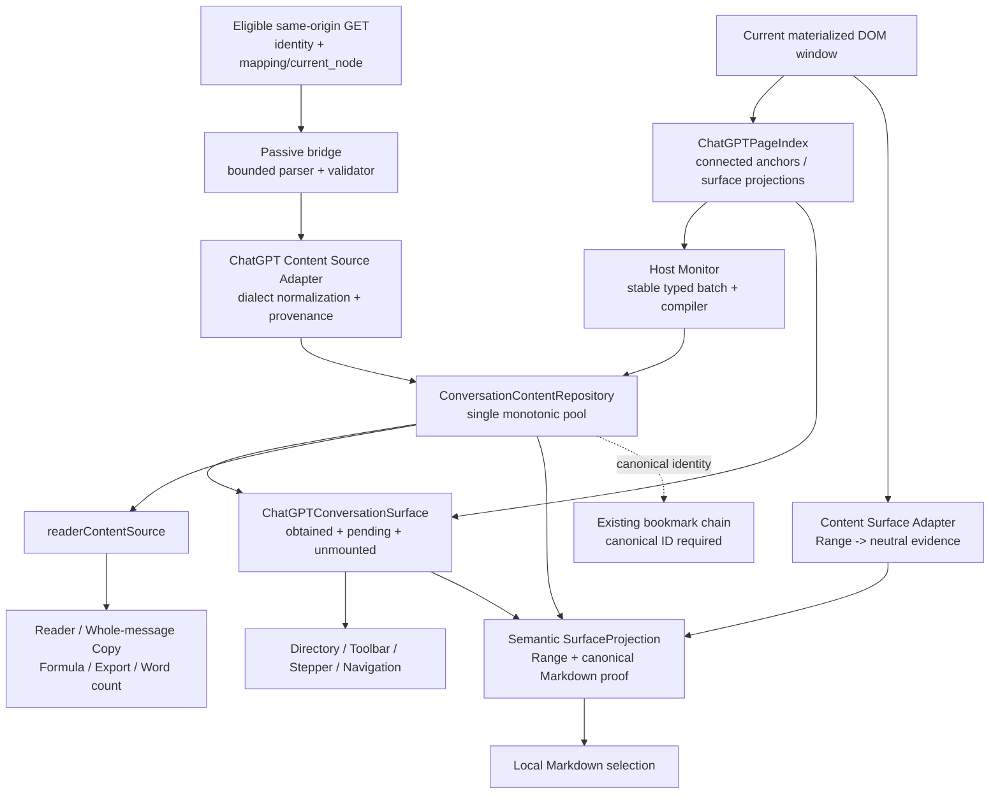

# Architecture Current State (As-Is)

本文描述 AI-MarkDone 当前仓库已经落地的结构事实，用于帮助开发者和 Codex 理解“现在是什么”。它不描述目标蓝图，也不描述未来计划。

> **ChatGPT discovery current boundary (2026-08-11)**
>
> Production has one signal-driven lifecycle: passive website Graph evidence and
> stable typed DOM rounds enter one `ConversationContentRepository`; the
> Repository and the single `ChatGPTPageIndex` are joined once by
> `ChatGPTConversationSurface`. Directory, Toolbar and Stepper subscribe to that
> atomic frame. Reader, word count, whole-message copy, formula and export read
> the same Content Port. A complete turn is either absent or obtained and
> consumable; streaming, compilation and mounted state never become a weaker
> public message state. See
> [ADR-0018](../adr/ADR-0018-chatgpt-identity-proven-single-content-pool.md).
>
> Every Runtime begins with a page-scoped identity. Therefore a stable first
> message is published even when no canonical URL ever appears. A later
> canonical identity promotes the same projection without changing turns,
> bodies, projection ID or content token. Only canonical A→B creates a new
> projection. The bridge remains passive: it observes eligible website-owned
> same-origin GET responses, never POST, and never issues a conversation
> request or reads cookies/storage/tokens/auth headers.
>
> `pending-surface` is UI geometry only. It can represent an assistant DOM node
> before content admission, but it never enters Reader, Directory count, copy,
> formula or export. Obtained but unmounted turns remain in the pool and remain
> available to content consumers.

> **Bookmark boundary (unchanged storage and protocol)**
>
> Bookmark types, storage fields, keys, save/remove protocol, migrations, old
> records and import/export are unchanged. Message-bookmark highlighting still
> uses the read-only canonical resolver. Without a canonical conversation ID
> and URL, bookmark controls are unavailable and no save/remove request or
> incomplete bookmark object is created. Identity promotion re-enables the
> existing chain during the next Surface reconciliation.

> **ChatGPT route identity audit (2026-08-10)**
>
> On the exact content hosts `chatgpt.com` and `chat.openai.com`, the route
> parser finds a semantic `c` or `conversation` path segment at any depth and
> reads the following safe URL token without assuming UUID or hexadecimal
> syntax. Therefore `/c/<id>`, `/conversation/<id>`,
> `/g/<scope>/c/<id>` and equivalent future prefixes use the same rule.
> `/g/<id>`, `/share/<id>`, query-only identities and unsafe tokens are not
> canonical Conversation Document identities. A URL-stable anonymous page uses
> its Runtime-owned page identity instead.
> Route parsing only binds identity and epochs; it never proves content,
> emptiness, login state, or endpoint shape. The executable rule is
> [`chatgptRoute.ts`](../../src/drivers/content/chatgpt/chatgptRoute.ts).

---

## 1. 当前代码分层

仓库当前主要按以下目录分层：

- `src/runtimes/*`
  - 运行时入口
- `src/drivers/*`
  - 浏览器 API、站点适配、注入、主题、导出、存储等基础设施
- `src/services/*`
  - 用例编排与跨站共享逻辑
- `src/ui/*`
  - 页面内 UI、控制器与 Shadow DOM UI foundation
- `src/contracts/*`
  - runtime 协议、平台契约、存储契约
- `src/core/*`
  - 更偏纯逻辑的数据与算法能力
- `src/style/*`
  - token、页面级 token 注入、Shadow DOM 样式入口

当前主线已经不再沿用旧的 `src/content/*` / `src/background/*` 目录组织，权威实现路径应以 `src/runtimes/*`、`src/drivers/*`、`src/services/*`、`src/ui/*` 为准。

---

## 2. 当前运行时入口

### Content runtime

- 入口：`src/runtimes/content/entry.ts`
- 当前职责：
  - 先按 URL 分流：ChatGPT 进入完整 content runtime；Gemini、Claude、DeepSeek 进入 formula runtime；未知 host 不启动页面能力
  - 为 ChatGPT 选择当前站点 adapter
  - 初始化 theme、math click、send controller，以及 Reader / Bookmarks / export / Copy PNG 的轻量 lazy ports
  - 初始化 bookmarks controller 与 message toolbar orchestrator；重型 panel / dialog / renderer 实现不进入页面启动图
  - ChatGPT 完整 runtime 与 Gemini/Claude/DeepSeek formula runtime 都监听 background 发来的 `ui:toggle_toolbar`；ChatGPT 切换完整 BookmarksPanel，formula runtime 允许复用全局书签管理面板作为扩展图标入口
  - 启动后向 background 发送一次 `content:ready`，让长时间休眠/恢复后的 service worker 能重新识别当前 supported tab
  - 处理 best-effort 的书签跳转恢复

当前 content feature 加载边界：

- `content.js` 仍是 manifest 直接声明的 classic content script，只包含站点启动、controller、port 与 lazy loader；`ReaderPanel`、`BookmarksPanel`、`SaveMessagesDialog`、`BookmarkSaveDialog`、Copy PNG 和公式资产 renderer 实现不得被它静态导入。
- `src/runtimes/content/lazyContentFeatures.ts` 通常在真实用户动作首次调用对应 port 时，通过 `browser.runtime.getURL(extensionAssets.contentFeaturesEntry)` 动态导入扩展自身的 `content-features.js`；ChatGPT 在已有 verified snapshot、页面可见且空闲时允许对 Reader/export 做一次受控预热。两条路径共享 module promise；加载失败会清空 promise，允许下一次用户动作重试。
- `content-features.js` 是保留公开导出的 ES module facade；每个 facade 方法再按 Reader、Bookmarks、Save Messages、bookmark save、Copy PNG 或公式资产动作的实际触发分别加载对应 chunk。它与 detached `reader.js` 在同一个 Rollup graph 中构建，以共享 Markdown / Reader 依赖而不复制整套 renderer。
- `content-features.js` 与 `content-feature-chunks/*.js` 只作为受控 web-accessible extension resources 暴露给受支持 host。chunk preload 必须用 `import.meta.url` 解析到扩展 origin，禁止退化为 ChatGPT host-origin 请求。
- classic `content.js` 与 lazy `content-features.js` 属于独立 module graph，各自持有 i18n module state。content runtime 必须把当前 storage-backed locale 同步给 `ContentFeatureModuleLoader`；loader 在创建任何 Reader、Bookmarks、Settings、Save 或 Copy PNG surface 前等待 lazy graph 完成同一 locale 应用，不能只依赖设置变化后的局部 `setLocale()`。
- `export-renderer.html` 是 authoritative TeX 公式资产的 extension-origin 渲染宿主，只在真实公式资产动作后按需创建。消息 PNG 在首次相关动作时加载 content feature chunk，并走 content-side 闭合 profile；Reader/export 的普通 feature chunk 可在 verified snapshot 后的受控 idle 预热中加载，但不创建 UI、不挂载 DOM、不预加载 export-renderer 或 MathJax capability。
  - 右下角真实 Bookmarks 按钮是当前自动化 trigger-path gate：无 verified snapshot 的合成基准必须证明启动、idle、streaming 与 toolbar recovery 阶段没有 feature module 请求；真实 ChatGPT 页面允许 verified snapshot 后的一次 Reader/export idle 预热。点击后 facade 导出可调用、面板可挂载，且没有 host-origin chunk 请求。

### Background runtime

- 入口：`src/runtimes/background/entry.ts`
- 当前职责：
  - 响应 content 发起的 protocol request
  - 路由到 bookmarks handler / settings handler
  - 处理 action icon/popup 状态：supported hosts 保持 active/no-popup 并通过 `ping -> ui:toggle_toolbar` 路由到 content runtime；其它页面显示 unsupported popup
  - 通过 `readerSession:*` protocol 为 detached Reader extension page 维护 `sessionId + sourceTabId + readerTabId` 绑定，并把 refresh/draft/beforeSend/send/locate 请求路由回源 ChatGPT content runtime
  - 对已关闭、discard/freeze 恢复中、content script 暂不可达的 tab 做 best-effort 静默降级
  - 在启动时执行 best-effort journal recovery

---

## 3. 当前协议与契约

- runtime 协议：`src/contracts/protocol.ts`
- 平台契约：`src/contracts/platform.ts`
- 存储契约：`src/contracts/storage.ts`
- Google Drive 书签备份位于 Settings → Data Management → Google Drive Backup。本地导出位于 Settings → Data Management → Local Backup。Google Drive Backup v1 不会实时双向更新，而是用户主动触发的不可变 bookmark snapshot 备份/安全合并恢复：本地读取与恢复写入仍通过 bookmarks storage/index 与 background storage queue，Drive 副作用经 `cloudBackup:*` runtime protocol 和 background provider 执行。Chromium build 使用 manifest `oauth2` 作为 `chrome.identity.getAuthToken` 的 Google OAuth SSOT，先按能力调用浏览器托管身份缓存，失败时再用 Web application OAuth client 与 `identity.getRedirectURL()` 走 `identity.launchWebAuthFlow`；Firefox 使用同一 WebAuth fallback，Firefox allizom redirect 会转成 MDN 允许的 loopback redirect。OAuth client ID 只标识 AI-MarkDone 这个公开应用，不携带开发者 Google 账号登录态；用户安装后授权的是当前浏览器/profile 中自己的 Google 账号。连接前 UI 会先显示 AI-MarkDone 的简短确认，用户确认后才启动 Google 授权。连接后本地状态只保存 Drive `about.get` 返回的账号摘要（邮箱、显示名、头像 URL）用于用户确认，不把 refresh token、cookie 或 Google account id 写入 extension storage。浏览器 identity cache 管理长期授权体验；provider 只把短期 access token 缓存在 extension local storage，过期前用于抗 service worker 重启。

当前 content ↔ background 协议已经具备：

- 固定版本字段 `v`
- request id `id`
- type-based request/response
- 统一错误码
- Supported content runtime 通过 `content:ready` 进行轻量恢复握手；extension action click 使用 `ping -> ui:toggle_toolbar`，不保活 MV3 service worker，也不新增动态注入权限。ChatGPT full runtime 打开完整 BookmarksPanel；Gemini、Claude、DeepSeek formula runtime 允许打开全局书签管理面板，但这只是扩展 UI 入口复用，不代表恢复这些平台的 Reader、消息 toolbar、发送、整条消息复制/导出或完整 adapter 适配。
- detached Reader session 只使用 `chrome.storage.session` / `browser.storage.session` 保存 snapshot 与 tab 绑定，不 fallback 到 persistent local storage，避免依赖 MV3 service worker 全局变量且避免把对话快照持久化；它不做强保活或实时 tail sync。当前合规/安全边界以浏览器提供的 `sender.tab.id` 和 `sessionId + sourceTabId + readerTabId` 绑定为权威：URL hash 只用于让 Reader 页声明要读取哪个 session，不能单独授予读取、刷新、发送或定位权限。

当前协议语义说明已经以 `docs/architecture/RUNTIME_PROTOCOL.md` 为权威；阅读时应以它和 `src/contracts/protocol.ts` 共同作为当前真相。

---

## 4. 当前已稳定的能力边界

### Platform adapter

- 当前生产完整页面 adapter 为 `src/drivers/content/adapters/sites/chatgpt.ts`
- Gemini、Claude、DeepSeek 当前保留公式复制 runtime，用于单公式 LaTeX 点击复制与用户启用的公式 PNG/SVG/MathML copy/save；旧书签中的平台字符串仍作为用户历史数据保留。formula runtime 可以构造/打开全局书签管理面板以支持扩展图标入口和设置入口，但不得恢复这些平台的 Reader、消息 toolbar、发送、整条消息复制/导出、定位或完整 adapter 链路。
- ChatGPT 内容发现采用 **Runtime page identity + 身份/结构证明的被动 Graph + 稳定 DOM 批次 + 单一内容池 + 原子 Surface**。`ChatGPTConversationContentRuntime` 统一处理初始化、PageIndex 事实、会话身份、Graph capture、`pushState`、`replaceState`、`popstate`、`hashchange` 与 `pageshow`。每个 Runtime 先拥有不可持久化的 page identity，因此无 canonical ID 的稳定 DOM 消息也能直接入池；后到 ID 只提升 identity，不重建内容。每个 canonical epoch 的 gate 最多接受一个合法 Graph。`ChatGPTConversationHostMonitor` 订阅唯一 `ChatGPTPageIndex` observer：跨 mutation batch 累积 typed identity，逐字符只标 dirty，在退出 streaming、正文非空、DOM 至少安静 400 ms、完成信号成立且通过 `RenderedContentCompilerV2` 校验后，将有序尾部批次原子提交给 Repository。官方 action anchor、generation end 或后续完整 round 都是强完成信号；三者都缺失时使用总计 2 秒的有界安静确认，action anchor 不再是正文入池硬条件。扩展主动 conversation GET/POST 恒为零，也不提供内容 RouteWatcher 或 timer-based 网络恢复。
  - V1 的 `ConversationContentSourceV1` 只发布不可变 `idle/syncing/ready/unavailable` 状态、`projectionId` 和 `contentToken`；`idle` 只表示当前没有绑定 page document，不再存在 URL/route unsupported 的内容失败语义。ChatGPT Runtime 在 canonical ID 之前即绑定 page identity，所以缺少 route ID 本身不会进入 unavailable。proof 只保留诊断性的 `basis: source | hybrid | host`。`complete` 表示已入池正文完整且数组稠密，不承诺从未观察到的隐藏历史已经获得。每条 assistant Markdown 带 `{ authority, fidelity, producer }` provenance；DOM 消息固定为 `host-rendered / normalized / rendered-content-v2`。`ChatGPTConversationSurface` 是 Content snapshot 与当前 PageIndex DOM 的唯一生产 join；它原子发布 `obtained`、`pending-surface` 与 unmounted 状态，并从同一 Frame 兼容投影 `ConversationMaterializationPortV1`。Reader、Copy、Save Messages、Formula 与 Export 从 V1 pool 投影；Directory/Toolbar/Stepper 只订阅 Surface；官网局部 Markdown 复制通过语义 `SurfaceProjection` 将当前 Range 映射到同一份 canonical 正文；非 ChatGPT 继续 legacy DOM path。
  - 消息缓存只发布 `coverage: complete` 的 dense snapshot。流式、400 ms 防抖、编译中和 deferred 都是内部过程：消息尚未进入缓存时消费者显示 pending/不可用，进入缓存后直接按 ready 消费。相同 `assistantMessageId` 幂等忽略，缓存正文不被后续 DOM 副本改写；新消息只追加到当前缓存末尾，无法确认顺序的单条消息暂缓，不使已有缓存失效。`host-rendered/normalized` 是经 compiler 校验的 canonical Markdown，可用于 whole-turn Reader、Copy、word count、formula、export 与有独立 SurfaceProjection 证明的官网局部 Markdown 复制；只有 canonical ID/URL 完整后才可进入既有 Bookmark 准备链路。
  - `src/contracts/semanticContent.ts` + `src/services/semantic-content/SemanticContent.ts` 是 provider-neutral Semantic Content Module：输入 canonical Markdown、revision、coverage 与 provenance，输出 AI-MarkDone 自有不可变节点、UTF-16 半开 source spans、plain text、Reader units/outline 与 canonical/fragment projections。unified/remark 只属于实现；DOM、Range、browser global、platform id、host selector、clipboard 与 UI 不进入该 Module。
  - `ContentSurfaceAdapter` 把同一非流式 assistant message 内的原生 Range 收敛成 typed target、`contentToken`、`materializationToken`、`surfaceToken` 与 W3C-style TextQuote；DOM handle 留在 driver。`SurfaceProjection` 是唯一允许把 surface evidence 与 canonical content/materialization 合并的 service seam，并校验 content/materialization revision；交互 controller 在复用 snapshot 前重新采样并比对 surface token、Range 与 TextQuote。任一 revision 陈旧、identity 歧义、重复文本无法消歧、decoded source offset 不可证明或正文为 reconstructed 时 fail open，不估算 Markdown offset。
  - page bridge 通过 manifest `document_start` 在页面主执行环境安装，只被动旁路观察 ChatGPT 页面自身成功的 same-origin GET；请求 URL 的已解码 path/query token 必须精确包含当前 canonical conversation ID，响应必须为 JSON，并在最多 4 层、256 个普通对象的有界遍历内通过 `mapping + current_node`、active branch、parent 链、角色、消息身份和完整 round 校验。它不依赖固定 endpoint，不观察 POST/PerformanceObserver，不读取请求体、生成正文、Cookie、Token 或认证 header，不 clone SSE，也不构造认证信息。若可信 Graph 缺失，稳定 DOM 消息仍可进入当前池；未被 Graph 或 DOM 暴露的历史保持“未获得”。
- `ChatGPTPageIndex` 是唯一 Page Monitor observer，监听 conversation/message 结构、identity attributes、语言无关 `data-testid`，以及限定在 typed assistant message 内的 `characterData`/child-list 生命周期变化；扩展自有节点、无关 child-list churn 和本地化 `aria-label` 被忽略。逐字变化只输出 dirty assistant ID。`ChatGPTConversationHostMonitor` 在安静窗口后做一次 typed tail scan/clone/compile，并将验证成功的正文提交给 Repository；它不读取 bridge、不轮询、不创建第二 observer。旧 DOM fact source 不再属于生产链路。
  - Graph 先到时一次性建立 source pool，后续 DOM 只追加新 assistant identity；DOM 先到时先发布 `host` pool，gate 保持开放，首个与池首条身份可靠重合的 Graph 只可补入该锚点之前尚未获得的历史前缀，已有正文与 digest 永不覆盖。无重合、顺序或身份冲突的 Graph 被忽略而不破坏池。虚拟化缩窗只移除 materialization anchor，池中消息与 ordinal 保留；重挂只更新 materialization token，不重新编译或重复挂载工具栏。
  - bridge request/response 在 Chrome 使用 object detail、Firefox 使用 JSON string detail；Graph capture event 在两种浏览器都使用 JSON string detail。差异只存在于 transport encode/decode 层；Reader、Bookmark、Copy、Save Messages 与 ChatGPT 消息词数通过 `ConversationContentSourceV1` / `readerContentSource` 消费同一个 V1 snapshot，不得新增浏览器分支或消费者自有 DOM fallback。
  - 完成态 `Deep Research` 报告继续属于同一 snapshot SSOT：page bridge 只识别已验证的 Deep Research resource 标识，并从其 `widget_state.report_message` 读取完整 assistant Markdown；未完成、空白、未知或损坏的 widget 必须 fail closed，上传文件正文、工具调用参数与其他 tool 输出不得进入报告。DOM 入口侧只把位于 `data-conversation-screenshot-content` 内的精确 `iframe[title="internal://deep-research"]` 视为已验证消息表面，并把既有消息工具栏挂到报告内容栈底部；iframe 延迟 hydration 复用唯一 PageIndex lifecycle 与共享 Conversation Surface，未知或无报告根的 iframe 不注入。iframe 只提供身份与锚点，报告正文仍复用既有 `normalizeChatGPTReaderMarkdown()` 与 `ReaderItem[]` 链路，不新增 iframe 正文采集、host permission、runtime protocol 或 Deep Research 专属 Reader/导出分支。
  - `ChatGPTPageIndex` 只缓存当前 materialized DOM window 的 connected anchors、typed identity、removal、跨批 generation start/end、同一稳定 owner 的 assistant identity replacement 与结构信号；它不拥有完整轮次数、绝对顺序或正文，也不依赖“一次 mutation 内出生完整 turn”。`ChatGPTConversationSurface` 原子读取该窗口和 Repository snapshot，以 `assistantMessageId` 连接获得的 turn。虚拟化可能只保留 assistant root、卸载 user root；assistant-only projection 只能回接已缓存消息。已获得但未挂载的 turn 仍保留在 Frame，Directory/Stepper 总数不会随 DOM 窗口缩小。Host Monitor 以唯一可见的缓存尾部为首选顺序锚点；尾部未挂载时，仅由真实 generation start 或缓存尾部的同 owner identity replacement 回接。候选位于可见尾部之前、存在未解析 round gap 或顺序歧义时只暂缓当前尾部，不污染已有池。缺少直接消息身份或出现歧义时 fail closed；Prompt 文本与 DOM-local position 永远不是 identity。PageIndex 过滤 AI-MarkDone 自有 mutation，观察稳定 `documentElement` 以覆盖 body/main replacement；root replacement 会 fence 旧编译、清除瞬态 generation/replacement evidence 并重建 Surface，在 Runtime dispose 时释放。Directory active-position geometry 使用 Surface 中完整 user/assistant `groupElements`，只有 assistant-only projection 时才使用该 assistant root。兼容 Materialization 的 toolbar anchor 只是定位锚点，不代表正文或整轮范围。
  - ChatGPT Message toolbar 不再维护 mounted-surface inventory、MutationObserver、route watcher、scan scheduler 或 recovery timer。它只订阅共享 Surface：`pending-surface` 可保留内部 pending 状态，但不会向官方 action row 插入节点；对应 turn 已进入池后，同一次 reconcile 挂载工具栏、显示数值词数并启用正文操作。它不移动、删除或替换官方工具栏、停止按钮或其父节点。虚拟化卸载/重挂只改变 Surface，不改变 content token，也不会重复挂载。非 ChatGPT adapter 暂时保留旧 DOM-local toolbar lifecycle。
  - `ChatGPTConversationNavigation` 的 off-screen 主路径使用 ChatGPT 持久化的 sibling turn slots，而不是按总高度推算目标像素：它只用当前已挂载且 identity 唯一的 user/assistant anchors 校准 canonical sequence 与宿主 slot sequence 的单一 offset，不读取 React/Fiber、私有 virtualizer 状态或 `conversation-turn-N` 数字。宿主可能在外层持久 slot 与内层 `section[data-turn]` 上重复 `data-turn-id-container`；PageIndex 的相邻性必须先归一到有同类 sibling 的外层 slot，不能把最近的重复 marker 当作列表项。一次导航只扫描一次 slot group并复用同一 target slot；校准成功后在总 timeout/attempt budget 内重复 `scrollIntoView()` 该节点，绝不降级为全局比例、像素 probing 或插值估算。无法建立可信 slot topology 时直接 fail closed。精确 anchor 的最终滚动必须在 bounded alignment window 内连续两次保持 tolerance；anchor 断开或持续漂移要 fail closed，用户主动滚动则立即停止自动纠偏。普通导航不新增全页 `MutationObserver`、`ResizeObserver` 或常驻 timer，诊断 observer 仅在显式 debug 模式短暂启用。
  - ChatGPT conversation route 识别只由共享 route helper 定义；内容发现的路由生命周期只由 `ChatGPTConversationContentRuntime` 持有。Directory、Toolbar、Stepper 与 Conversation Surface 信任 Runtime 已绑定的 page/canonical document，不再各自重解析 URL 来判断内容是否可用；内容链路没有 500 ms RouteWatcher。其它非内容功能若仍使用共享 RouteWatcher，不构成正文发现输入。
  - `ChatGPTDirectoryController` + `ChatGPTDirectoryRail` 是默认开启、用户可关闭的 ChatGPT right-side surface，由 `chatgptDirectory.enabled` 控制。目录宿主在 Runtime 初始化时独立挂载到 `document.body`，使用与 lower-right controls 相同的 page-level fixed portal；body 尚未创建时才暂挂到 `document.documentElement`。Directory 生产路径只订阅一个 Surface Frame，并在一次 `reconcile(frame)` 中同时更新条目、可见性、DOM geometry、书签投影与 active observer，因此不存在“Shadow DOM 已有条目但 rail 仍隐藏”的独立状态。所有 obtained turns 都进入目录；未挂载项保留条目，挂载项使用完整 message group 计算高亮。当前 DOM hydration window 变小不得缩短目录。无 canonical ID 时目录仍工作，但不读取消息书签状态。rail/preview 几何与官方导航隐藏规则保持原有 tokenized、fail-open 边界，不修改官方 DOM，也不影响 Reader、Save Messages、复制或书签存储。
  - `ChatGPTMessageStepperController` 是独立于旧 directory rail 的轻量 lower-right surface：它默认提供书签面板入口、当前页面收藏、Detached Reader Split View、Prompts、上一条/下一条按钮。书签面板入口使用 AI-MarkDone 品牌 Logo 并固定贴底，替代 ChatGPT header 入口，避免在官方 header 区注入按钮影响第三方划词弹窗；页面收藏按钮由 `chatgptBehavior.showPageBookmarkControl` 单独控制，只保存当前 ChatGPT 对话 URL/标题/平台/文件夹/时间等元数据，不保存完整对话内容，也不进入消息级 `bookmarks:positions` 高亮链路；无 canonical conversation identity 时该收藏动作不可用且不发送请求，identity promotion 后按原协议恢复。Detached Reader Split View 由 `chatgptBehavior.showDetachedReaderControl` 控制；Prompts 由 `chatgptBehavior.showPromptControl` 控制；上一条/下一条按钮显示由 `chatgptBehavior.showMessageStepper` 控制。Prompts 按钮使用 `messageSquareTextIcon`，位于 Split View 和 Previous/Next 之间，并打开与 composer `\` 联想共用的 Prompt 管理浮层。Left/Right 键消息导航由 `chatgptBehavior.enableArrowKeyMessageNavigation` 单独控制。定位时复用 `src/ui/content/chatgptDirectory/navigation.ts` 的 same-page helper。键盘监听默认开启，但会跳过 input、textarea、contenteditable、role=textbox、组合键、IME composing 与 AI-MarkDone 自有面板/弹窗/输入区。
  - `ChatGPTComposerEditingController` 统一持有官方 composer 绑定、键盘优先级、列表删除、公式助手和加号旁 Input Enhancement 按钮生命周期，并继续复用唯一 `document.body` subtree observer，不新增全局 observer。设置 SSOT 是 `chatgptBehavior.inputEnhancement`：`available` 决定入口存在与否，`enabled` 是运行总开关，Enter、粗体、列表父开关、有序/无序列表、公式联想和公式预览是保值的独立子项；有效状态只由 `resolveChatGPTInputEnhancement()` 计算。新安装全部开启；旧 `markdownComposerEnabled` / `enterKeyNewline` 只作为 v4 normalizer 的迁移输入。Settings 只修改 `available`，composer 弹层乐观保存完整嵌套快照，保存中禁用控件，失败回滚整个快照。按钮与官方加号动作容器并列；popover 是页面根节点上的独立 tokenized Shadow DOM portal，语法说明复用 `OverlaySession + ModalHost`。
  - composer 事件优先级固定为 IME/重入放行 → 已打开公式联想 → Cmd/Ctrl + Enter 发送与 Shift + Enter 宿主行为 → 已启用列表类型的 Backspace/Delete → 已启用粗体快捷键 → 普通 Enter。Enter 换行关闭时，普通文本 Enter 交还 ChatGPT，只有命中已启用真实列表类型才拦截。行前缀只做廉价候选检查，`markdownListEditing` 继续以 Lezer CommonMark AST 确认 `OrderedList` / `BulletList → ListItem`；有序/无序开关分别关闭对应类型全部规则。续写、拆分、空项退出、连续 sibling 重编号、loose list、引用、嵌套、等宽 marker 删除、二次合并和完整中间行删除继续共用纯规则与一个 native range edit；代码块、伪 marker、跳号边界、IME 和失败编辑交还宿主，不允许 `replaceChildren` 重建 ProseMirror。
  - Cmd/Ctrl + B 仍只写入或移除可见 `**`。公式联想和公式预览是独立能力：只开联想时只按需加载 `vendor/latex-workshop/formula-snippets.json` 且不调用 renderer；只开预览时只渲染 `$...$` / `$$...$$` 浮层且不加载目录；两者都关时不调度 scanner、目录或 renderer。目录继续来自固定 LaTeX Workshop upstream commit 的 1,250 条离线筛选项，不读取 `at-suggestions.json`、不实现 `@` 语法；候选和 Prompt autocomplete 复用 `ComposerSuggestionList`，公式插入只走 native range port。当前不接入 Reader，也不提供输入框内富文本、表格辅助、`\\(...\\)` / `\\[...\\]` 或用户宏。
  - composer observer 必须覆盖 ChatGPT 对任意嵌套 hydration shell 的替换，因为观察 adapter container 或其直接父级都无法感知该被观察节点自身从文档脱离；coalesced rebind 后必须把键盘监听迁移到当前 composer，并在 `available` 时恢复唯一 Input Enhancement 按钮，替换时关闭旧 popover。
  - `ChatGPTPromptAutocompleteController` 默认绑定 ChatGPT 官方 composer，并可在 Reader `SendPopover` 打开期间通过 `attachExternalComposer` 临时绑定当前 textarea：当前 token 以 `\` 开头且位于词边界时打开 Prompt 联想，按有纯文本 triggerText 且 enabled 的 Prompt 过滤；自动联想由 `chatgptBehavior.promptAutocomplete` 控制，默认开启，关闭后不监听 ChatGPT composer / Reader SendPopover 输入，也不会弹候选框，但不影响右下角、Settings、Reader 设置或 detached Reader 设置里的手动 Prompt manager 入口。Input Enhancement 的公式联想或公式预览有效且 ChatGPT caret 位于 dollar math environment 时，Prompt controller 不查询 library、主动关闭 Prompt 候选并把 `\` token 让给公式助手；公式外仍保持 Prompt 行为，Reader SendPopover 不接入公式助手。ChatGPT composer 按 contenteditable caret rect 定位，Reader SendPopover 按 textarea caret mirror 定位，上方空间不足或光标矩形不可用时回退到输入框附近。SendPopover 关闭时必须 detach 临时 composer 并回到官方 composer 监听。无匹配自动关闭，Backspace 恢复匹配时重新显示，按 Escape 后当前 token 不会反弹。候选框打开时会在 window capture 层优先接管 Enter、Tab、Escape 与上下键，确保 Enter 确认当前候选，不依赖 Input Enhancement 的 Enter 换行设置；点击、Enter 或 Tab 会用 Prompt 内容替换当前 trigger token，并在 `{{cursor}}` 标记处恢复光标，否则落在插入内容末尾；无可选项时不拦截 Enter/Tab。候选列表 DOM/CSS 与公式助手复用 `ComposerSuggestionList`。Prompt Library 存在 `browser.storage.local`，由 background `prompts:*` protocol 管理；已规范化 library 的普通读取不写回 storage，不刷新 `updatedAt`；首次读取会迁移到 4 条固定英文 v4 默认 Prompt（Humanize Text With a Skill、Turn Rough Ideas Into Prompts、Create a Reusable Skill、Translate Naturally），其中 Skill Creator 默认指向 OpenAI Codex `skill-creator` sample 目录，并要求最终输出一个自包含代码块 Prompt 来封装所有生成的 Skill 文件；默认 seed 不随界面语言切换；未修改过的默认 Prompt 由 `managedDefaultId` 继续接管，读取时会通过历史默认快照识别未编辑默认 Prompt，即使 `defaultPromptSetVersion` 未变化也会随当前默认 seed 升级；用户改过的默认 Prompt 会转为用户接管并不再覆盖；旧 `\`/`/` trigger 会规范化为纯文本；`prompts:list` 默认排除 disabled，管理器用 `includeDisabled: true` 展示全部并允许直接启用/禁用；disabled Prompt 仍占用 trigger，避免重新启用时产生冲突。Prompt 本身统一，Reader 注释导出和 Reader SendPopover 通过 shared Prompt Library provider 按需读取当前 enabled prompts，不把 Prompt 列表缓存回 reader settings；旧 Reader 自建/改过 prompts 会迁移，未改旧默认只保留 `Point-by-Point Revision` 作为普通可管理 Prompt，其他未改旧默认跳过；Reader settings 只继续持有 promptPosition 和 comment template；右下角、书签 Settings、Reader 设置与 detached Reader 设置的 Prompt 列表入口完全复用同一管理器，列表主区域和编辑按钮都进入编辑，文本插入只通过 `\` autocomplete 完成；用户可见摘要不得从旧 `reader.commentExport.prompts` 推导标题或数量。Prompt manager 是固定 520px 宽的浮层，manager 高度上限为 630px，使用内部列表滚动和 viewport clamp；编辑页中间内容独立滚动且底部操作区保持可见，正文 textarea 保留纵向 resize 但必须有最大高度，不能撑破浮层或遮住底部操作区。Prompt manager 可通过标题栏拖动，拖动位置只在当前页面会话内保留，不写入 settings 或 storage；再次从任一入口打开时可复用同一会话位置，刷新、新 tab 或 extension runtime 重建后回到入口附近弹出；拖动、窗口 resize 与 visual viewport resize 后都必须 clamp 在 viewport 内。Prompt 列表 drag handle 只负责通过 `prompts:reorder` 写回 storage 顺序，必须与面板拖动隔离；autocomplete 与 Reader picker 保持同一顺序。Prompt Library 另有 core-only portable JSON helpers，用于未来手动导入/导出或云同步规划；portable payload 只携带 id、title、content、triggerText、enabled、createdAt、updatedAt 与 lastUsedAt，不携带默认集接管、迁移状态或 UI-only 字段；当前 Google Drive backup 不读取或写入 Prompt Library。
  - Reader comment settings 的当前准确枚举为 `promptPosition + comment template + sortMode`；其中 `sortMode` 只由 Reader 内 settings dialog 提供入口，不进入全局 Settings。此项取代上一条中仍只列出 `promptPosition + comment template` 的旧枚举。
  - `ChatGPTPageWidthController` 是 ChatGPT-only 页面宽度调节层：`chatgptBehavior.pageWidthScale` 默认 100，表示不改变官方页面；用户可通过 Settings 滑块调到 105–200。controller 优先识别 ChatGPT 对话与 composer 共用的 `--thread-content-max-width` 限制器，并保留旧对话节点作为 fallback；它读取浏览器实际计算出的原始像素 `max-width`，再注入按比例计算后的绝对像素 `max-width`，避免依赖浏览器对 `length * number` CSS 算术的支持。唯一的 controller-owned style 直接作用于目标节点，不依赖可被页面生命周期清掉的 `html[data-aimd-chatgpt-page-width]` 选择器前缀，因此正文和输入条同步扩宽，延迟挂载的同语义节点也自动命中同一 CSS 规则。该能力只调整页面可视宽度，不进入内容发现、Reader、Save Messages、书签定位或目录条发现链路。
  - `ChatGPTDirectoryRail` hover accordion 与 compact preview 只能属于 rail UI 热路径：已渲染条目和轮次可在组件内缓存，鼠标移动时只允许更新旧/新 hover 邻近范围内的少量视觉状态，并复用已存在的 page-root preview style；rail host 与 preview 直接挂在 `document.body`，使用 fixed positioning，不依赖 ChatGPT 内容元素；body 尚未创建时才使用 documentElement 作为早期 fallback，后续 refresh 迁移回 body，不注册常驻 portal observer。不得在 hover 时全量扫描 `.rail__item`、按轮次线性查找 preview 内容、重写 token style、读取 layout rect 定位 preview，或触发目录发现、snapshot、Reader、toolbar、bookmark、resize suspend 等下层链路。旧 lower-right step controls 不再属于 rail。
  - `ViewportResizeSuspendController` 是 ChatGPT content runtime 的轻量 viewport 宽度拖拽保护层：它只消费浏览器 `window.resize` 信号和宽度变化阈值，不依赖 ChatGPT DOM/mutation；宽度变化超过 8px 时立即通过页面级 `data-aimd-viewport-resizing` 标记让 ChatGPT action-row toolbar chrome 暂时隐藏并暂停子树渲染，停止 resize 1 秒后派发一次恢复事件。该链路只影响插件 chrome 的临时可见性，不卸载 DOM、不重建 toolbar record、不折叠 action-row toolbar 布局、不改变 snapshot、Reader、Save Messages 或书签语义。
  - `ChatGPTDirectoryRail` 的滚动与展开样式归组件 Shadow DOM 持有；长目录仍由 rail 内部列表滚动，但原生滚动条必须视觉隐藏，不保留额外滚动槽。expanded 条目必须用明确的 grid 列分配编号、可收缩文案和右侧短线，避免 hover/active 状态被裁切。expanded label 的可见宽度应优先由 CSS intrinsic sizing 与字符宽度预算表达，而不是固定像素宽度、一次性宽度 token 或 JS 测量补偿。
  - `ChatGPTConversationNavigation` 是 ChatGPT 同页定位的 driver interface：Reader locate、Bookmark Go、跨页 pending navigation、directory 与 stepper 都提交 typed identity。已挂载目标直接使用 Conversation Surface anchor；未挂载目标只允许有界、可取消、projection-safe 的 materialization seek，并在精确 identity 命中后成功。URL 文本本身不决定取消边界；Surface projection 变化才 fence 旧任务。无 ID 时 Directory/Stepper 仍可进行本页已获得消息导航，但 Bookmark Go/跨页定位仍要求既有 canonical identity。`src/ui/content/chatgptDirectory/navigation.ts` 只负责命中后的视觉对齐；用户主动滚动、触摸、指针或键盘导航会中止短生命周期 re-align。
  - `ChatGPTSendPositionRestoreController` 是 ChatGPT-only page-behavior 层能力，由 `chatgptBehavior.restorePositionAfterSend` 默认开启地控制。它只负责发送后的阅读位置恢复，不进入正文发现链路；仅在用户主动发送前记录主滚动容器、scrollTop 与顶部附近 turn anchor，发送后用短生命周期 MutationObserver / scroll listener / rAF 合并做 instant restore。关闭时没有 observer/rAF/额外 scroll listener；开启但未发送时只有少量 capture 事件监听；armed 后会在用户 wheel/touch/pointer/keyboard、官方滚到底部、Reader locate、Bookmark Go、90 秒超时或恢复次数上限时释放。
  - Reader、Save Messages 导出、当前消息 Copy Markdown / Copy PNG、书签准备与词数通过 `readerContentSource` 共享唯一 `ReaderItem[]` 正文投影。普通消费统一读取当前已发布 pool；`collectFreshReaderContent()` 保留为兼容名称，只委托无副作用的当前读取。显式 Reader Refresh 只等待或返回已观察到的本地工作，不能启动 baseline admission；`ConversationContentSourceV1` 不暴露 acquire/reconcile/coordinator API。初始同步、PageIndex、History 事件、`pageshow` 与 Graph capture 只进入或重绑页面纪元、提交已观察本地批次或唤醒仍开放的 gate，任何信号都不能主动 GET 或重开已关闭 gate。ChatGPT provider dialect 在 discovery source Adapter 边界先规范化后再发布，Reader 投影不重复标准化；projection/content/surface tokens 用于本页异步失效，书签事务继续额外要求 canonical conversation ID。ChatGPT 不使用消费者自有 DOM 正文 fallback，导出、复制、PNG 和书签不得各自选择正文发现或提取路径。
  - 当前消息 Copy Markdown 与 Copy PNG 可以在同一 content token 内共享一个 in-flight/resolved Reader item promise；该 identity 只用于异步事务校验，不进入书签、导出或存储 schema。Token 变化或 route/document replacement 必须清空整页正文 promise；DOM mutation 只能使当前元素映射失效，不能绕过 cache 创造第二正文来源。普通入口不主动 refresh；Route/dispose 同样清空，禁止跨 token 返回旧正文。
  - 官网 conversation Reader 由 `ChatGPTConversationReaderBinding` 订阅 Source state：cache 新增尾项时追加，缓存中已有 typed identity 时保持其内容，内容不变不更新；没有 snapshot 时关闭当前 Reader。Message toolbar 不再扫描 DOM 正文、维护第二内容缓存或触发消费者 flush。Detached Reader 继续采用不可变快照与手动 Refresh；Refresh snapshot 构造完成后必须再次校验 content token，annotation focus 在 Reader show 与 focus 两个异步提交点后也必须复核，迟到结果关闭旧 Reader 并 fail closed。
  - Save Messages 打开期间任何 ChatGPT source revision 变化都会关闭弹窗；书签保存弹窗返回后必须再次校验点击时的 source revision，不一致则拒绝写入。Copy/PNG 以点击时确认的 snapshot 为原子输入，不在执行中途切换正文。`source-backed`、`host-rendered` 与两者构成的 hybrid snapshot 只要已进入 cache 都可进入 whole-turn 输出；SurfaceProjection 的 `stale-content` / `stale-surface` 仍只表示一次选择操作或异步结果失效，不是消息缓存状态。
  - ChatGPT snapshot 正文进入 `ReaderItem[]` 前必须经过 `normalizeChatGPTReaderMarkdown()`：引用/file citation 噪声继续移除；ChatGPT 内部 annotation token 不能裸露到 Reader/Copy/Export/Bookmark。已知 `entity` token 归一成正文显示名，已知 GenUI math widget 归一成 Markdown inline/block math，未知 annotation token 安全丢弃。
  - ChatGPT Reader 的 `jump to message`、书签面板 Go 与跨页 pending navigation 都复用同一条 canonical navigation interface。
  - ChatGPT 工具栏与 Directory 的书签状态只在 Conversation Surface 带 canonical identity 时被动调用既有 read-only resolver；保存命令从当前 snapshot 的 Reader item/turn read 取得 typed identity、prompt、正文与绝对 position，再复用现有 `url + position` 书签身份。无 ID、URL 不完整或显式 element 无法精确映射时 fail closed，不发送保存/删除请求，也不改变底层类型、协议、存储 schema、迁移或兼容数据。
  - ChatGPT adapter 的 observer container 契约由唯一 `ChatGPTPageIndex` 持有；conversation root 替换、typed identity、完成 action anchor、Deep Research hydration 与当前 DOM anchor 都从这一个 Page Monitor 投影。`MessageToolbarOrchestrator` 在 ChatGPT 生产组合中不创建 `MutationObserver`、`RouteWatcher`、`ScanScheduler` 或 targeted recovery timer，只订阅 `ChatGPTConversationSurface`。pending surface 不向官方 action row 注入插件节点；对应 assistant 已进入权威 Content snapshot、宿主已退出 streaming 且官方 anchor 仍 connected 后才挂载并显示数值词数。无 canonical ID 时正文操作继续可用，书签 action 被禁用；identity promotion 后原位恢复。anchor 卸载时移除、稳定重挂时保持单例。`dirtyMessages + incremental reconcile` 仅为非 ChatGPT adapter 的现有兼容生命周期。
  - ChatGPT toolbar record 以 logical turn 的 `primaryMessageEl` 为唯一 identity；同一回复内多个 assistant segment 共享一个官方 action row 时，full 与 incremental reconcile 都必须先归一到该 turn，不能各自创建并争抢 toolbar host。
  - 每条 `MessageToolbar` 的常态 Shadow DOM 只保留立即可用的动作与状态结构；仅 Copy PNG 等次级任务真正开始时，才按需创建 `TaskProgressPanel` 子树和对应 CSS。`TooltipDelegate` 在调用方明确 `upgradeTitles: false` 时只保留事件委托，不创建无效 `MutationObserver`。这些延迟资源不得改变 hover 入口、取消、进度、完成反馈、主题 token 或 dispose 行为。
  - `drivers/content/virtualization/*` 与相关设计文档目前只保留为历史实验资产，不构成现行 shipping path

ChatGPT 内容发现与页面交互必须保持一个内容池、一个 PageIndex、一个原子 Conversation Surface，以及一个独立的局部选择证明：

```mermaid
flowchart TD
    Graph["Eligible same-origin GET<br/>identity + mapping/current_node"]
    Bridge["Passive bridge<br/>bounded parser + validator"]
    Adapter["ChatGPT Content Source Adapter<br/>dialect normalization + provenance"]
    HostMonitor["Host Monitor<br/>stable typed batch + compiler"]
    Repository["ConversationContentRepository<br/>single monotonic pool"]
    DOM["Current materialized DOM window"]
    PageIndex["ChatGPTPageIndex<br/>connected anchors / surface projections"]
    ConversationSurface["ChatGPTConversationSurface<br/>obtained + pending + unmounted"]
    SurfaceConsumers["Directory / Toolbar / Stepper / Navigation"]
    ReaderSource["readerContentSource"]
    BodyConsumers["Reader / Whole-message Copy<br/>Formula / Export / Word count"]
    SurfaceAdapter["Content Surface Adapter<br/>Range -> neutral evidence"]
    SurfaceProjection["Semantic SurfaceProjection<br/>Range + canonical Markdown proof"]
    SelectionConsumers["Local Markdown selection"]
    Bookmark["Existing bookmark chain<br/>canonical ID required"]

    Graph --> Bridge
    Bridge --> Adapter
    Adapter --> Repository
    DOM --> PageIndex
    PageIndex --> HostMonitor
    HostMonitor --> Repository
    Repository --> ConversationSurface
    PageIndex --> ConversationSurface
    ConversationSurface --> SurfaceConsumers
    Repository --> ReaderSource --> BodyConsumers
    DOM --> SurfaceAdapter
    SurfaceAdapter --> SurfaceProjection
    Repository --> SurfaceProjection
    ConversationSurface --> SurfaceProjection
    SurfaceProjection --> SelectionConsumers
    Repository -. "canonical identity" .-> Bookmark
```

- Reader、工具栏 Copy/Copy PNG、Save Messages 导出与书签保存正文必须只通过当前 snapshot 的 `readerContentSource` 获取正文，并消费同一份 `ReaderItem[]` 语义；Reader structure/outline 由 Semantic Content projection 提供。显式 Reader Refresh 只冲刷本地已观察工作；普通点击不得等待 refresh。页面局部 Markdown 复制必须走 `ContentSurfaceAdapter -> SurfaceProjection`，并可消费 source-backed 或已封存的 `host-rendered` canonical Markdown；DOM 只提供 typed target、Range/TextQuote 和 revision 证明。陈旧、歧义、跨消息、流式或 reconstructed 正文必须 fail open，不能退回 `Range.toString()` 或 DOM→Markdown。
- ChatGPT 已获得正文、当前顺序与 typed message identity 只由 `ConversationContentRepository` 的 V1 snapshot 负责；React props、内部 store 与消费者侧 DOM Markdown 不得恢复成第二套 semantic fallback。Source Adapter 可提交一次可信 Graph 历史，Host Monitor 可先建立或继续追加经过稳定编译的 DOM 批次，后到 Graph 仅补可靠历史前缀。已有长对话缺少 Graph 时，当前已观察 DOM 消息仍可消费，但系统不得把未挂载、未捕获的隐藏历史伪称为已获得。
- ChatGPT snapshot 可能包含官方页面渲染层已经消化掉的内部 annotation token，例如 entity metadata 或 GenUI math widget；这些 token 必须在 snapshot Markdown normalizer 层转换/清理，而不是依赖 Reader renderer 或 DOM fallback 后处理。
- Directory、Toolbar、Stepper 与同页 Navigation 只消费 `ChatGPTConversationSurface`；Frame 已经把冻结的 V1 order 与当前 connected anchors/assistant-only projections 按 typed identity 原子连接。Reader locate、Bookmark Go 与 pending navigation 复用由同一 Frame 投影的 Materialization/Navigation ports。旧 `ChatGPTConversationIndex`、独立 `ChatGPTConversationMaterialization` 与 Discovery Coordinator 已删除；任何消费者都不得重新 join Content 与 PageIndex。Prompt 文本、URL 文本和 DOM-local position 永远不是消息 identity。
- Directory、Stepper 与消息工具栏 host 使用统一 Surface consumer marker。ChatGPT hydration 若移除这些扩展自有节点，唯一 `ChatGPTPageIndex` observer 只发布一次 surface lifecycle fact，由消费者从当前 Frame 重建；不得为自愈增加消费者 Observer、重新读取正文或改变 content token。逐字符 content mutation 只进入 Host Monitor dirty 合并，不触发 Surface 重建或 PageIndex topology 重扫。
- ChatGPT Reader 打开后的内容页集不得通过 DOM 正文补齐或以 DOM message ID 过滤。DOM 变化只触发 canonical 对账；verified snapshot 中未挂载的完整轮次仍属于 Reader。稳定 canonical prefix 增长时允许追加 tail；branch 或既有 identity 变化时必须原子替换完整 items，并按唯一 typed identity 保留当前位置。异步 tail 结果写入前必须校验 route token 与 snapshot conversation ID；显式 clicked element 无法映射到 canonical round 时 fail closed。
- 四个职责固定：V1 Repository/Source 回答“当前已获得内容是什么”；`ChatGPTConversationSurface` 回答“这些内容当前如何挂载以及有哪些 pending UI surfaces”；Semantic Content Module 回答“这份 Markdown 的稳定语义与 source span 是什么”；语义 `SurfaceProjection` 回答“这次 Range 是否唯一对应当前 canonical Markdown”。PageIndex 只是 host facts 输入，不是第三个内容源。
- ChatGPT send position restore 与上述内容/定位 SSOT 平行：它只消费发送事件与页面滚动位置，不读取正文、不刷新 snapshot、不改变 Reader/Save Messages/Copy/Bookmark 内容语义。
  - 该链路的变更边界必须局限在 ChatGPT 内容发现、Reader/Save Messages 正文供给、目录/定位投影及其测试/SSOT；不得改变书签存储 schema、导出 formatter、Reader 渲染主题、平台开关或发送链路。

### Bookmarks

- background 负责写入和恢复
- content UI 负责意图触发与界面交互
- `BookmarksPanel` 现在主要承担 shell / overlay lifecycle / tab orchestration
- `BookmarksTabView`、`SettingsTabView`、`FeedbackTabView`、`MappamoryTabView`、`SponsorTabView` 是 bookmarks family 的主内容真相；`SponsorTabView` 只进入 Chrome/Firefox target surface
- bookmarks 信息页职责已经拆开：`FeedbackTabView` 是最底部反馈入口，Chrome/Firefox 提供完整不裁切的 QQ 与小红书群聊邀请图、邀请有效期说明，以及关注小红书账号后从账号加入群聊的 fallback；`AboutTabView` 持有个人介绍、项目背景与 About 小红书入口；`MappamoryTabView` 独立持有好友迹的双语产品介绍、公开能力、App Store/官网入口与宣传图；`SponsorTabView` 持有付款二维码、GitHub 支持入口与感谢赞助名单
- 书签树渲染与 virtualization 已收口到 `BookmarksTreeViewport`
- `src/ui/content/overlay/OverlaySession.ts` 现在是通用 overlay session wrapper，负责组合 overlay host、keyboard scope、input boundary 与 modal slot
- `BookmarksPanel`、`BookmarkSaveDialog` 与 `SaveMessagesDialog` 已直接复用通用 `OverlaySession`；Bookmarks family 不再保留独立 overlay wrapper
- `Deep Research` 的完成态报告已纳入 ChatGPT snapshot 正文范围；适配只存在于既有 page bridge 的消息序列化层，不恢复独立 compatibility hook 或第二套 Reader source
- `src/ui/content/components/transientUi.ts` 现在是共享 outside-click / transient-root contract；Bookmarks family 只保留对它的 family-level 组合，而不再拥有私有实现
- Bookmarks family 内部的 inline select / number-stepper 目前仍保持为 family-scoped primitive，并通过统一 transient-ui contract 与 panel shell 协作
- `ModalHost` 现在只承担 dialog render、topmost modal ownership 与 focus restore；shared host boundary 与 keyboard scope 由 `OverlaySession` 负责
- `ModalHost`、`BookmarksPanel`、`BookmarkSaveDialog`、`SaveMessagesDialog`、`ReaderPanel` 与 `SendPopover` 现在都使用共享 motion contract：surface 先进入 `opening/open/closing` 状态，再在关闭动画结束后卸载，而不是立即从 DOM 移除
- 全屏 `OverlaySession` host 本身始终不接管 pointer；只有真实 backdrop 与 surface opt in。任何 close motion 无法启动时，owner 必须立即卸载 session 并释放 scroll lock；关闭中重开必须取消当前 close 并复用唯一 host，避免透明层、重复 host 或滚动锁残留导致宿主页面不可点击。
- 当前 motion contract 明确分成两族：
  - `panel-window`
  - `modal-dialog`
- 共享 backdrop fade 已从各 surface CSS 中抽离成单一 shared contract；surface owner 只保留各自 family 的 shell motion
- `ReaderPanel`、`SaveMessagesDialog`、`BookmarkSaveDialog` 与 `BookmarksPanel` 现在都通过 stable shell/backdrop ownership 保持首次 mount 的外层节点；后续内容刷新只更新内部内容区，不再重建进入动画绑定的外层 DOM
- `ModalHost` 现在和 `panel-window` 家族一样遵守单次 dismiss/close 提交；已进入 `closing` 的 surface 不再重复触发 dismiss 回调或恢复逻辑
- `ModalHost` 与 `panel-window` 家族现在都使用共享 focus lifecycle：打开前捕获 opener，打开稳定后把焦点移入 surface，关闭后再恢复焦点
- Settings tab 中的公式配置写入独立 `formula` category；平台开关写入 `platforms` category。`platforms.chatgpt` 控制 ChatGPT 完整 runtime；`platforms.gemini` / `platforms.claude` / `platforms.deepseek` 控制对应平台公式复制 runtime。`formula.clickCopyFormulaFormat` 是点击单公式复制的唯一格式设置，`formula.markdownCopyFormulaFormat` 是整段 Markdown 源码复制/下载的唯一格式设置；两个字段共享同一组 formula source format model，但互不覆盖。旧 `behavior.enableClickToCopy` 只作为设置迁移/兼容输入，不再作为公式交互的运行时 SSOT；旧 `formula.copyMarkdownDelimiters` 只作为迁移输入，`false` 会迁移为点击单公式 raw LaTeX，且不会改变整段 Markdown 源码输出默认值
- Settings tab 的主顺序是 Platforms、Buttons & Entrypoints、ChatGPT Reading & Input、Reader & Comment Workflow、Copy, Formula & Export、Language、Data Management、Advanced。Buttons & Entrypoints 是无路由、非持久化的二级页，集中持有工具栏、lower-right ChatGPT 入口和公式 hover action 可见性。ChatGPT Reading & Input 持有发送后恢复阅读位置、Input Enhancement 入口可用性、Prompt autocomplete、对话/输入条宽度、左右方向键导航，以及 `chatgptDirectory` 目录条开关、显示模式、prompt label 模式和右侧边距；不再单独暴露 Enter 换行或 Markdown 开关。`chatgptBehavior.inputEnhancement.available` 默认开启，关闭后按钮卸载且全部输入增强暂停，但 `enabled` 和所有子项原值保留。`chatgptBehavior.promptAutocomplete`、页面宽度、lower-right 按钮和目录条继续保持各自独立设置边界。
- Input Enhancement 的运行总开关和详细项只在 composer 弹层中管理；按钮高亮只代表 `available && enabled`。Enter 换行、列表父开关、有序/无序、粗体、公式联想和公式预览独立保存；列表父开关只禁用两个列表类型，总开关只禁用全部子项，均不清空值。页面弹层与 Settings 通过同一个 `chatgptBehavior` category 和 storage 订阅回流。设置版本保持 v4，旧 `markdownComposerEnabled` / `enterKeyNewline` 不再出现在正式类型或写回 payload 中。
- 更新日志的一次性提示由 background 的 `bookmarks:changelogNotice:get/ack` 状态持有；BookmarksPanel 与 Reader conversation profile 都通过共享 presenter 读取并确认同一条 pending notice，因此同一版本只提示一次，不新增 Reader 私有计数或存储字段
- `ToolbarHoverActionPortal` 是消息工具栏 hover 次动作与公式 hover 图片动作的共享 anchored portal；它负责 viewport clamp、anchor bridge 定位与顶部空间不足时的下翻，不允许调用方各自实现一次性边界补偿。该 portal 的 action row 以 `transform` 持有上下方锚定几何，因此明确保留既有的无动效 outside-pointer / resize / scroll 生命周期，避免通用 opening motion 覆盖定位并造成 hover 闪烁。
- 消息工具栏 Copy 主按钮的 `Copy Markdown` label tooltip 固定优先显示在按钮下方，避免遮挡其上方展开的 Copy PNG 次动作；移入 Copy PNG 按钮后，次动作自己的 label tooltip 仍按标准规则优先显示在按钮上方。

### Reader / Copy / Sending

- `pure/domain service` 负责纯逻辑与规则
- `content-facing feature service` 负责数据准备和行为编排
- content driver 负责 DOM 采集、剪贴板、导出、发送桥接
- UI 层负责 DOM / Shadow DOM 呈现；仓库当前不以 React 作为 UI runtime
- `ReaderPanel` 当前通过 surface-owned named profiles 收口多入口差异；消息工具栏与书签预览不再直接传 low-level chrome flags，而是分别选择 `conversation-reader` 与 `bookmark-preview`
- `readerContentSource` 是 Reader 正文供给的共享 service 入口；Reader、Save Messages 导出、当前消息 Copy Markdown / Copy PNG 与书签保存正文均消费同一份 snapshot-backed `ReaderItem[]` 语义。普通入口直接读取当前投影；同一 immutable snapshot 与规范化页面 URL 命中 projection cache，不重新解析 Markdown；Reader header Refresh 只执行一次本地 flush 后重读当前投影，不能发起 Graph 获取。detached Reader 通过 `readerSession:refresh` 回源页执行同一 local-flush/read，并按 canonical typed identity 的唯一匹配保留当前页，仅对完全缺少 identity 的 legacy snapshot 使用唯一 position fallback。Reader Copy、Reader 选区源码复制、工具栏 Copy Markdown、消息书签 Markdown copy 与 ChatGPT 官网直选共同进入 `canonicalMarkdownCopy`；只在写入剪贴板前按 `formula.markdownCopyFormulaFormat` 重写公式 wrapper，默认 Markdown-dollar 不重复解析已经 canonical 的 Markdown。Reader 选区 action 与 Shadow DOM 原生 copy handler 不得各自决定公式格式。导出只将 `ReaderItem.content` resolve 为 `ChatTurn[]` 后交给既有 Markdown/PDF/PNG formatter，其中只有 Markdown formatter 会在写出文件前应用同一个 formula source format model；已经进入 pool 的 source/hybrid/host 投影可导出，reconstructed canonical output 仍 fail closed。
- ChatGPT 官网正文直选是一条严格限定的 selection exit，不是新的消息正文来源：只要 ChatGPT platform runtime 开启，唯一的 `ChatGPTAtomicSelectionController` 就保持一个 document `selectionchange` listener、一个 window `keydown/keyup` listener 和一个 window bubbling `copy` listener；`chatgptBehavior.atomicMarkdownCopyShortcut` 只选择 `none`、`mod-c` 或 `mod-shift-c`。controller 只接受同一条非流式 assistant `.markdown.prose` 内的单 Range，并用 `requestAnimationFrame` 合并 selection churn；`ContentSurfaceAdapter` 把它收敛成 typed target、content/materialization/surface token、TextQuote 与可靠 formula atoms，`SurfaceProjection` 再从 Repository 当前封存的 source-backed 或 `host-rendered` Markdown 中解析唯一 canonical span。DOM 不生成正文，也不负责 Markdown 序列化。controller 在快捷键出口重新采样 Range 与 surface evidence；token 陈旧、选区变化、重复文本无法唯一消歧、跨消息、流式、reconstructed、正文空白或 unsupported atom 时 fail open，不得恢复 DOM→Markdown。`mod-c` 只在真实 `keydown → copy` 意图下清空宿主 clipboard types 并写入 canonical `text/plain`；`mod-shift-c` 在合法用户手势中直接写入；`none` 完全交还宿主。公式 wrapper 只在最终剪贴板出口经共享 `canonicalMarkdownCopy` 应用。该入口不创建选区按钮、HTML/MathML/Office payload、第二个 observer、逐消息 listener 或持久缓存，也不加载 Reader/export renderer。旧的 strict rendered-unit DOM converter 仅保留给缺少 canonical content/materialization ports 的非 ChatGPT legacy composition，不得被生产 ChatGPT 的投影失败重新启用。
- Detached Reader 是独立扩展页入口，不新增 ChatGPT 正文发现模型：当前 v1 由右下角 message stepper 左侧的 Split View 全局按钮触发，首次打开前显示复用现有 modal/notice family 的实验性提示；确认后通过同一条 `readerContentSource` 创建 fresh snapshot，再由 background 建立 `sessionId + sourceTabId + readerTabId` 绑定。独立页复用 ReaderPanel 渲染、Reader 内部 bookmark、copy/comment/Sticky/prompt/settings 能力，以及 conversation Reader action service；refresh/draft/beforeSend/send/locate 都经 `readerSession:*` protocol 回到源 ChatGPT content runtime 执行既有 fresh content、composer draft read/write、sending 与 navigation helper；locate 与 send 会激活源 ChatGPT tab，但不关闭 detached Reader tab。发送按钮复用同一个 tokenized `SendPopover`，由完整 `SendPort` contract 把官网内 content adapter 发送与 detached session 发送分开；detached 页打开发送弹框时读取源 ChatGPT composer 当前草稿，关闭/取消发送弹框时把未发送草稿写回源 ChatGPT composer，点击发送时先通过 `readerSession:beforeSend` 在源页 arm 同一条发送后位置恢复，再通过 `readerSession:send` 激活源 ChatGPT tab 并调用 `sendText(adapter, text)`。v1 不做实时双向同步或强保活；源 ChatGPT tab 关闭时 background 会 best-effort 关闭对应 Reader tab，Reader tab 关闭时只清理 session。Detached Reader 的安全审查结论是：当前实现不新增外部传输、不新增 host permission、不持久化对话快照；协议 payload 更严格 schema 校验和 source URL 复核属于后续防御深度增强，不是当前合并阻断项。
- `saveMessagesFacade` 只保留 `exportTurnsMarkdown` / `exportTurnsPdf` / `exportTurnsPng` 这组格式化与副作用入口；它不再从 adapter 收集 turns，也不再拥有 ChatGPT snapshot refresh fallback
- Reader Markdown 正文恢复为单一默认主题；正文样式继续由共享 tokenized markdown contract 持有，入口不能直接传 preset、CSS 或 theme object
- Reader Markdown 支持边界固定为 sanitized GFM、KaTeX math、syntax-highlighted fenced code 与 tokenized reader typography；fenced code chrome 只提供 copy 与每块代码独立 word-wrap toggle，`latex`/`tex` 默认 wrap，其他语言默认横向滚动；Mermaid 图表渲染已退出产品路线，Mermaid fences 只作为普通代码源码展示，不再接入 renderer iframe、SVG 替换、预览层或相关设置项
- Reader 正文最大宽度由 `reader.contentMaxWidthPx` 设置驱动，默认保持 1000px；该设置只影响 Reader content inner width，并必须继续 clamp 到 Reader panel 宽度内，不改变 panel shell、fullscreen 或 Markdown 渲染链路

说明：

- `src/services/copy/*`
- `src/services/reader/*`
- `src/services/markdown-parser/*`
- `src/services/export/*`

当前都属于 `content-facing feature service`，不是严格意义上的“纯 service”。
- `src/services/export/saveMessagesPdf.ts` 属于明确例外：它负责构建最终导出文档，并消费样式 token 生成 PDF/打印用 CSS。
- `SendPopover` 仍是 anchored popover，而不是 overlay surface；它保留 textarea-level `inputEventBoundary` 作为 intentional local boundary，不视为 shared overlay contract 的例外缺口。`SendPopover` 的提交副作用通过完整 `SendPort` 注入：content runtime 端口继续读取/写回官方 composer、发送前 arm 位置恢复并调用 `sendText(adapter)`；detached Reader 端口通过 `readerSession:draft` 回源页读写当前 composer draft，通过 `readerSession:beforeSend` 回源页执行发送前 position restore arm，并通过 `readerSession:send` 激活源 ChatGPT tab 后调用 `sendText(adapter, text)`。发送浮层打开期间可临时接入共享 Prompt autocomplete controller；当 `chatgptBehavior.promptAutocomplete` 开启时，官网内 Reader 与 detached Reader 的 textarea 支持 `\` 联想；关闭浮层时解绑，避免长期抢占 ChatGPT 官方 composer 监听。
- Reader 当前已经拥有两条稳定的“只在 Reader 内部生效”的扩展链路：
  - atomic closed-unit source selection：普通文本保留原生选区，closed unit 按整单元高亮与源码复制
  - inline comments：ChatGPT 的 verified conversation 注释由 `ReaderAnnotationDocument` / `ReaderAnnotationTarget` 绑定到 conversation 与 assistant message identity；background 以每会话 `storage.local` bundle 作为 durable 记录的唯一写入权威。`reader.persistAnnotations` 只控制新建注释是否进入该 bundle：已有 durable 注释无论开关状态都始终读取、展示并继续持久化编辑/删除；关闭期间的新注释只进入当前页面 runtime，重新开启也不自动迁移。官网内 Reader、detached Reader 与 Reader 注释管理模态框通过 typed annotation client 共享 durable 记录，并把当前会话的 runtime-only 记录合并进当前/全部视图。当前会话/全部注释、按会话/时间线、搜索、50/50 原文摘录、批量选择删除和跨会话精确回源均在 Reader family 内完成；无法唯一重锚的记录保留并显示 `unanchored`。Gemini、Claude、DeepSeek 以及没有 verified document identity 的入口仍保持页面内存行为。comment export 的 prompt/template/prompt-position/sort-mode 配置继续位于 settings 域，Copy annotations、Reader export popover 和 Reader Send 插入注释保持原有语义，不属于新的持久化查询或导出能力
- Reader conversation profile 还拥有一条临时 Sticky 摘录链路：选区浮层的 `Stick` action 只消费现有 atomic selection Markdown export，将内容在当前页面生命周期内渲染为 sanitized Markdown block；Sticky block 保存在 `ReaderPanel` 实例内存状态中，翻页和关闭/重开 Reader 时保持不变，只有页面刷新或 content runtime 重新初始化才允许丢失。block 自身不限高且不使用卡片外框，左侧只保留拖拽与删除两枚纵向操作按钮。该链路不进入 bookmark-preview profile，不写入 background/storage，也不改变 Reader 内容采集、导出、书签、发送或评论合同。宽屏时 Sticky 是左侧 rail，宽度可拖拽且最大 clamp 到 Reader body 宽度的 2/3；窄屏时只允许作为 Reader 内部 drawer 覆盖，不形成三栏布局；展开入口位于 Reader footer 左侧 action cluster 前。
- Reader 不再新增专用图表渲染扩展链路；需要展示图表时保持 fenced code 源码，避免把重型渲染库重新带入 content runtime 或额外 overlay 生命周期
- 公式点击复制与单公式 PNG/SVG/MathML hover 动作由 `FormulaAssetHoverController` 统一承载，运行时消费 `formula` settings、`platforms` settings 与 build-time target surface policy 做 gating；hover 动作默认全部关闭，既有 `formula.assetActions` 选择继续保留。ChatGPT 与 Gemini/Claude/DeepSeek 仍通过各自现有公式识别入口取得 source 与 display mode，但资产链路必须把来源区分为 authoritative TeX 与 `dom-only`，不能把平台文本、`outerHTML` 或 heuristic source 冒充 TeX。authoritative TeX 进入共用 `export-renderer.html`：MathJax 生成一次 standalone SVG，SVG 直接交付，PNG 从同一 SVG 等比栅格化，MathML 由同一 renderer 输出，并显式带入页面前景色、字号和 display mode。`dom-only` 只允许通过唯一 DOM compatibility adapter 生成 PNG；SVG/MathML 稳定返回 `SOURCE_UNAVAILABLE`，不得输出错误资产。公式 PNG 保持完整单图，极端尺寸允许低于 1x 等比缩放，SVG 始终保留无损出口。Toolbar Copy Markdown、Reader Copy、Reader 选区源码复制、Detached Reader copy、消息书签 Markdown copy 与 Save Messages Markdown 下载仍只在源码出口按 `formula.markdownCopyFormulaFormat` 重写 wrapper，不改变 Reader canonical Markdown 或消息 PNG 语义。
- `MathClickHandler` 同时拥有 bounded content-root discovery 与公式节点监听，并只建立一个 document-level `MutationObserver`；ChatGPT 和 formula-only runtime 只注册 root + selector，不得再借用 toolbar 注入回调或建立第二条 observer/discovery pipeline。新增节点先按已启用容器过滤，再通过单次合并 selector 扫描公式候选；重复 enable 不得重扫，公式交互 gate 未变化的 settings update 不得 teardown/re-enable。真正离开文档的 message 必须释放公式 listener 与容器引用，同页 reparent 的 message 则继续保持公式交互。
- Reader shell chrome 与正文排版都继续由 tokenized panel/template contract 持有，不再额外接入开源 Markdown 主题 preset
- fullscreen Reader 切换仍属于 surface state change，不复用 centered panel 的 open/close transform；fullscreen Reader 只保留更轻的 fade-style motion

### Image Export Renderer

- 当前保留三个用户入口：当前消息 Copy PNG、Save Messages PNG、单公式 PNG/SVG/MathML；语义输入只有 fresh `ReaderItem[] -> ChatTurn[] -> ExportDocumentV1` 与公式 source 两类。Markdown 文件导出、PDF 交付、Reader 展示和现有宽度/倍率 settings schema 不变。
- 当前消息 Copy PNG 与 Save Messages PNG 都先构建 `ExportDocumentV1`，再由 `message-card-v1` 生成闭合 HTML/CSS，最终统一进入 content-side `renderPngBlob()`。调用方不传 renderer function，clipboard/download 仍留在 content driver。
- 消息栅格化不复制 ChatGPT 宿主计算样式；导出 profile 自持 Markdown、highlight、KaTeX 和静态图片规则。PNG 会移除不可见 MathML 树、将超宽 display formula 等比收敛、让代码与表格在配置宽度内换行，避免滚动条和横向裁切。
- 超过 2,000 CSS px 或节点、复杂节点、文本预算时，renderer 按 message section 与 `.reader-markdown` 顶层 block 分组调用 `html-to-image`，每个分段之间主动 yield，并恢复多段进度；最终使用一个安全倍率下的 stitched Canvas 编码为一张 PNG。倍率按 16,384 单边与 24,000,000 pixels 的保守预算自动降低，优先稳定产出。
- authoritative TeX 公式 SVG/PNG/MathML 继续由 lazy `export-renderer.html`、私有 `MessageChannel` 与 bounded cache 处理；`dom-only` 公式 PNG 继续使用唯一 content-side compatibility adapter。消息 PNG 不再依赖 iframe handshake、host timeout 或 worker stream。

### ChatGPT Directory And Stepper

- ChatGPT right-side directory rail 当前是默认开启、用户可关闭的 surface；content runtime 会创建 `ChatGPTDirectoryController`，实际显示由 `chatgptDirectory.enabled` 与 perf kill switch 控制。
- `ChatGPTDirectoryController` / `ChatGPTDirectoryRail` 必须继续共享 active position、round discovery 与 `navigateChatGPTDirectoryTarget(...)`，不得新增第二套定位模型。
- Directory rail 必须把 `window.innerWidth - document.documentElement.clientWidth` 测得的 classic scrollbar 宽度与 `chatgptDirectory.rightInsetPx` 用户边距相加后作为 right offset；默认用户边距为 0px，用于在 overlay scrollbar 或浏览器滚动条视觉入侵时手动兜底。该设置只调整 rail/preview 的右侧定位，不改变条目长度、目录发现、active following 或导航模型。
- 右下角 page-control cluster 由独立 `ChatGPTMessageStepperController` 持有，不属于 directory rail；它承载书签面板入口、当前页面收藏、Detached Reader Split View、Prompts、Previous/Next。书签面板入口使用 AI-MarkDone 品牌 Logo、固定 `bottom: 0`，并替代 ChatGPT header 注入入口；页面收藏走 `bookmarks:page:*` 并与消息书签共用书签管理/文件夹/导入导出；Previous/Next 复用同一条 `navigateChatGPTDirectoryTarget(...)` 定位模型。该 cluster 是 `docs/design.md` 明确记录的 scoped light-DOM 例外：只在 `document.body` 持有唯一 fixed host，不修改 ChatGPT 官方 header 或 conversation DOM，只使用唯一前缀的 AI-MarkDone 选择器；content runtime 把 `ThemeManager` 与 settings 归一为一个 `AppearanceSnapshot`，controller 再通过 `AppearanceScope.forLightDomPortal(...)` 应用共享 token CSS。不得通过一次性读取 document attribute、硬编码深色颜色或局部样式补丁修复 light/dark 对比度。`chatgptBehavior.showPageBookmarkControl` 只控制页面收藏按钮；`chatgptBehavior.showDetachedReaderControl` 只控制 Split View；`chatgptBehavior.showPromptControl` 只控制 Prompts；`chatgptBehavior.showMessageStepper` 只控制 Previous/Next 按钮显示；`chatgptBehavior.enableArrowKeyMessageNavigation` 只控制左右方向键监听。
- Rail hover preview 与 accordion 的历史约束保留：只能更新 UI 层缓存和邻近 marker 状态，preview 内容从 rail 内轮次缓存读取，preview 位置保持固定 page-root surface，避免 hover 期间触发 layout measurement 或 portal style 重写。
- 浏览器 viewport 宽度变化超过 8px 时，页面级 resize suspend 会立即保护 action-row message toolbar chrome，并临时隐藏 directory rail、directory preview 与 lower-right message stepper；停止 resize 1 秒后恢复。

### ChatGPT Send Position Restore

- 该能力属于 ChatGPT-only UI/page-behavior 层，设置为 `chatgptBehavior.restorePositionAfterSend`，默认开启。
- 发送前 arm 的入口只有官方 composer 的 Enter / send button / form submit，以及 AI-MarkDone `SendPopover` 在调用 `sendText()` 前派发的同一 arm event。
- controller 只在 armed 后挂 MutationObserver、scroll listener 与 rAF schedule，并用 anchor delta 优先恢复视觉位置；anchor 丢失或水合延迟时 fallback 到 saved `scrollTop`，后续 anchor 出现后再校准。
- 用户主动滚动、触摸、指针/键盘导航、官方滚到底部、Reader locate、Bookmark Go、超时或恢复次数上限都会 release；该链路只使用短生命周期 observer / rAF 恢复阅读位置，不读取消息正文，也不触发 snapshot。

### Style system

当前 token 与 appearance 链路是：

1. `src/style/reference-tokens.ts` 生成 light/dark Reference token；`src/style/system-tokens.ts` 映射产品语义并应用全局 override；`src/style/public-tokens.ts` 单独暴露组件可消费的 Public alias；`src/style/tokens.ts` 负责三层组合。
2. `UserThemeOverrides` 只包含 `accentColor` 与 `baseFontScale`。Reader content width 与 Reader body font size 由 Reader state 和 Reader family CSS 持有，不进入全局 appearance。
3. `src/style/appearance.ts` 把 theme 与归一化 overrides 固化为带 fingerprint 的不可变 `AppearanceSnapshot`；content runtime 在生成首个 snapshot 前完成主题探测，避免暗色启动先广播浅色。formula-only runtime 通过可销毁的 `ThemeManager` 与 settings 订阅保持同步；detached Reader 通过 `SettingsClient` 实时回流 locale/appearance，同时保留 session theme。三条 runtime 都只在 fingerprint 改变时向已创建 Surface 广播一次 `setAppearance(snapshot)`，并在销毁时解除 observer、media-query 与 storage listener。
4. `src/style/appearanceScope.ts` 统一 page、ShadowRoot 与 light-DOM portal 三类 scope。page CSS 只有 base-light 与 dark override；ShadowRoot 对相同 `id + cssText` 共享 constructed stylesheet，能力不可用时由 `src/style/shadow.ts` 回退为 root-local `<style>`，adoption 失败且尚无消费者的 shared cache entry 会立即释放；light-DOM portal 使用唯一 host/selector 和同一套 Public token 输出。
5. `src/style/pageTokens.ts` 通过 page `AppearanceScope` 保留 `ensurePageTokens()` 合同；Message Toolbar、Directory preview 和 lower-right controls 分别使用 ShadowRoot 或 light-DOM scope，不再自行拼接另一套 token CSS。

当前 Surface/runtime ownership 是：

- `src/ui/content/components/SurfaceRuntime.ts` 定义 `panel`、`modal`、`anchored`、`inline` profile，以及 `ResponsiveProfile`、`SurfaceMotionProfile` 和 `SurfaceSession`。session 组合 appearance/locale binding、focus、Escape、outside dismiss、positioner、open/close/reduced-motion timing 与 destroy；CSS 与 JS close timing 由同一个 motion profile 驱动。
- `OverlaySession` 是 modal/panel 路径的共享 adapter，继续组合 `OverlaySurfaceHost + ModalHost`；结构 CSS 在 host mount 时写入一次，后续 appearance/locale/内容更新不重复生成同一结构样式。Bookmarks、Reader、Bookmark Save、Save Messages、Input Enhancement guide 和 workflow dialogs 不建立第二套 overlay stack。
- Input Enhancement、Formula Composer Assistant、Prompt autocomplete/manager、SendPopover 与 Reader comment/template settings 复用 anchored `SurfaceSession`。Toolbar hover portal 是明确的 transform-owned geometry 例外，保留已验证的手动 pointer boundary 与 resize/scroll teardown；host selector、caret rect、rail geometry 等站点差异仍由 adapter 或 family geometry owner 提供。
- `tests/support/uiSurfaceCoverage.ts` 是 `docs/design.md` catalog 的可执行镜像：每个用户可见 Surface 都登记 owner、production entry、profile、DOM scope、lifecycle owner、responsive contract、Chrome/Firefox 目标、真实 trigger test 与 tracked real-module fixture；family coverage 必须说明通过哪个真实 owner 触发。
- `tests/support/uiStyleInventory.ts` 自动发现 shipped style source。token graph gate 阻止未定义引用、重复 non-isolated owner、循环、未消费 Public alias 与不可达的 foundation token；family token 由显式 registry 限定定义 owner 和消费者。style-value gate 同时检查 raw color、spacing、radius、shadow、z-index、motion 与非 print `!important`，静态 popup/export 例外按精确 signature、owner 与理由登记。
- unsupported-page popup 是静态 extension document；Detached Reader 复用同一 `ReaderPanel` family 但拥有独立 extension-page runtime；隐藏的 export/formula renderer 是渲染基础设施，不进入产品 Surface catalog。

当前长链职责拆分是：

- Prompt：`PromptWorkflow` 持有数据/模式状态，`PromptGeometryAdapter` 持有 caret/anchor 定位，`PromptSurfaceRenderer` 持有 DOM 渲染，`ChatGPTPromptAutocompleteController` 只做 orchestration。
- Reader：`ReaderWorkflow` 持有 profile/workflow state，`ReaderViewModel` 构造展示模型，`ReaderRendering` 负责渲染，`ReaderHostAdapter` 隔离 window/document/browser 行为，`ReaderPanel` 编排这些模块并继续实现 `ReaderPanelPort`。
- Bookmarks：`BookmarksPanelTabWorkflow` 与 `BookmarksCloudBackupWorkflow` 持有相应流程，`bookmarksWorkspaceResponsiveCss` 持有 family responsive contract；`BookmarksPanel` 保留 shell、overlay、tab orchestration 与 snapshot wiring。
- Bookmarks 的 phone contract 不复用桌面 overlay geometry：工具栏从 leading edge 换行，类型、标题、日期按可用宽度堆叠，行操作只在选中、hover 或 keyboard focus 后进入独立操作行；不得用绝对定位操作组覆盖 bookmark metadata，也不得通过隐藏操作来解决窄屏碰撞。
- Markdown display CSS 的唯一 owner 是 `src/services/renderer/markdownTheme.ts`。生产中不存在并行的 UI compatibility shim。
- production-dead `SendModal`、generic `Tabs`、no-op Markdown enhancer、空 `BookmarksOverlaySession` 与重绘型 Panel Studio 均已删除；Reader Send 只走 `SendController + SendPopover`。

---

## 5. 历史文档边界

- `docs/antigravity/*` 仍是活跃文档路径的一部分，但它表示历史命名空间，不代表当前依赖任何旧工具链
- 已归档或较老的架构描述可能保留当时的目录或实现形态；当前事实以本文件和实际代码路径为准
- 文档体系已经迁移到 `AGENTS.md` + `.codex/*` + `docs/*`，旧规范目录不再是活跃规范来源

---

## 6. 与其它文档的边界

- 想看目标架构：读 `docs/architecture/BLUEPRINT.md`
- 想看依赖方向：读 `docs/architecture/DEPENDENCY_RULES.md`
- 想看 runtime 协议：读 `docs/architecture/RUNTIME_PROTOCOL.md`
- 想看全 UI 收敛的阶段历史与 Phase 7 closeout：读 `docs/refactor/UI_SYSTEM_REFACTOR_PLAN.md`
- 想看更早的通用重构 checklist：读 `docs/refactor/REFACTOR_CHECKLIST.md`
