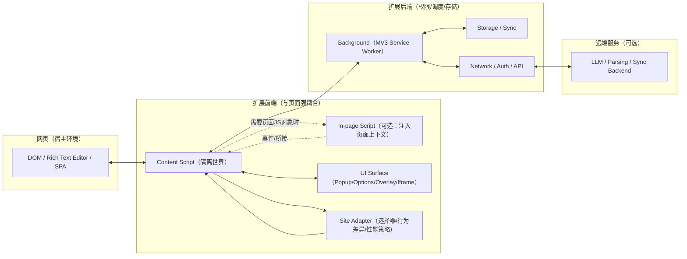

# 跨网站大型浏览器插件分层架构调研（Grammarly 等）

目标：沉淀一套可复用的“前后端分离 + 分层架构”参考模型，用于让 AI-MarkDone 在适配不同大模型网站（ChatGPT/Gemini/Claude/Deepseek …）时保持一致的操作逻辑，并具备可维护、可扩展、可协作的工程边界。

说明：商业插件（如 Grammarly）核心实现通常不开源，本文对其“内部代码结构”的部分内容以公开材料为依据，并在必要时以“可验证的工程约束 → 合理推断”的方式给出架构结论；可直接验证的部分尽量引用官方文档/公开工程实践/开源项目结构。

---

## 1. 结论摘要（可直接落地）

- **把“跨站适配”收敛为 Adapter 层**：把 DOM 选择器、站点特性、事件节流策略等 *全部* 限定在 Adapter/Integration 层，核心用例（Copy/Render/Parse/Bookmark 等）只依赖抽象接口（Ports）。
- **把“插件后端”视为 Background Orchestrator**：Background（MV3 Service Worker）做权限、存储、跨 Tab/跨页面调度、网络访问、账号/同步、日志与上报；Content/UI 不直接碰敏感能力。
- **把“插件前端”拆成两类**：Content Script（与页面交互、采集/注入） + UI Surface（Popup/Options/页面内浮层/iframe）。两者都属于前端，但**职责边界不同**。
- **以消息协议作为“层间唯一接触面”**：Content ↔ Background 只通过 versioned、typed 的 message 协议交互，避免函数互调和隐式依赖。
- **把“统一操作逻辑”落成 Use Case 层**：例如“复制为 Markdown/复制为 LaTeX/导出 PDF/收藏”等都以用例形式存在，输入输出是领域模型，不是 DOM 节点。
- **用 MV3 约束倒逼架构**：Service Worker 的生命周期是事件驱动、可被回收；不要在 Background 里假设常驻内存与长连接，关键状态必须可恢复（存储/幂等/重试）。

---

## 2. 证据分级（阅读时快速判断可信度）

- **A 级（强证据）**：Chrome 官方扩展文档 / MDN 扩展文档（规则与约束）。
- **B 级（中强证据）**：一线团队工程博客/官方支持文档（解释设计原因与实践经验）。
- **C 级（强可验证）**：大型开源扩展的真实代码结构（可直接对照分层与边界）。
- **D 级（推断）**：基于 A/B/C 的工程约束推导出的合理架构结论（会标注为“推断”）。

---

## 3. 大型跨网站扩展的通用分层模型（推荐作为“参考架构”）

> 该模型同时兼容 Chrome MV3 与 Firefox（在 Manifest 差异下做薄适配），并天然支持多站点适配。



### 3.1 各层职责与边界（“互不干扰”的关键点）

1. **Domain/Core（纯逻辑层）**
   - 只定义：领域模型、用例（Use Cases）、纯函数/算法、错误类型、策略接口（Ports）。
   - 禁止依赖：`window/document`、Chrome/Firefox API、DOM、网络库。

2. **Application/Use Case（用例编排层）**
   - 定义“统一操作逻辑”：例如 `ExportConversationAsMarkdown`、`CopyLastMessage`、`RenderPreview`。
   - 通过 Ports 调用：StoragePort、ClipboardPort、TelemetryPort、PlatformPort（从页面采集数据的抽象）等。

3. **Adapter/Integration（平台适配层：跨站差异收敛点）**
   - 只做：DOM 选择器、页面结构差异、富文本编辑器兼容策略、性能节流/降级、A/B 特性开关。
   - 通过 Ports 暴露：`getMessageNodes()` / `extractUserPrompt()` / `getComposer()` 等。

4. **Runtime/Infrastructure（运行时层）**
   - Content Script / Background / UI 各自实现 Ports：
     - Content：PagePort、SelectionPort、OverlayPort、ClipboardPort（或由 Background 代理）。
     - Background：StoragePort、NetworkPort、AuthPort、CrossTabPort、Policy/PermissionPort。
     - UI：SettingsPort、ViewModel/State、ThemePort。

5. **Message Protocol（层间契约）**
   - Content ↔ Background：只走 message passing（Chrome 推荐的扩展组件通信方式）。A 级证据：Chrome Message Passing 文档。

---

## 4. Grammarly：跨网站“原生体验”的工程启示（B 级 + 推断）

Grammarly 的公开工程文章强调其核心目标之一是 **“让产品在任意网站都像原生一样工作”**，困难集中在：富文本编辑器多样性、DOM 结构不可控、SPA 频繁变动、性能与兼容性风险。Grammarly 在文章中提到的一些具体实现约束与策略包括：尽量不污染页面 DOM、为下划线/提示做“外置”渲染层、通过观察器/轮询/可见性判断来平衡性能与实时性等。([Making Grammarly Feel Native On Every Website](https://www.grammarly.com/blog/engineering/making-grammarly-feel-native-on-every-website/))

可学习点（与“分层”直接相关）：

- **把“渲染层”与“页面内容层”隔离**：文章提到避免 DOM 污染、下划线渲染不直接侵入编辑框内部（减少与站点脚本/样式冲突）。这与“UI Surface（Overlay/Shadow DOM）”分层高度一致。
- **把“站点差异”收敛为策略集合**：不同网站/不同编辑器需要不同探测与定位策略（例如位置计算、滚动同步、可见性判断）。这天然要求一个明确的 Adapter 层，避免差异扩散到核心逻辑。
- **性能是架构约束，而不是优化细节**：跨站 DOM 观察（MutationObserver）、位置计算（Range.getClientRects）、滚动/输入监听在复杂页面上会变成主成本，必须在架构层面提供节流、降级、分级监测与兜底路径。

推断（D 级，但与扩展通用架构一致）：

- 为了跨站实时分析与 UI 提示，Grammarly 在浏览器侧必然存在：**页面交互层（Content）** 与 **能力调度层（Background/Remote）** 的拆分；否则无法在权限、性能、稳定性上兼顾规模化部署。

---

## 5. 1Password：用“组件分工 + 消息协议”实现安全与可维护（A/B 级）

1Password 官方支持文档把浏览器扩展拆成多个部分（背景页/后台组件、内容脚本、内联 iframe 等），并说明它们如何协作以及为何需要这种分拆（本质上是权限边界 + 运行时隔离 + UI 注入方式的组合）。([1Password in the Browser](https://support.1password.com/1password-in-the-browser/))

可学习点：

- **背景组件做集中调度**：机密数据/账号状态/跨站复用能力需要集中管理，天然适合 Background 作为“扩展后端”。
- **内容脚本只处理页面交互**：内容脚本位于隔离世界（Isolated World），负责与 DOM 交互并与后台通信；这与 Chrome 的 Content Script 模型一致。([Content Scripts](https://developer.chrome.com/docs/extensions/develop/concepts/content-scripts))
- **UI 注入用 iframe/独立容器**：复杂 UI 在页面内的承载方式（iframe/Shadow DOM/独立根节点）是减少样式冲突、提升可维护性的常见策略。

---

## 6. 开源大型扩展：结构与分层可直接对照（C 级）

### 6.1 uBlock Origin（过滤引擎与浏览器集成分离）

uBlock Origin 的代码与构建产物展示了典型的分层：过滤/规则引擎（核心逻辑）与浏览器 API/页面注入（运行时）解耦，UI（面板/设置）与后台调度分离。([uBlock Origin repo](https://github.com/gorhill/uBlock))

可学习点：

- **核心引擎可跨运行时复用**（不同浏览器/不同 Manifest 的差异放到薄适配层）。
- **配置与策略集中管理**（后台作为权威状态源，前端只读/提交意图）。

### 6.2 Dark Reader（“核心算法引擎”与“浏览器/页面适配”分层）

Dark Reader 作为跨网站运行、复杂度很高的扩展，其开源结构里同样体现了：核心算法（颜色变换/样式注入策略）与浏览器适配/页面注入拆分；并通过消息协议与设置系统实现可维护性。([Dark Reader repo](https://github.com/darkreader/darkreader))

可学习点：

- **把复杂算法放入可测试的纯逻辑模块**，减少对 DOM/浏览器 API 的耦合，从而提高回归测试与重构安全性。

### 6.3 LanguageTool Browser Add-on（云端能力与本地采集分离）

LanguageTool 的浏览器插件是典型的“页面采集/注入 + 后台请求语言服务”的模型：内容脚本负责收集文本、标注结果并渲染提示；后台负责网络请求与权限。([LanguageTool browser addon repo](https://github.com/languagetool-org/languagetool-browser-addon))

可学习点：

- **“重计算”放到后台/远端**：页面侧尽量只做采集与渲染，避免在复杂页面中做高成本分析。

---

## 7. Google/Chrome 对扩展架构的约束与“推荐思路”（A 级）

这些约束本身就是“大公司扩展为什么分层”的根本原因：

- **扩展由多个组件组成，各自职责不同**：Service Worker（后台）、Content Scripts、Extension Pages（Popup/Options 等）。([Architecture Overview](https://developer.chrome.com/docs/extensions/develop/concepts/architecture-overview))
- **Content Script 运行在隔离世界**：与页面脚本隔离，减少互相干扰；需要与页面脚本交互时通常通过注入脚本/桥接。([Content Scripts](https://developer.chrome.com/docs/extensions/develop/concepts/content-scripts))
- **组件之间通过消息传递通信**：这是推荐的解耦方式，能形成明确的契约边界。([Message Passing](https://developer.chrome.com/docs/extensions/develop/concepts/messaging))
- **MV3 禁止远程托管代码**：出于安全与可审核性，架构上必须把“动态逻辑”变为“数据驱动/配置驱动”。([Remote hosted code](https://developer.chrome.com/docs/extensions/develop/migrate/remote-hosted-code))
- **Service Worker 生命周期可被回收**：后台不保证常驻，架构必须能恢复状态并以事件驱动工作。([Service worker lifecycle](https://developer.chrome.com/docs/extensions/develop/concepts/service-workers/service-worker-lifecycle))
- **安全最佳实践强调最小权限与边界**：权限、数据访问、注入能力应集中控制并可审计。([Stay secure](https://developer.chrome.com/docs/extensions/develop/concepts/stay-secure))

---

## 8. “彻底详细且深入”的分层架构汇总表（核心交付）

> 阅读方式：把“层”当作**可独立演进的子系统**，把“边界”当作**可测试的契约**，把“接口”当作**协作的唯一通道**。

| 层/模块 | 运行时位置 | 主要职责（做什么） | 边界（不做什么） | 典型接口/契约 | 为什么这么分（合理性） | 主要收益（工程化） |
|---|---|---|---|---|---|---|
| Domain/Core | 纯 TS 模块（无运行时依赖） | 领域模型（Message/Conversation/Selection）、变换规则（Markdown/LaTeX）、导出策略、错误模型 | 不依赖 DOM/浏览器 API/网络/存储 | 纯函数 + Ports（接口定义） | 让核心逻辑可测试、可复用、可重构（Dark Reader/uBlock 的“核心引擎”思路） | 高可测、低耦合；多站点/多浏览器复用 |
| Use Cases（应用层） | 纯 TS 模块 | 统一操作逻辑编排：选择消息→解析→渲染→复制/导出/收藏 | 不包含选择器/DOM 操作细节 | `execute(input): Result`；依赖 Ports | 把“统一操作逻辑”从站点差异与运行时差异中剥离 | 保证不同站点操作一致；便于协作分工 |
| Site Adapter（内容适配层） | Content Script 内 | DOM 选择器、节点提取、站点差异策略、性能节流/降级 | 不实现业务用例、不做跨站共享状态 | `getMessageSelector()` / `extractUserPrompt()` 等（与现有 adapter registry 对齐） | Grammarly 类产品“跨站原生体验”的核心复杂度就在这里 | 站点变动时只改适配层；避免污染核心 |
| Page Observers（页面观察层） | Content Script 内 | Mutation/URL/可见性监听，触发用例执行；数据采集缓存 | 不直接写业务规则 | 事件总线（EventBus）、数据源（LivePageDataSource） | SPA/富文本编辑器需要稳定的变化探测机制（Grammarly 文中强调性能与观察策略） | 稳定性与性能可控；减少“到处监听” |
| UI Surface（页面内 UI） | Content Script 内（Shadow DOM/iframe） | 工具栏/浮窗/预览/字数统计等 UI；仅呈现状态与收集意图 | 不直接做页面提取、不直连后台敏感能力 | ViewModel/State；UI → 用例意图消息 | 解决样式/DOM 冲突，降低“页面差异”对 UI 的影响（Grammarly：避免 DOM 污染；1Password：iframe/UI 分拆） | UI 可独立迭代；跨站外观一致 |
| Extension UI（Popup/Options） | Extension Page | 设置、快捷入口、全局状态展示 | 不依赖宿主页面 DOM | Settings API、消息协议 | 与页面无关的 UI 应与内容脚本解耦（Chrome 架构推荐） | 降低耦合；清晰的交互入口 |
| Background Orchestrator | MV3 Service Worker | 权限/策略控制、存储、跨 Tab 调度、网络、认证、同步、日志上报 | 不操作页面 DOM、不承载重 UI | `chrome.runtime.onMessage` 协议；存储/网络 Ports | Chrome 推荐组件化；Service Worker 生命周期约束要求事件化与可恢复 | 安全可审计；跨站共享状态一致；可控的副作用集中点 |
| Storage & Sync | Background（或独立模块） | 统一管理配置、书签、缓存、迁移 | 不让 Content/UI 直接读写敏感存储 | StoragePort；数据版本与迁移脚本 | 最小权限与一致性；便于做 schema 迁移/回滚 | 数据一致；减少竞态；可做幂等与审计 |
| Remote Backend（可选） | 远端服务 | LLM/复杂解析/账号体系/跨设备同步 | 不要求页面侧了解远端细节 | HTTP API + 鉴权；重试/熔断策略 | 重计算不应在页面侧进行（LanguageTool 模式）；也便于隐私与安全策略集中 | 性能与体验；跨端一致；运维可控 |
| Message Protocol（契约层） | Content ↔ Background | 版本化消息 schema、错误码、能力协商、请求幂等 | 不携带 DOM 引用/函数 | `type` + `payload` + `requestId` + `version` | Chrome 建议用消息传递作为组件边界；同时是团队协作边界 | 降低耦合；易测试；易演进 |

---

## 8.1 协议与端口（Ports）示意：把“协作面”固定下来

目的：让不同层/不同模块的协作只围绕“契约”发生，而不是围绕“实现细节”发生（这通常是大团队维持稳定迭代速度的关键）。

### 8.1.1 Content ↔ Background：消息协议骨架（示意）

```ts
// Versioned, typed messages (示意)
export type ProtocolVersion = 1;

export type ExtRequest =
    | { v: ProtocolVersion; id: string; type: 'storage:get'; key: string }
    | { v: ProtocolVersion; id: string; type: 'storage:set'; key: string; value: unknown }
    | { v: ProtocolVersion; id: string; type: 'net:fetch'; url: string; method?: 'GET' | 'POST'; body?: unknown };

export type ExtResponse =
    | { v: ProtocolVersion; id: string; ok: true; type: ExtRequest['type']; data: unknown }
    | { v: ProtocolVersion; id: string; ok: false; type: ExtRequest['type']; error: { code: string; message: string } };
```

要点：

- `v`（协议版本）与 `type`（消息类型）决定可演进性；`id`（requestId）决定可观测与幂等追踪。
- Payload **只允许可序列化数据**；严禁传 DOM 引用/函数/类实例。

### 8.1.2 Domain/Application ↔ Runtime：Ports（示意）

```ts
export interface ConversationPort {
    getLastConversation(): Promise<{ messages: Array<{ role: string; html: string }> }>;
}

export interface ClipboardPort {
    writeText(text: string): Promise<void>;
}

export interface SettingsPort {
    get<T>(key: string): Promise<T | undefined>;
    set<T>(key: string, value: T): Promise<void>;
}
```

要点：

- 用例层只依赖这些 Ports；Content/Background/UI 各自提供实现（具体跑在哪个 runtime 由实现决定）。
- 一旦 Ports 稳定，**站点扩展**（新增 adapter）与 **能力扩展**（新增用例）能并行推进，互不阻塞。

---

## 9. 对 AI-MarkDone 的“架构落地建议”（结合现有目录）

你们当前的目录已经具备良好雏形（`src/content/adapters/*`、`src/parser/*`、`src/background/*`、`src/renderer/*`、`src/shared/*`）。建议后续在不大改目录的前提下，把“层”明确化，并用规则保证依赖方向：

1. **把 `src/shared/` 明确为 Domain/Core + Use Cases 的承载点**
   - 目标：让“操作逻辑一致性”由 `shared` 统一定义，而不是散落在 `content/features/*`。
   - 落地：把可纯化的逻辑（例如复制流水线、导出策略、错误模型、消息 schema）逐步迁移/沉淀到 `shared`。

2. **把 `src/content/adapters/*` 定义成“唯一允许站点差异的地方”**
   - 目标：任何与具体站点 DOM 结构、类名、编辑器行为有关的逻辑都不得进入 Domain/Use Cases。
   - 落地：通过 adapter contract（接口 + 语义约束）锁定边界；为每个 adapter 写契约测试（已有大量 tests，可延续该风格）。

3. **把 `src/background/*` 定义为“唯一可执行敏感副作用的地方”**
   - 例如：网络请求、持久化写入、跨 Tab 广播、权限查询。
   - Content/UI 通过消息协议提交“意图”（intent），Background 执行并返回结果（result）。

4. **把“消息协议”当成第一等公民**
   - 版本化：`protocolVersion` + `type`。
   - 可观测：统一记录 requestId、耗时、错误码（注意隐私）。
   - 可测试：对 schema 做单测；对兼容性做回归测试。

5. **用 MV3 约束定义工程策略**
   - Service Worker 可被回收：关键状态持久化；请求幂等；重试与超时；避免把状态只放内存。
   - 禁止远程代码：可扩展能力走“配置/规则”而不是动态脚本。

---

## 10. 可操作的“互不干扰/模块化”检查清单（建议纳入评审）

- 依赖方向：Domain/Core 不依赖 Content/Background/UI；Use Cases 只依赖 Ports。
- 站点差异：任何选择器/DOM 假设必须在 Adapter 层；不得在 Use Case 里出现。
- 副作用集中：网络/存储写入只能由 Background 执行（Content 只能请求）。
- 契约化通信：Content ↔ Background 只通过消息协议；禁止直接共享实现细节。
- 可恢复性：Background 重启后不会破坏功能（关键状态可恢复、操作幂等）。
- 可观测性：关键路径有一致的日志与错误码（并遵守隐私与最小化原则）。

---

## 11. 参考资料（按优先级）

- [Chrome Extensions — Architecture overview](https://developer.chrome.com/docs/extensions/develop/concepts/architecture-overview)
- [Chrome Extensions — Content scripts (Isolated World)](https://developer.chrome.com/docs/extensions/develop/concepts/content-scripts)
- [Chrome Extensions — Message passing](https://developer.chrome.com/docs/extensions/develop/concepts/messaging)
- [Chrome Extensions — Remote hosted code (MV3)](https://developer.chrome.com/docs/extensions/develop/migrate/remote-hosted-code)
- [Chrome Extensions — Service worker lifecycle (MV3)](https://developer.chrome.com/docs/extensions/develop/concepts/service-workers/service-worker-lifecycle)
- [Chrome Extensions — Stay secure (best practices)](https://developer.chrome.com/docs/extensions/develop/concepts/stay-secure)
- [Grammarly Engineering — Making Grammarly feel native on every website](https://www.grammarly.com/blog/engineering/making-grammarly-feel-native-on-every-website/)
- [1Password Support — 1Password in the browser](https://support.1password.com/1password-in-the-browser/)
- [uBlock Origin (open source)](https://github.com/gorhill/uBlock)
- [Dark Reader (open source)](https://github.com/darkreader/darkreader)
- [LanguageTool browser addon (open source)](https://github.com/languagetool-org/languagetool-browser-addon)
